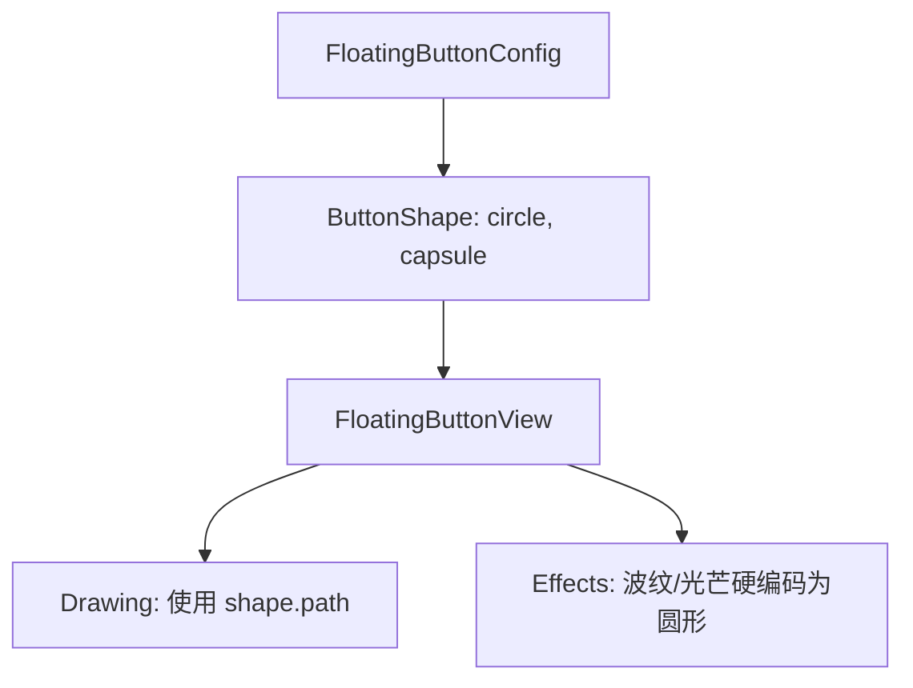
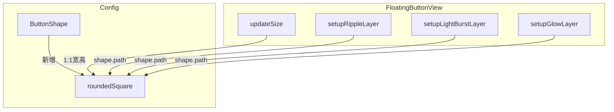

# 添加悬浮球形状设置

## 概述
为悬浮球个性化设置添加“圆角正方形”形状选项。确保外发光、波纹及光芒特效能正确适配不同的形状（圆形、圆角正方形、胶囊形）。

## 当前实现

## 方案
### 方案一：全方位适配新形状 (推荐方案 🚀)
1. **扩展模型层**：在 `ButtonShape` 枚举中增加 `roundedSquare`。
2. **优化渲染层**：
    - 修改 `FloatingButtonView` 的 `updateSize`，处理 `roundedSquare` 的宽高比（1:1）。
    - 修改 `setupRippleLayer`, `setupLightBurstLayer`, `performRippleAnimation` 等方法，将硬编码的 `CGPath(ellipseIn:)` 替换为 `shape.path(in:)`。
    - 统一特效层的 `cornerRadius` 处理。
3. **适配外发光**：
    - 确保 `glowLayer` 的 `path` 随形状变化。
    - 调整 `cornerRadius` 设置，避免在非圆形情况下强制应用全圆角。

**优点：**
- 提供更多个性化选择。
- 视觉特效（波纹、发光）与主体形状保持高度一致，提升质感。

**缺点：**
- 修改涉及多处特效逻辑，需确保所有动画路径均已更新。

**代码修改位置：**
1. [FloatingButtonConfig.swift](vscode://file/Volumes/Cache/X/Sources/Model/FloatingButtonConfig.swift:172) (枚举定义)
2. [FloatingButtonView.swift](vscode://file/Volumes/Cache/X/Sources/View/FloatingButtonView.swift:69) (updateSize)
3. [FloatingButtonView.swift](vscode://file/Volumes/Cache/X/Sources/View/FloatingButtonView.swift:192) (setupGlowLayer)
4. [FloatingButtonView.swift](vscode://file/Volumes/Cache/X/Sources/View/FloatingButtonView.swift:208) (setupRippleLayer)
5. [FloatingButtonView.swift](vscode://file/Volumes/Cache/X/Sources/View/FloatingButtonView.swift:233) (setupLightBurstLayer)
6. [FloatingButtonView.swift](vscode://file/Volumes/Cache/X/Sources/View/FloatingButtonView.swift:946) (performRippleAnimation)
7. [FloatingButtonView.swift](vscode://file/Volumes/Cache/X/Sources/View/FloatingButtonView.swift:1010) (performLightBurstAnimation)

## 测试用例
1. 右键悬浮球，打开“个性化设置”。
2. 在“形状”下拉框中选择“圆角正方形”。
3. 点击“应用”。
4. 观察悬浮球是否变为圆角正方形。
5. 悬停悬浮球，观察外发光是否贴合圆角正方形边缘。
6. 点击悬浮球，观察波纹特效是否是圆角正方形扩散。
7. 观察休息提醒触发时的光效（如果是基于此视图）是否适配形状。
8. 验证原本的“默认（圆形）”和“胶囊”功能依然正常。

## 任务总结与结论
<待填充>

## 任务耗时
- 任务开始时间：16:48
- 任务结束时间：<待填充>
- 任务总耗时：<待填充>
