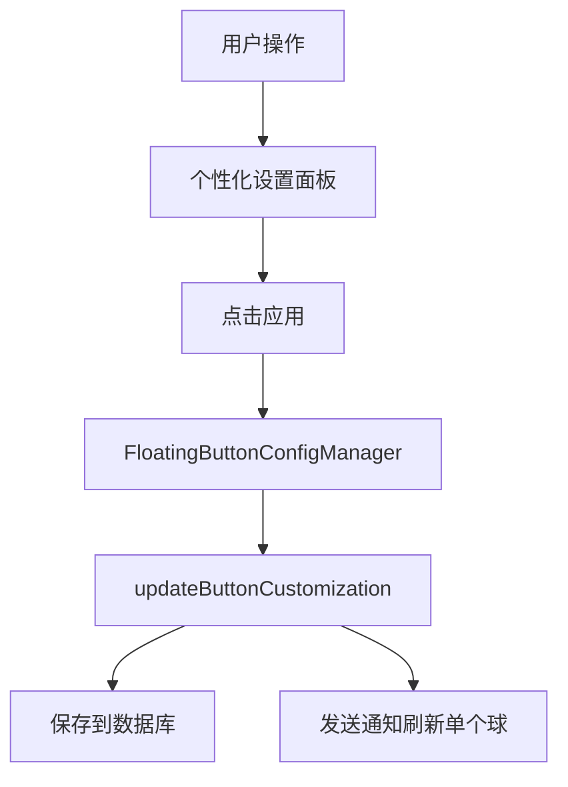
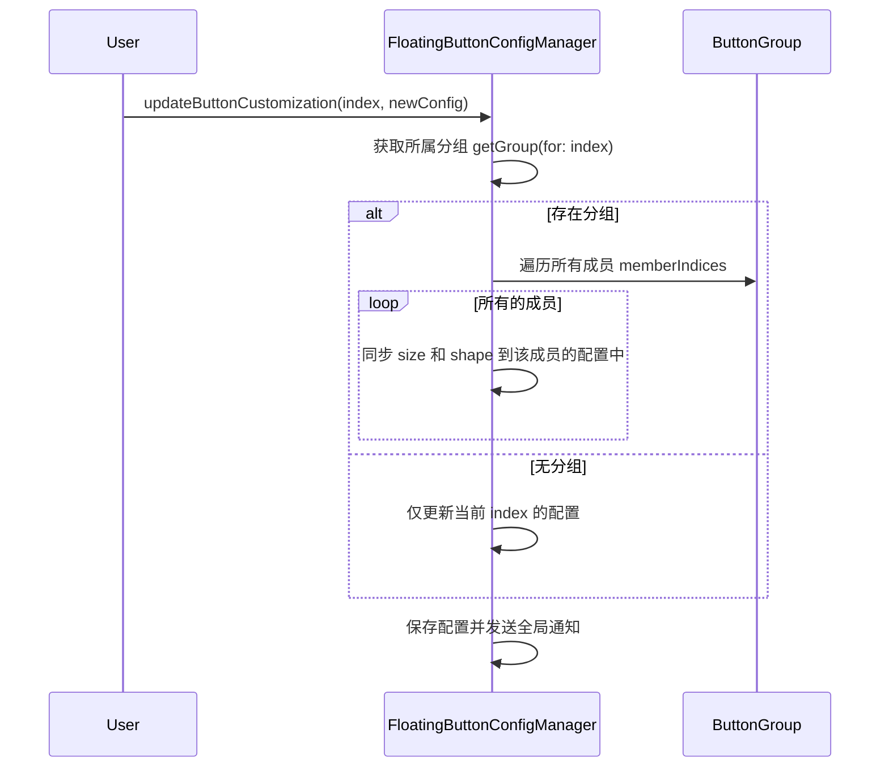

# 同一个分组的悬浮球大小形状同步

## 概述
实现分组联动功能：当用户修改一个悬浮球的大小或形状时，如果该球属于某个分组，则该分组内的所有悬浮球应同步更新为相同的大小和形状。注意：颜色主题（ColorScheme）不属于同步范畴，保持各自独立。

## 当前实现
目前每个悬浮球的 `ButtonCustomization` 是完全独立的。修改其中一个球的配置只会更新 `config.buttonCustomizations` 中对应的索引项。

## 方案 (推荐方案 🚀)
在 `FloatingButtonConfigManager` 的更新方法中引入分组检查机制。

### 优缺点分析
- **优点**：符合用户对“分组”作为整体交互的直觉；减少了重复设置多个球的操作成本。
- **缺点**：如果用户想在同一分组内设置不同的大小/形状，将变得不可能（但这正是本任务的需求）。

### 代码修改位置
- [FloatingButtonConfig.swift](vscode://file/Volumes/Cache/X/Sources/Model/FloatingButtonConfig.swift:498) (修改 `updateButtonCustomization` 核心逻辑)

## 测试用例
1. **分组同步验证**：将“球1”和“球2”加入“分组A”。修改“球1”的形状为“圆角正方形”，大小为 100px。点击应用后，观察“球2”是否自动同步为“圆角正方形”且大小变为 100px。
2. **非分组成员验证**：修改不属于任何分组的“球3”，确保其操作不影响其他球。
3. **取消分组验证**：将“球1”移出分组，再次修改其配置，确保“球2”不再受影响。

## 任务总结与结论
1. **分组联动**：在 `FloatingButtonConfigManager` 中实现了大小与形状的同步逻辑，支持多球联动。
2. **布局加固**：重构了 `AppDelegate` 的排列算法，通过预更新窗口尺寸、过滤非法索引（脏数据）以及基于有效成员的增量累积坐标，解决了在同步更新时可能出现的球重叠与移出屏幕的 Bug。

## 任务耗时
- 任务开始时间：17:21
- 任务结束时间：18:38
- 任务总耗时：77 分钟
