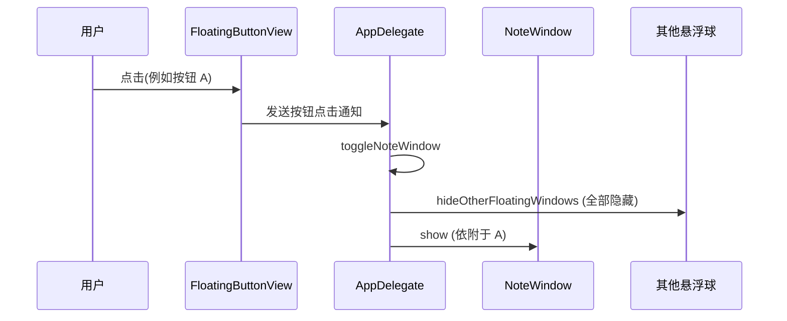
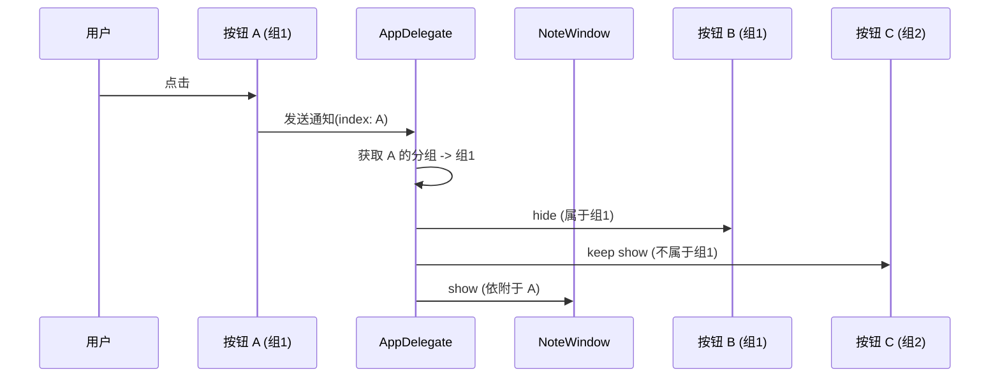

# 点击悬浮球仅隐藏同分组成员

## 概述
修改悬浮球点击后的联动行为。目前点击悬浮球打开笔记、剪贴板等窗口时，会自动隐藏除当前按钮外的所有其他悬浮球。本任务要求将其修改为：仅隐藏与当前按钮属于同一分组的其他成员，非同组成员保持显示。

## 当前实现

## 方案 (推荐方案 🚀)
1. 修改 `toggleNoteWindow` 方法，增加 `buttonIndex: Int` 参数。
2. 修改 `hideOtherFloatingWindows` 为 `hideSameGroupFloatingWindows(for index: Int, except window: NSWindow?)`。
3. 修改 `showAllFloatingWindows` 逻辑，在功能面板关闭时，仅恢复同一分组的成员显示（或根据上下文判断）。
4. 在 `handleFloatingButtonClicked` 中提取按钮索引并传递给相关方法。

### 优缺点
- **优点**：符合用户的分组管理逻辑，减少不必要的 UI 变动，提升多组协作体验。
- **缺点**：需要确保在按钮没有分组（独立按钮）时逻辑依然正确。

### 修改位置
- [AppDelegate.swift](vscode://file/Volumes/Cache/X/Sources/App/AppDelegate.swift:400) - `handleFloatingButtonClicked` 解析 index 并传参。
- [AppDelegate.swift](vscode://file/Volumes/Cache/X/Sources/App/AppDelegate.swift:433) - `toggleNoteWindow` 签名修改及逻辑更新。
- [AppDelegate.swift](vscode://file/Volumes/Cache/X/Sources/App/AppDelegate.swift:476) - `hideOtherFloatingWindows` 替换为分组逻辑。
- [AppDelegate.swift](vscode://file/Volumes/Cache/X/Sources/App/AppDelegate.swift:484) - `showAllFloatingWindows` 考虑是否需要改为 `showGroupFloatingWindows`。

## 测试用例
1. **多分组验证**：
   - 创建两个分组：组1 (按钮0, 1)，组2 (按钮2)。
   - 点击按钮0打开笔记，观察按钮1是否隐藏，按钮2是否保持显示。
   - 关闭笔记，观察按钮1是否恢复显示。
2. **无分组验证**：
   - 将按钮0移出分组。
   - 点击按钮0，由于它不属于任何分组，应该只有它自己显示（或者按照定义，只隐藏属于“无分组”的其他按钮？通常无分组视为独立个体，不应隐藏其他任何人）。
3. **切换依附**：
   - 在笔记打开状态下，点击按钮2，观察界面如何切换。

## 任务总结与结论
成功实现了按分组控制悬浮球显隐的逻辑。现在点击悬浮球打开功能面板时，只会隐藏属于同一分组的其他按钮，保持其他组的按钮可见，提高了多任务场景下的操作便利性。

## 任务耗时
- 任务开始时间：17:39
- 任务结束时间：17:41
- 任务总耗时：2 分钟
