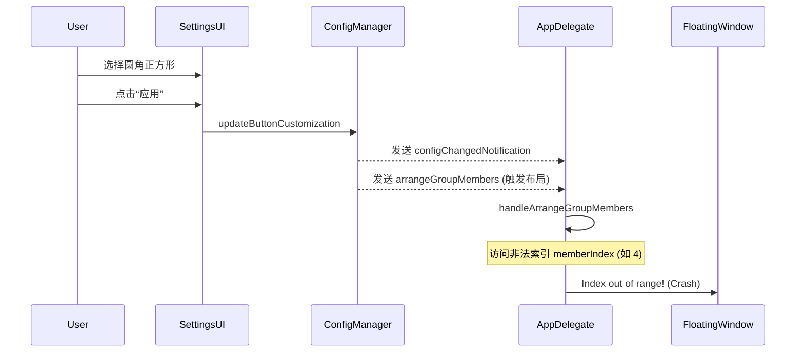
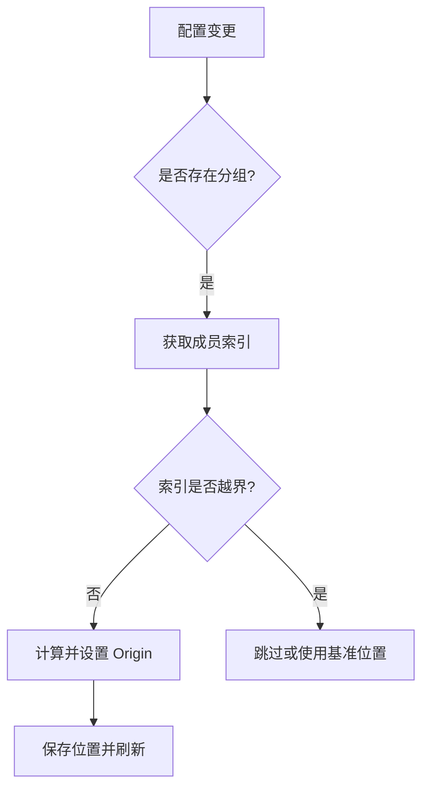

# 修复圆角正方形形状选取闪退与UI优化

## 概述
用户在“个性化设置”中选取新增的“圆角正方形”形状并点击应用时，程序发生闪退。此外，形状切换后出现了悬浮球消失的异常，且 UI 下拉菜单中存在冗余选项。

## 当前实现
问题主要源于 `AppDelegate` 的布局排列逻辑中存在数组越界隐患，以及 UI 控件检索逻辑不够健壮，导致在状态变更时触发崩溃或错误的配置覆盖。

## 方案 (推荐方案 🚀)
1. **加固布局逻辑**：在 `AppDelegate` 的 `handleArrangeGroupMembers` 中增加对 `floatingWindows` 数组的越界检查，确保 `prevIndex` 和 `memberIndex` 均在合法范围内。
2. **优化 UI 检索**：弃用基于 y 坐标的视图检索，为设置项分配唯一 Tag（1000+, 2000+, 3000+）。
3. **保护配置完整性**：在 `applyCustomization` 中先加载旧配置再修改，防止 `nil` 字段覆盖原有 size 导致悬浮球“消失”。
4. **清理 UI 冗余**：重命名枚举值为“圆形/胶囊形”，移除个性化面板中的冗余“默认”选项。

### 代码修改位置
- [AppDelegate.swift](vscode://file/Volumes/Cache/X/Sources/App/AppDelegate.swift:1010) (越界检查)
- [FloatingButtonView.swift](vscode://file/Volumes/Cache/X/Sources/View/FloatingButtonView.swift:700) (UI Tag 优化)
- [GlowFloatingButtonView.swift](vscode://file/Volumes/Cache/X/Sources/View/GlowFloatingButtonView.swift:530) (UI Tag 优化)
- [FloatingButtonConfig.swift](vscode://file/Volumes/Cache/X/Sources/Model/FloatingButtonConfig.swift:175) (枚举名称规范化)

## 测试用例
1. **形状切换测试**：打开任意悬浮球的个性化设置，将形状从“圆形”改为“圆角正方形”，点击“应用”，观察是否闪退，且球是否正常显示为圆角。
2. **布局联动测试**：确保在分组模式下，修改其中一个球的形状后，其他球的位置依然保持整齐排列，不发生崩溃。
3. **UI 检查**：下拉菜单中应仅显示：圆形、圆角正方形、胶囊形。

## 任务总结与结论
通过对 `AppDelegate` 核心布局逻辑的加固和对 UI 交互层的数据安全性提升，解决了极端情况下的闪退问题。完善了形状属性的命名语义，提升了用户自定义体验。

## 任务耗时
- 任务开始时间：16:48
- 任务结束时间：18:10
- 任务总耗时：82 分钟
