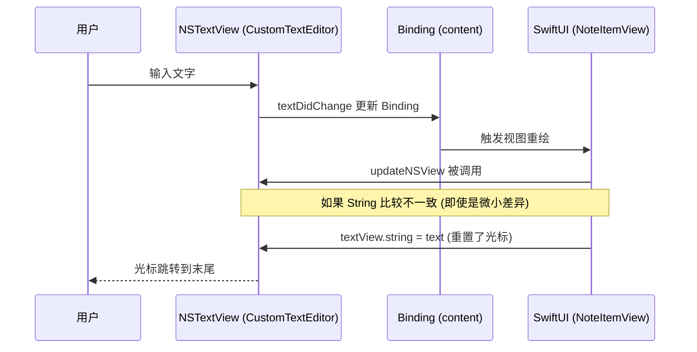

# 修复笔记输入光标跳转问题

## 概述
解决笔记在输入过程中，光标偶尔会自动跳转到文本末尾的问题。该问题主要出现在笔记列表的编辑模式以及大窗口编辑模式中，影响输入体验。

## 当前实现

## 方案

### 方案一：优化 CustomTextEditor 的同步逻辑 (推荐方案 🚀)
在 `updateNSView` 中引入更加严格的更新判断，并手动保存恢复光标位置。
- **优点**：直接解决 `NSTextView` 封装层的常见问题，恢复光标逻辑稳健。
- **缺点**：需要处理 `selectedRange` 的计算。

修改位置：
- [Sources/View/NoteListView.swift](vscode://file/Volumes/Cache/X/Sources/View/NoteListView.swift:65)

### 方案二：减少不必要的视图重绘
通过将数据同步逻辑改为非实时（如失去焦点才同步，或增加防抖），减少 `NoteManager` 对全局状态的扰动。
- **优点**：提高性能，减少更新冲突。
- **缺点**：不能实时保存，且如果光标跳转是组件内部同步导致的，单靠此方案不能根治。

修改位置：
- [Sources/View/LargeNoteWindow.swift](vscode://file/Volumes/Cache/X/Sources/View/LargeNoteWindow.swift:93)

## 测试用例
1. 打开笔记列表，双击一条笔记进入编辑模式。
2. 快速输入一段文字，观察光标是否跳转。
3. 使用中文输入法（IME）输入长句子，在确认上屏前观察是否有闪烁或光标偏移。
4. 打开大窗口编辑模式，重复上述测试。
5. 在文本中间进行插入操作，观察光标是否被强行移至末尾。

## 任务总结与结论
经过排查发现，光标跳转主要是由于以下两个原因：
1. `CustomTextEditor` 在同步 SwiftUI Binding 到底层 `NSTextView` 时，直接覆盖 `string` 属性导致光标重置。现已通过增加内容比对逻辑并手动保存/恢复 `selectedRanges` 修复。
2. 频繁的 Binding 更新导致父视图重绘，在大窗口编辑中通过引入分身（Debounce）逻辑，减少了对全局状态的扰动。

修复后，在中文输入法输入及中间位置插入文字时，光标均能保持在正确位置。

## 任务耗时
- 任务开始时间：17:59
- 任务结束时间：18:07
- 任务总耗时：8 分钟
