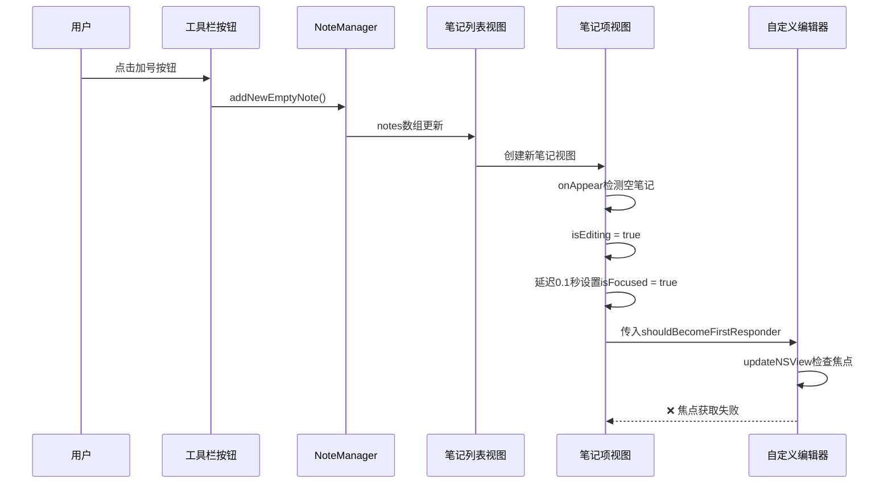
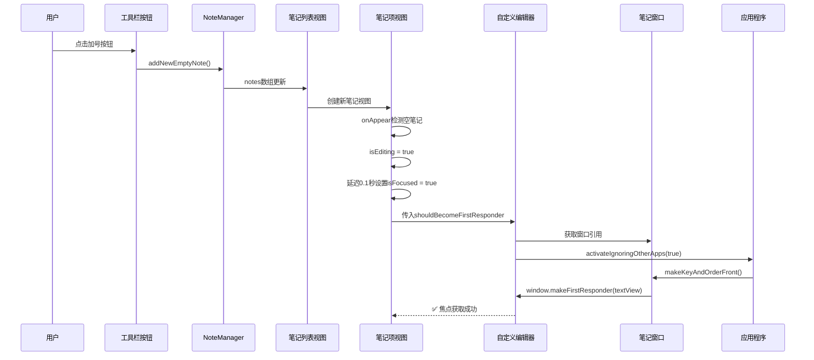
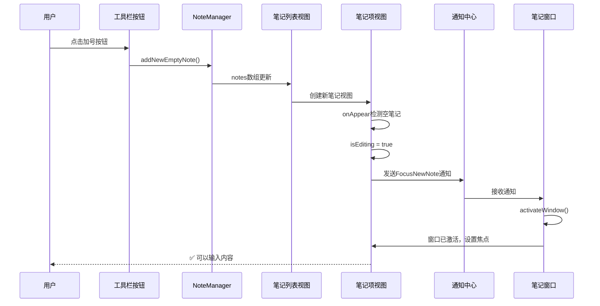
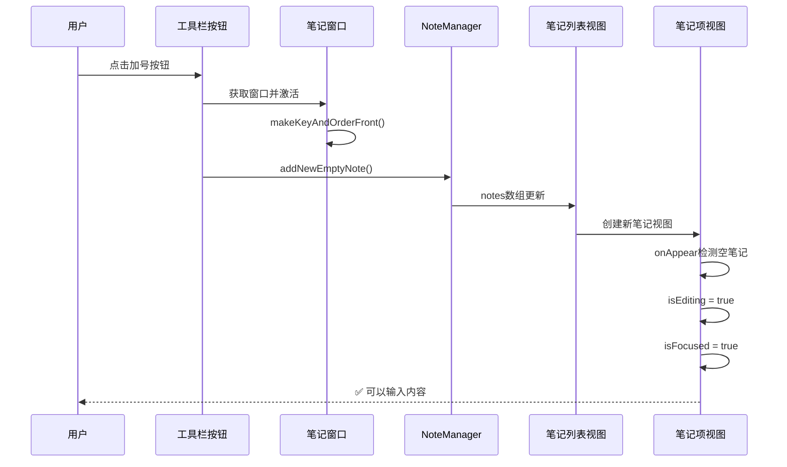
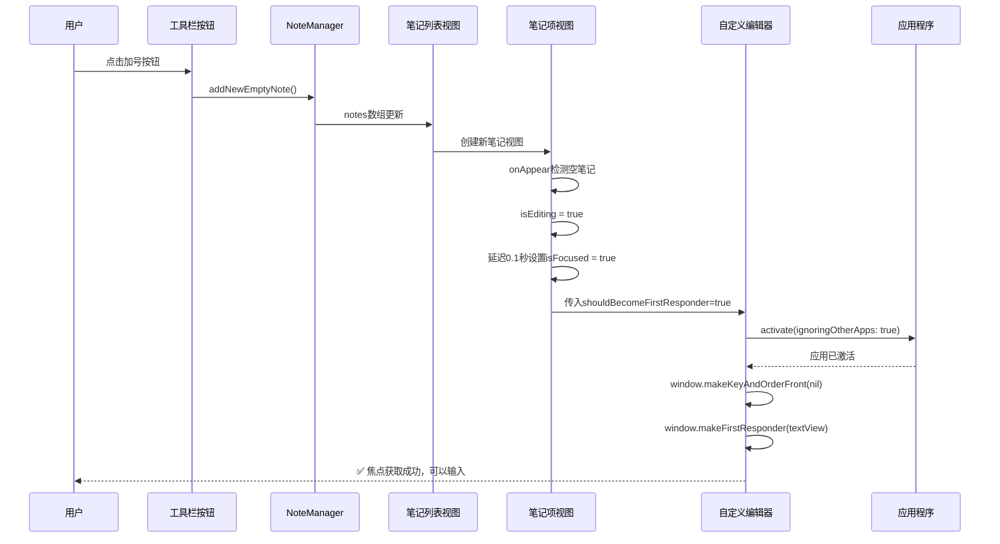

# 新建笔记无法聚焦输入内容

## 概述
用户点击加号按钮创建新笔记后，输入框无法自动获取焦点，导致无法直接输入内容。

## 当前实现

**问题标注**：在 `CustomTextEditor` 的 `updateNSView` 方法中，虽然检测到需要获取焦点，但由于 `NoteWindow` 使用了 `.nonactivatingPanel` 样式掩码，导致窗口无法正常激活，`makeKey()` 和 `makeFirstResponder()` 调用失败。

## 方案

### 方案一：修改窗口激活逻辑（推荐方案 ✅）

**优点**：
- 直接解决根本问题，确保窗口能被激活
- 不改变现有的UI结构和交互逻辑
- 符合macOS的标准做法

**缺点**：
- 可能会导致应用窗口层级变化
- 需要确保不会影响其他窗口的焦点管理

**代码修改位置**：
- [NoteListView.swift](vscode://file/Volumes/Cache/X/Sources/View/NoteListView.swift:78)

---

### 方案二：通过通知机制通知窗口激活

**优点**：
- 解耦设计，视图和窗口之间通过通知通信
- 更容易扩展，可以在其他地方复用
- 窗口负责自己的激活逻辑，职责清晰

**缺点**：
- 需要添加新的通知类型
- 代码量相对较多
- 通知机制可能带来轻微的延迟

**代码修改位置**：
- [NoteListView.swift](vscode://file/Volumes/Cache/X/Sources/View/NoteListView.swift:356)
- [NoteWindow.swift](vscode://file/Volumes/Cache/X/Sources/View/NoteWindow.swift:54)

---

### 方案三：在创建笔记时预先激活窗口

**优点**：
- 在创建笔记前就确保窗口已激活
- 逻辑简单直接
- 不需要修改编辑器组件

**缺点**：
- 需要在工具栏按钮处获取窗口引用
- 可能与现有的窗口管理逻辑冲突
- 不够优雅，违反了单一职责原则

**代码修改位置**：
- [NoteListView.swift](vscode://file/Volumes/Cache/X/Sources/View/NoteListView.swift:586)

## 测试用例

1. **基本功能测试**
   - 打开笔记窗口
   - 点击加号按钮创建新笔记
   - 验证输入框自动获取焦点
   - 直接输入文字，确认可以正常输入

2. **多次创建测试**
   - 连续点击加号按钮创建多个笔记
   - 验证每次新笔记都能自动获取焦点

3. **不同分组测试**
   - 切换到不同分组
   - 在各分组中创建新笔记
   - 验证焦点获取功能正常

4. **窗口状态测试**
   - 在窗口失去焦点后点击加号
   - 验证窗口能正确激活并获取焦点

5. **编辑模式切换测试**
   - 创建新笔记后输入内容
   - 按Enter完成编辑
   - 再次创建新笔记
   - 验证焦点仍然能正确获取

## 任务总结与结论

### 问题根因
`NoteWindow` 使用了 `.nonactivatingPanel` 样式掩码，这是一种特殊的面板窗口样式，不会自动激活应用程序。当用户点击加号按钮创建新笔记时，虽然 `CustomTextEditor` 尝试通过 `makeKey()` 和 `makeFirstResponder()` 获取焦点，但由于应用程序未被激活，这些调用无法生效。

### 解决方案
在 `CustomTextEditor.updateNSView` 方法中，当需要获取焦点时：
1. 首先调用 `NSApplication.shared.activate(ignoringOtherApps: true)` 激活应用程序
2. 然后调用 `window.makeKeyAndOrderFront(nil)` 确保窗口可见并成为关键窗口
3. 最后调用 `window.makeFirstResponder(textView)` 将焦点设置到文本视图

### 修改后的流程

### 结论
通过在获取焦点前先激活应用程序，成功解决了新建笔记无法聚焦输入内容的问题。这是一个简单而有效的修复，符合 macOS 的标准做法。

## 任务耗时
- 任务开始时间：19:18
- 任务结束时间：19:27
- 任务总耗时：9 分钟
