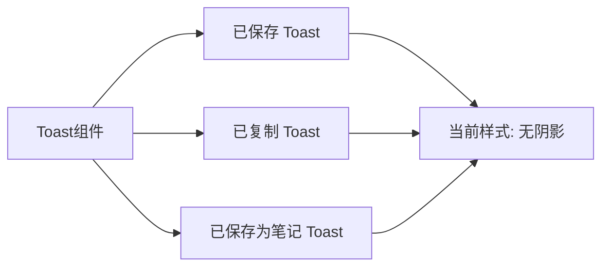
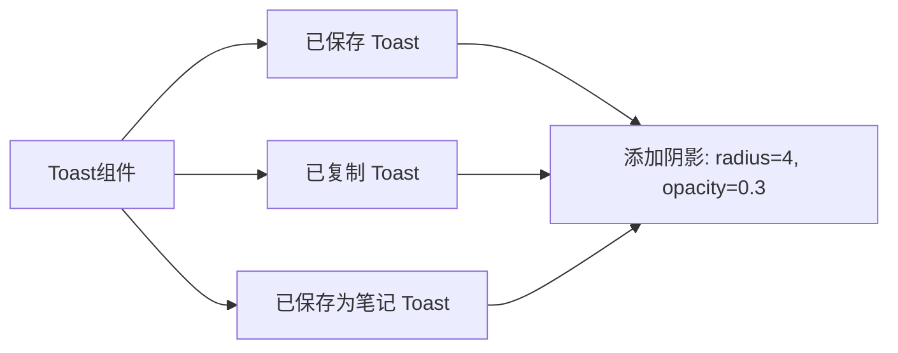
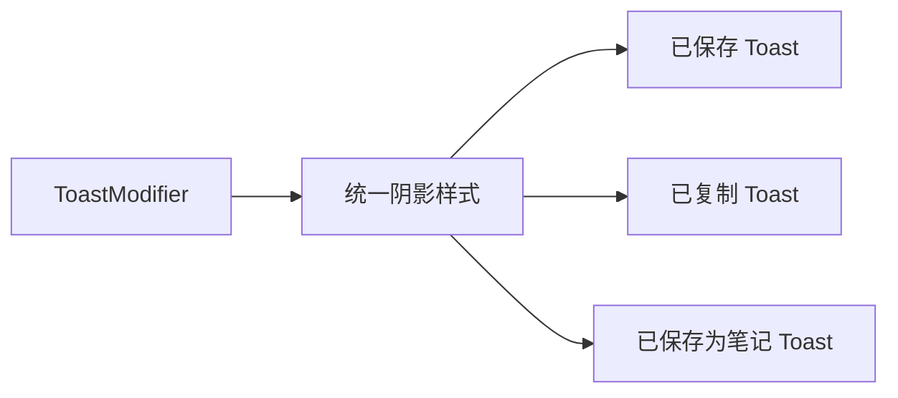

# 笔记Toast添加阴影效果

## 概述
为笔记组件的Toast提示添加阴影效果，使其在视觉上更加凸显。

## 当前实现

**问题标注**：当前所有Toast提示都只有背景色，没有阴影效果，导致在某些背景下不够突出。

## 方案

### 方案一：为每个Toast添加统一阴影样式（推荐方案 ✅）

**优点**：
- 实现简单，修改量小
- 保持现有代码结构
- 统一的视觉效果

**缺点**：
- 无

**代码修改位置**：
- [NoteListView.swift - savedToastOverlay](vscode://file/Volumes/Cache/X/Sources/View/NoteListView.swift:414)
- [NoteListView.swift - 剪贴板Toast](vscode://file/Volumes/Cache/X/Sources/View/NoteListView.swift:1332)

---

### 方案二：创建可复用的Toast视图修饰符

**优点**：
- 代码复用性更好
- 未来修改样式更方便

**缺点**：
- 修改量较大
- 对于简单的阴影需求过度设计

**代码修改位置**：
- [NoteListView.swift](vscode://file/Volumes/Cache/X/Sources/View/NoteListView.swift:1)

## 测试用例

1. **已保存Toast测试**
   - 编辑笔记内容后按Enter
   - 验证"已保存"Toast显示时有阴影效果

2. **已复制Toast测试**
   - 点击复制按钮复制笔记内容
   - 验证"已复制"Toast显示时有阴影效果

3. **已保存为笔记Toast测试**
   - 将剪贴板内容保存为笔记
   - 验证"已保存为笔记"Toast显示时有阴影效果

4. **不同背景测试**
   - 在不同颜色的笔记背景下测试Toast
   - 验证阴影在各种背景下都能凸显Toast

## 任务总结与结论

### 修改内容
为笔记组件的三个Toast提示添加了统一的阴影效果：
- `.shadow(color: Color.black.opacity(0.3), radius: 4, x: 0, y: 2)`

### 修改位置
1. `savedToastOverlay` - "已保存" Toast
2. 剪贴板预览中的 "已复制" Toast
3. 剪贴板预览中的 "已保存为笔记" Toast

### 效果
Toast提示现在具有阴影效果，在各种背景下都能更加凸显，提升了用户体验。

## 任务耗时
- 任务开始时间：19:31
- 任务结束时间：19:36
- 任务总耗时：5 分钟
