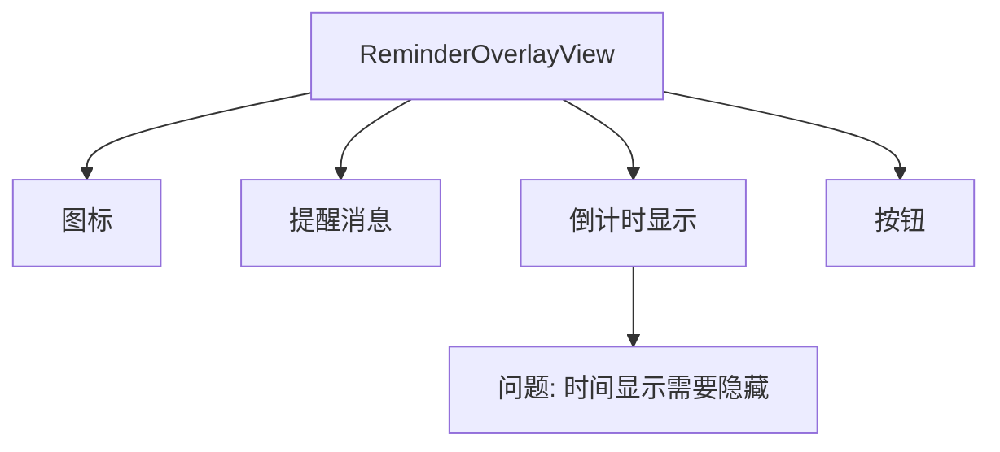
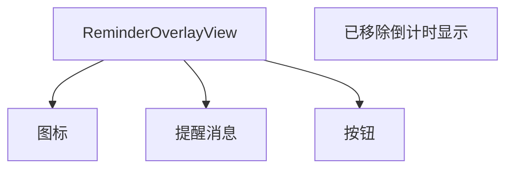
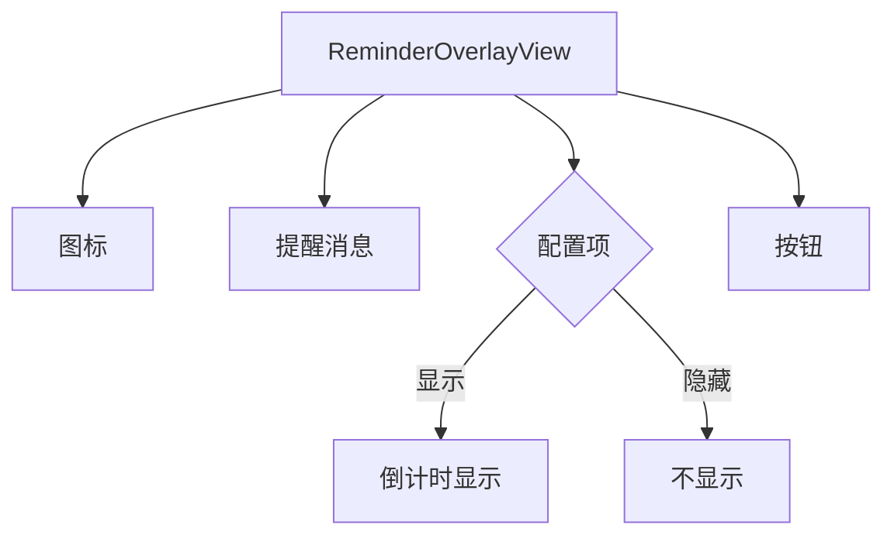

# 隐藏休息倒计时蒙版时间显示

## 概述
移除休息倒计时蒙版页面中的时间显示，只保留提示消息和按钮。

## 当前实现

**问题标注**：当前在 `restCounting` 状态下会显示倒计时时间（如 "04:30"），用户希望隐藏这个时间显示。

## 方案

### 方案一：移除倒计时显示代码（推荐方案 ✅）

**优点**：
- 实现简单直接
- 完全移除不需要的功能

**缺点**：
- 无

**代码修改位置**：
- [ReminderOverlayWindow.swift](vscode://file/Volumes/Cache/X/Sources/View/ReminderOverlayWindow.swift:269)

---

### 方案二：添加配置项控制显示

**优点**：
- 用户可以选择是否显示
- 更灵活

**缺点**：
- 增加配置复杂度
- 对于简单的需求过度设计

**代码修改位置**：
- [ReminderOverlayWindow.swift](vscode://file/Volumes/Cache/X/Sources/View/ReminderOverlayWindow.swift:1)
- [ReminderConfig.swift](vscode://file/Volumes/Cache/X/Sources/Model/ReminderConfig.swift:1)

## 测试用例

1. **休息倒计时状态测试**
   - 触发休息提醒
   - 进入休息倒计时状态
   - 验证蒙版页面不再显示倒计时时间

2. **其他状态测试**
   - 验证 workComplete 状态正常显示
   - 验证 restComplete 状态正常显示

## 任务总结与结论

### 修改内容
移除了 `ReminderOverlayView` 中的倒计时时间显示代码。

### 修改前
在 `restCounting` 状态下会显示大号倒计时时间（如 "04:30"）。

### 修改后
蒙版页面只显示图标、提醒消息和按钮，不再显示倒计时时间。

### 效果
界面更加简洁，用户不会被倒计时数字分散注意力。

## 任务耗时
- 任务开始时间：19:39
- 任务结束时间：19:43
- 任务总耗时：4 分钟
