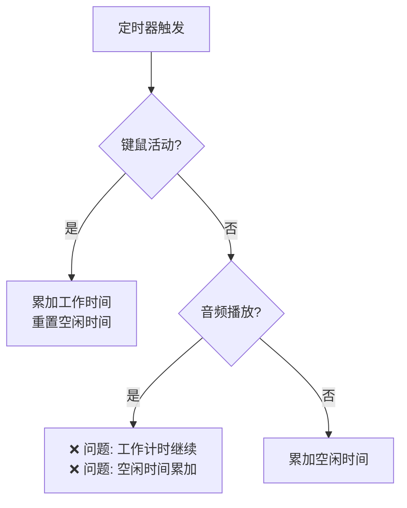
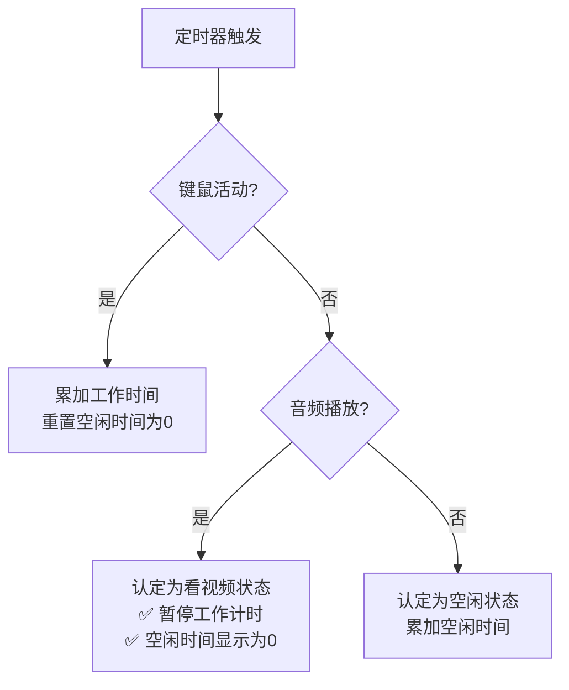
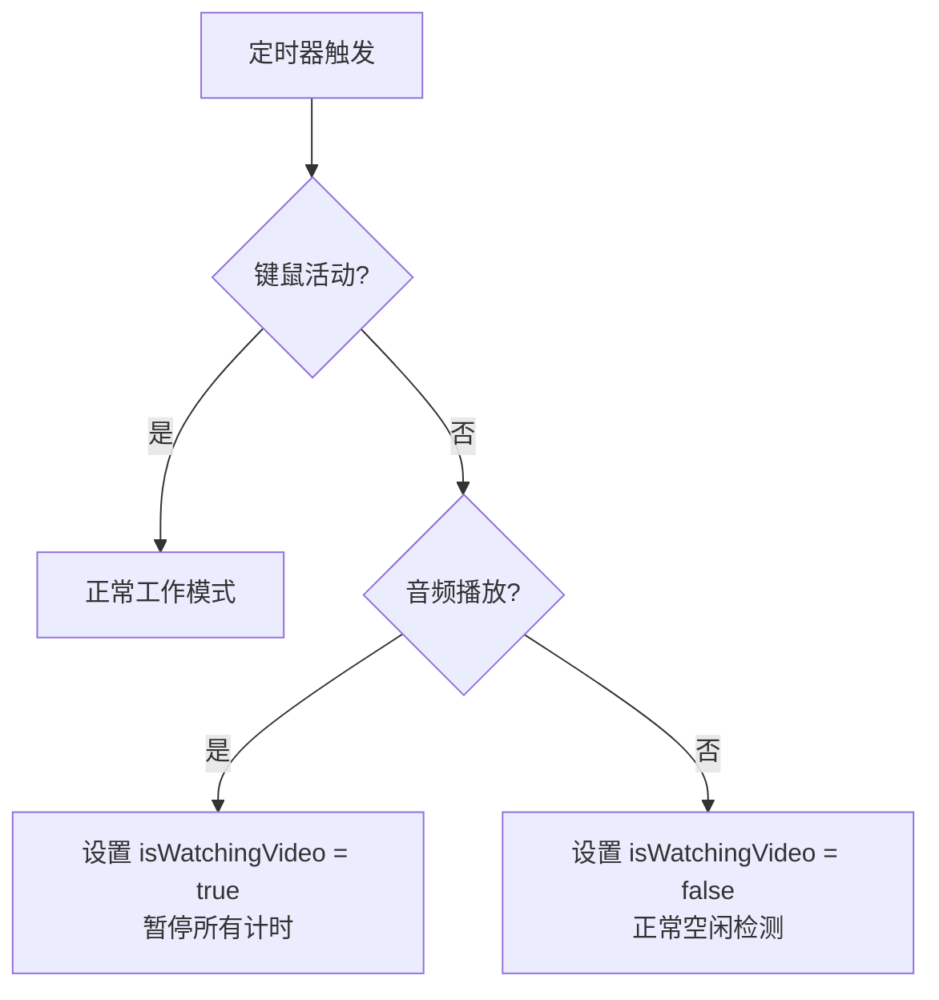

# 音视频播放时暂停菜单栏计时

## 概述
当检测到音频/视频播放且键鼠停止活动时，应认定为"看视频状态"，所有计时都暂停，空闲时间重置为0。只有当没有音频输出但键鼠停止时，才认定为"空闲"，才需要累加空闲时间。

## 当前实现

**问题标注**：
1. 当音频播放+无键鼠活动时，代码应该暂停所有计时，但实际上工作计时和空闲时间都在继续累加
2. `updateStatusBarTimer()` 中的 `idleTime` 直接从 `inputMonitor.timeSinceLastActivity()` 获取，没有考虑"看视频状态"

## 方案

### 方案一：看视频状态时重置空闲时间并暂停所有计时（推荐方案 ✅）

**修改内容**：
1. 当检测到音频播放+无键鼠活动时，认定为"看视频状态"
2. 在"看视频状态"下，`idleTime` 传递 0 而不是实际空闲时间
3. 确保工作计时正确暂停

**优点**：
- 符合用户期望的行为
- 逻辑清晰：看视频 = 暂停一切，空闲 = 累加空闲时间

**缺点**：
- 无

**代码修改位置**：
- [SmartReminderManager.swift - updateStatusBarTimer](vscode://file/Volumes/Cache/X/Sources/Model/SmartReminderManager.swift:428)

---

### 方案二：添加专门的"看视频"状态标志

**优点**：
- 状态更明确
- 便于后续扩展

**缺点**：
- 需要添加新的状态变量
- 修改量较大

**代码修改位置**：
- [SmartReminderManager.swift](vscode://file/Volumes/Cache/X/Sources/Model/SmartReminderManager.swift:1)

## 测试用例

1. **看视频状态测试**
   - 在浏览器中播放视频
   - 停止键鼠操作
   - 验证菜单栏左侧空闲时间显示为 00:00
   - 验证右侧剩余工作时间停止减少（暂停状态）

2. **键鼠恢复测试**
   - 在视频播放状态下移动鼠标或按键
   - 验证工作计时恢复正常累加
   - 验证空闲时间重置为0

3. **无音频空闲测试**
   - 停止视频/音频播放
   - 停止键鼠操作
   - 验证空闲时间正常增加（左侧显示累加）
   - 验证工作计时继续累加（直到空闲超过阈值）

4. **空闲超阈值测试**
   - 停止视频/音频播放
   - 停止键鼠操作超过空闲阈值
   - 验证进入休息判定状态

## 任务总结与结论

### 问题分析
1. 原始问题：音频播放+无键鼠活动时，工作计时和空闲时间都在累加
2. 根本原因：
   - 音频检测使用的方法不够准确
   - 空闲阈值（60秒）导致键鼠停止后需要等待较长时间才被认定为不活跃

### 解决方案
1. **修改检测逻辑优先级**：
   - 键鼠活跃 → 正常计时（无论是否有音频）
   - 键鼠不活跃 + 有音频 → 看视频状态，暂停计时，空闲时间显示0
   - 键鼠不活跃 + 无音频 → 空闲检测

2. **快速响应键鼠状态**：
   - 有音频时：键鼠停下来超过1秒就认为不活跃
   - 无音频时：使用正常的空闲阈值（60秒）

3. **添加 `isPausedByVideo` 标志**：区分"看视频暂停"和"空闲暂停"，便于正确恢复状态

### 修改的文件
- `Sources/Model/SmartReminderManager.swift` - 核心逻辑修改
- `Sources/Model/VideoDetector.swift` - 音频检测优化

### 最终效果
- 播放视频+移动鼠标 → 正常计时
- 播放视频+停止键鼠 → 1秒后暂停计时，空闲时间显示0
- 不播放视频+停止键鼠 → 空闲时间正常累加
- 音频结束+键鼠活跃 → 恢复正常计时

## 任务耗时
- 任务开始时间：19:51
- 任务结束时间：20:58
- 任务总耗时：67 分钟
