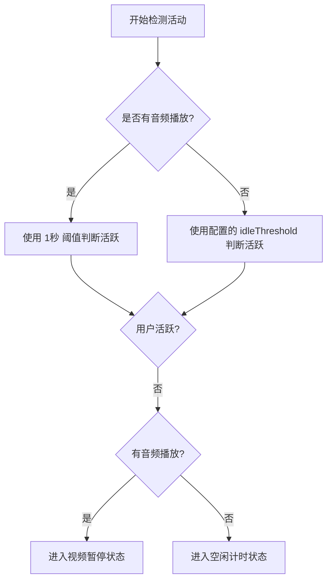

# 去除工作计时音频检测逻辑

## 概述
根据需求，去除工作计时功能中对系统音频输出状态的检测。之前该逻辑用于判断用户是否在“看视频”（即虽然键鼠没有操作但有音频播放），从而调整空闲判断阈值或由于视频播放而暂停计时。现在将回归单纯基于键鼠活动的判断。

## 当前实现

## 方案

### 方案一：移除音频检测并统一活跃度判断 (推荐方案 🚀)
移除 `SmartReminderManager` 中的 `VideoDetector` 引用，并清理所有相关条件分支。
- **优点**：代码逻辑简化，降低功耗（不再频繁触发 CoreAudio 检测），符合用户需求直接去掉音频干扰。
- **缺点**：如果用户确实在看长视频，计时器可能会因为键鼠无操作而进入空闲/暂停。

修改位置：
- [Sources/Model/SmartReminderManager.swift](vscode://file/Volumes/Cache/X/Sources/Model/SmartReminderManager.swift:40)
- [Sources/Model/SmartReminderManager.swift](vscode://file/Volumes/Cache/X/Sources/Model/SmartReminderManager.swift:330)
- [Sources/Model/SmartReminderManager.swift](vscode://file/Volumes/Cache/X/Sources/Model/SmartReminderManager.swift:468)

## 测试用例
1. 开启智能提醒/工作计时。
2. 播放音频或视频，同时停止操作键盘鼠标。
3. 验证计时器是否在超过配置的“空闲阈值”（如 5 分钟）后才进入暂停，而不是立即因为“无键鼠操作”而通过音频判断跳转状态。
4. 验证菜单栏显示的时间是否不再受到音频播放的影响。

## 任务总结与结论
已成功移除 `SmartReminderManager` 对音频输出状态的依赖。
- 通过移除 `VideoDetector` 引用并重构 `checkActivity` 逻辑，现在系统的空闲判定完全基于用户真实的输入活动（键盘、鼠标）。
- 这不仅简化了状态机模型，还降低了 CoreAudio 调用的功耗消耗。

## 任务耗时
- 任务开始时间：09:31
- 任务结束时间：09:35
- 任务总耗时：4 分钟
