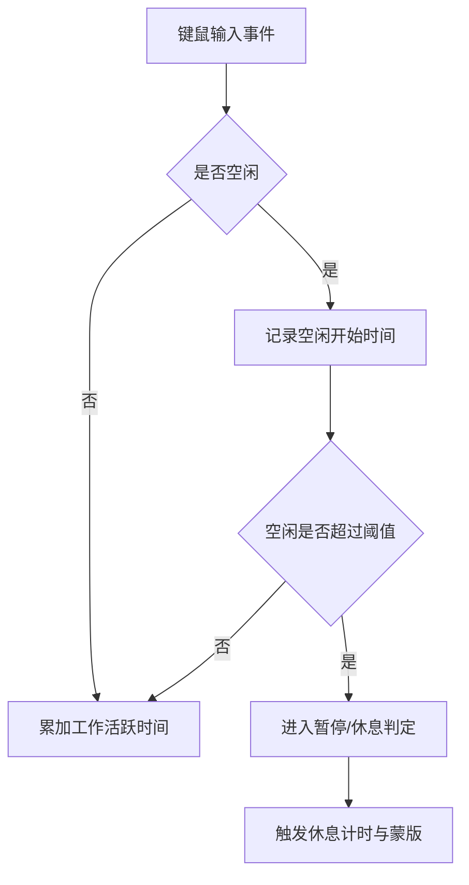
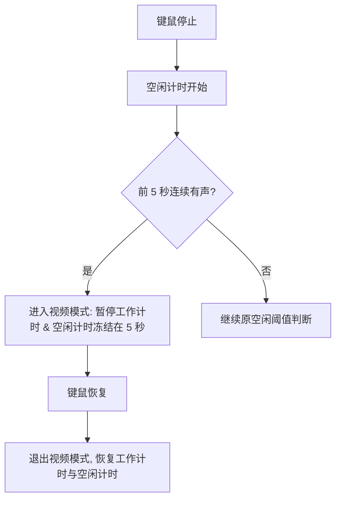
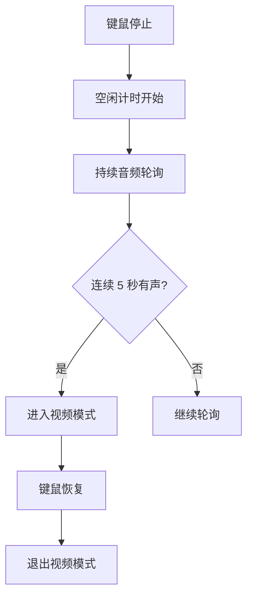
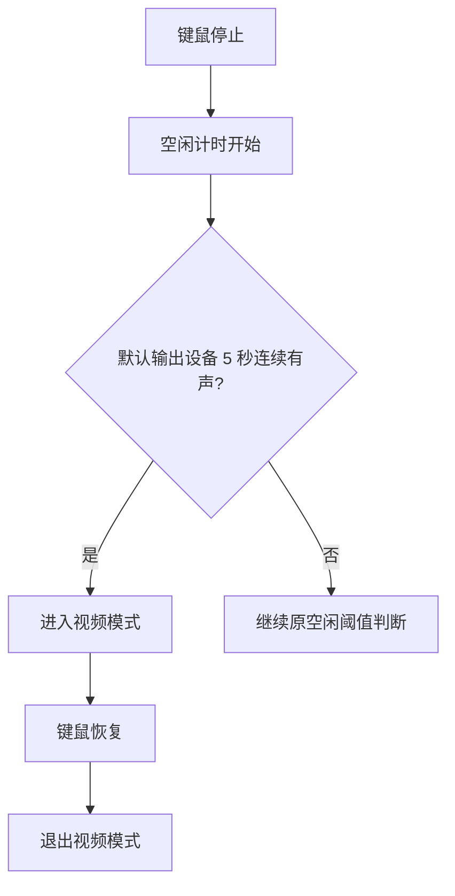
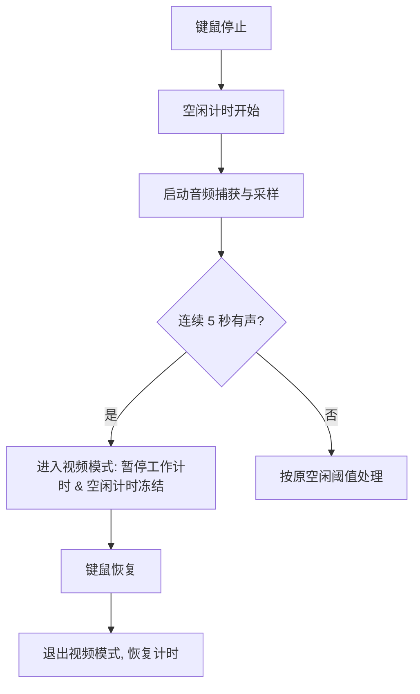

# 音频空闲判断

## 概述
在用户停止键鼠输入后，空闲计时开始的前 5 秒内检测是否存在连续的音频输出；若连续 5 秒都有音频响度，则判定为“看视频/听音频”，暂停工作计时并冻结空闲计时，直到键鼠恢复后再继续工作计时。

## 当前实现

## 方案
### 方案一：在空闲开始后 5 秒内做音频采样，连续有声则进入“视频模式”（推荐方案✅）

优点：
- 与现有计时模型兼容，不影响休息逻辑
- 仅在空闲初期判断，符合需求且实现简单
- 可通过统一音频检测工具复用

缺点：
- 依赖系统音频计量能力，部分设备可能不支持峰值读数

代码修改位置：
- [SmartReminderManager.swift](vscode://file/Volumes/Cache/X/Sources/Model/SmartReminderManager.swift:289)
- [SmartReminderManager.swift](vscode://file/Volumes/Cache/X/Sources/Model/SmartReminderManager.swift:417)
- [AudioActivityMonitor.swift](vscode://file/Volumes/Cache/X/Sources/Utility/AudioActivityMonitor.swift:1)
- [Package.swift](vscode://file/Volumes/Cache/X/Package.swift:16)

### 方案二：在空闲期间持续轮询音频，任意时刻连续 5 秒有声即进入视频模式

优点：
- 对“稍后开始播放音频”的场景更敏感

缺点：
- 与需求“前 5 秒内判断”不完全一致
- 空闲时间越长，误判概率越高

代码修改位置：
- [SmartReminderManager.swift](vscode://file/Volumes/Cache/X/Sources/Model/SmartReminderManager.swift:289)
- [AudioActivityMonitor.swift](vscode://file/Volumes/Cache/X/Sources/Utility/AudioActivityMonitor.swift:1)

### 方案三：仅检测默认输出设备，简化音频判断

优点：
- 实现成本最低，性能开销小

缺点：
- 不能覆盖多输出设备场景

代码修改位置：
- [SmartReminderManager.swift](vscode://file/Volumes/Cache/X/Sources/Model/SmartReminderManager.swift:289)
- [AudioActivityMonitor.swift](vscode://file/Volumes/Cache/X/Sources/Utility/AudioActivityMonitor.swift:1)

## 测试用例
1. 停止键鼠操作，确保前 5 秒无音频输出，确认仍按原逻辑累加空闲时间并按阈值进入休息。
2. 停止键鼠操作，同时连续播放音频 5 秒，确认进入视频模式：工作计时暂停、空闲时间冻结。
3. 视频模式下恢复键鼠操作，确认工作计时继续、空闲时间恢复为实时显示。
4. 空闲 5 秒内断续有声（非连续），确认不进入视频模式。

## 任务总结与结论
已完成音频响度检测与视频模式判定，并补充屏幕录制权限引导。现在在用户停止键鼠后，进入 5 秒音频检测窗口，连续 5 秒有声将触发视频模式并冻结空闲计时；权限缺失时会提示并引导跳转系统设置。

## 任务耗时
- 任务开始时间：1018
- 任务结束时间：1118
- 任务总耗时：60 分钟
