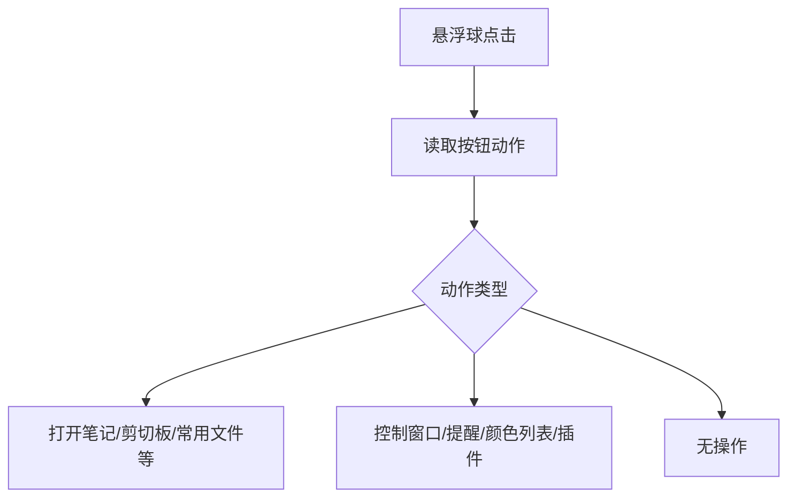
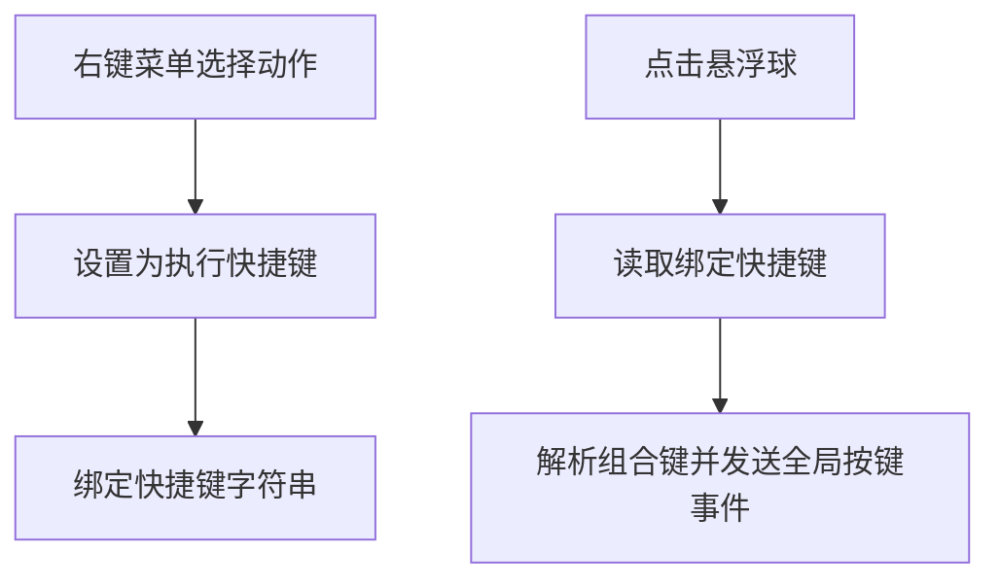
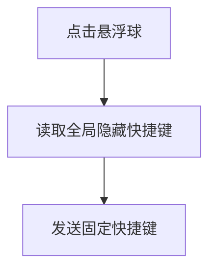
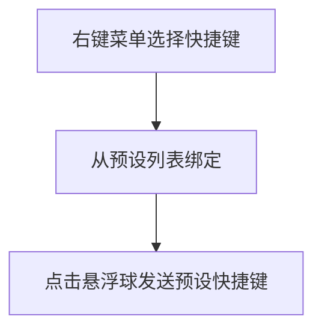
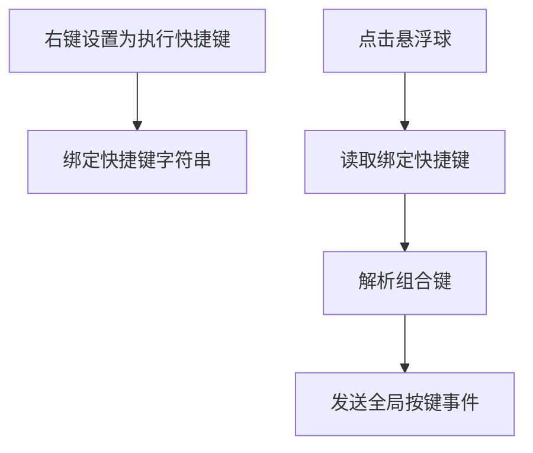

# 悬浮球快捷键绑定

## 概述
为悬浮球新增“执行快捷键”能力：用户可为每个悬浮球绑定一个快捷键，点击悬浮球时触发该快捷键的全局执行。

## 当前实现

## 方案
### 方案一：新增“执行快捷键”动作 + 右键菜单绑定（推荐方案✅）

优点：
- 贴合现有动作体系，操作入口清晰
- 每个悬浮球独立绑定，灵活
- 与当前快捷键格式保持一致

缺点：
- 需要新增热键解析与事件发送的公共工具

代码修改位置：
- [AppDelegate.swift](vscode://file/Volumes/Cache/X/Sources/App/AppDelegate.swift:338)
- [AppDelegate.swift](vscode://file/Volumes/Cache/X/Sources/App/AppDelegate.swift:396)
- [GlowFloatingButtonView.swift](vscode://file/Volumes/Cache/X/Sources/View/GlowFloatingButtonView.swift:377)
- [FloatingButtonConfig.swift](vscode://file/Volumes/Cache/X/Sources/Model/FloatingButtonConfig.swift:6)
- [FloatingButtonConfig.swift](vscode://file/Volumes/Cache/X/Sources/Model/FloatingButtonConfig.swift:215)
- [HotkeyParser.swift](vscode://file/Volumes/Cache/X/Sources/Utility/HotkeyParser.swift:1)
- [HotkeyExecutor.swift](vscode://file/Volumes/Cache/X/Sources/Utility/HotkeyExecutor.swift:1)
- [Package.swift](vscode://file/Volumes/Cache/X/Package.swift:16)

### 方案二：复用全局隐藏快捷键（不新增绑定字段）

优点：
- 实现最简单，不新增配置字段

缺点：
- 无法做到每个悬浮球独立绑定
- 与需求“可绑定”不完全一致

代码修改位置：
- [AppDelegate.swift](vscode://file/Volumes/Cache/X/Sources/App/AppDelegate.swift:396)

### 方案三：提供预设快捷键列表（避免任意输入）

优点：
- 交互简单，输入错误少

缺点：
- 灵活性不足，覆盖场景有限

代码修改位置：
- [GlowFloatingButtonView.swift](vscode://file/Volumes/Cache/X/Sources/View/GlowFloatingButtonView.swift:377)
- [FloatingButtonConfig.swift](vscode://file/Volumes/Cache/X/Sources/Model/FloatingButtonConfig.swift:6)

## 测试用例
1. 将某悬浮球动作设置为“执行快捷键”，绑定如 Cmd+Shift+Y，点击悬浮球，确认系统收到该快捷键。
2. 未绑定快捷键时点击悬浮球，确认有提示或无操作。
3. 删除悬浮球后，确认快捷键绑定数据随索引迁移。
4. 多个悬浮球分别绑定不同快捷键，点击时互不影响。

## 任务总结与结论
已新增“执行快捷键”动作与快捷键绑定数据结构，右键菜单支持绑定/清除快捷键，点击悬浮球会解析并发送全局按键事件，实现绑定快捷键触发。

## 任务耗时
- 任务开始时间：1121
- 任务结束时间：1136
- 任务总耗时：15 分钟
