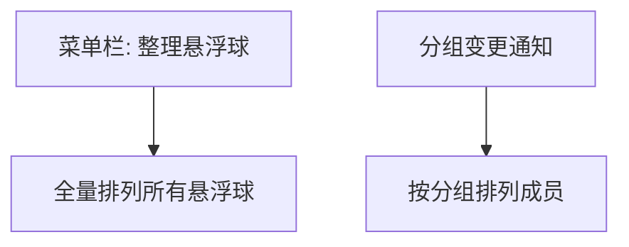
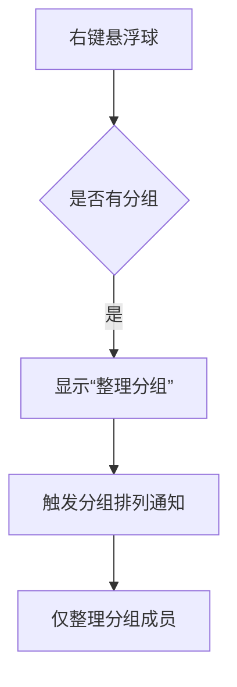
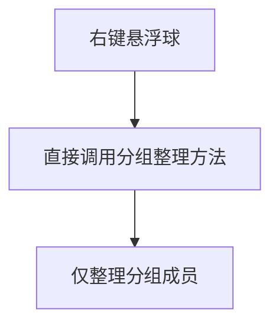
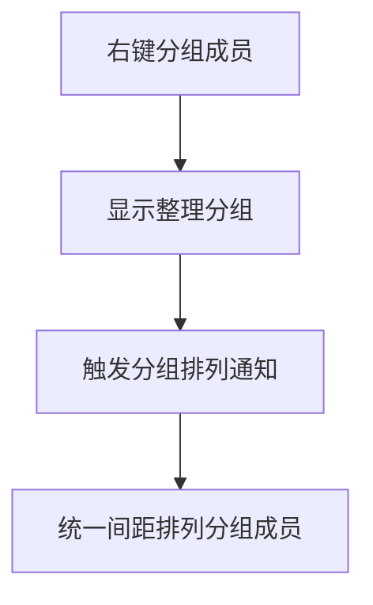

# 分组整理菜单

## 概述
在悬浮球右键菜单中新增“整理分组”入口：当悬浮球属于分组时显示该菜单项，点击后仅整理该分组内悬浮球，按均匀间隔排列，不移动到屏幕右半边。

## 当前实现

## 方案
### 方案一：复用分组排列逻辑，右键菜单触发（推荐方案✅）

优点：
- 复用现有分组排列实现，改动范围小
- 满足“仅分组内整理、不移至右半屏”要求

缺点：
- 依赖分组布局设置，需确保间距一致

代码修改位置：
- [GlowFloatingButtonView.swift](vscode://file/Volumes/Cache/X/Sources/View/GlowFloatingButtonView.swift:377)
- [FloatingButtonView.swift](vscode://file/Volumes/Cache/X/Sources/View/FloatingButtonView.swift:470)
- [AppDelegate.swift](vscode://file/Volumes/Cache/X/Sources/App/AppDelegate.swift:1015)

### 方案二：新增独立分组整理方法（不复用通知）

优点：
- 流程更直观，不依赖通知

缺点：
- 需新增方法并维护两套整理入口

代码修改位置：
- [AppDelegate.swift](vscode://file/Volumes/Cache/X/Sources/App/AppDelegate.swift:1015)
- [GlowFloatingButtonView.swift](vscode://file/Volumes/Cache/X/Sources/View/GlowFloatingButtonView.swift:377)

## 测试用例
1. 将多个悬浮球加入同一分组，右键任意分组成员，确认出现“整理分组”。
2. 点击“整理分组”，仅分组内悬浮球按均匀间隔排列，位置不移动到屏幕右半边。
3. 单成员分组不显示“整理分组”或点击无效果。

## 任务总结与结论
已在悬浮球右键菜单加入“整理分组”，并复用分组排列逻辑，按统一间距在原位置整理分组成员，避免移动到屏幕右半边。

## 任务耗时
- 任务开始时间：1140
- 任务结束时间：1145
- 任务总耗时：5 分钟
