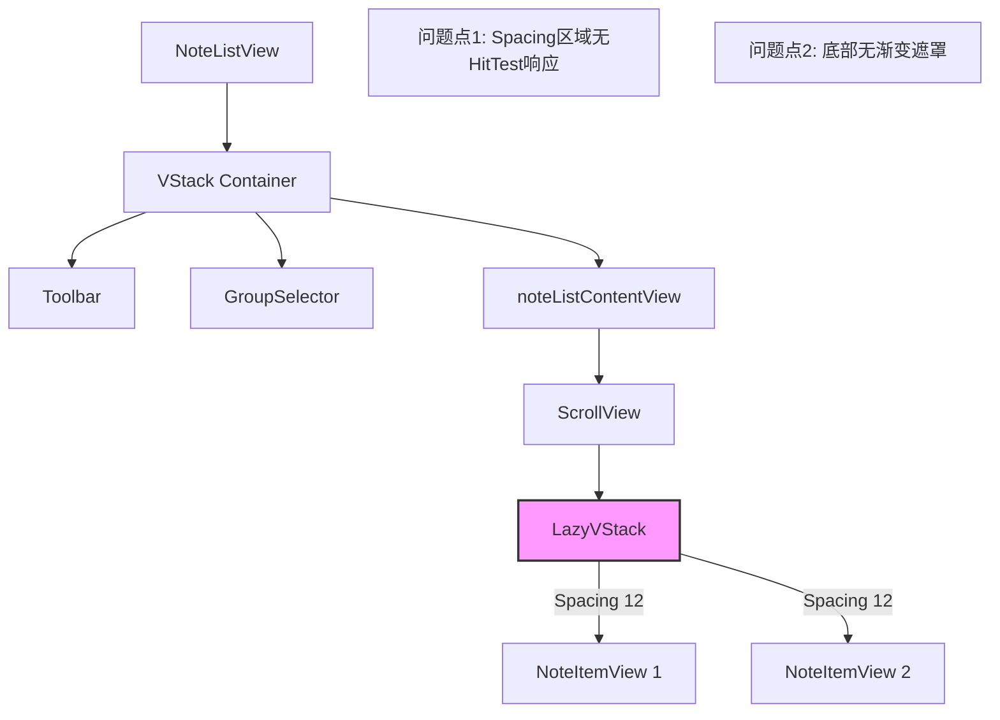
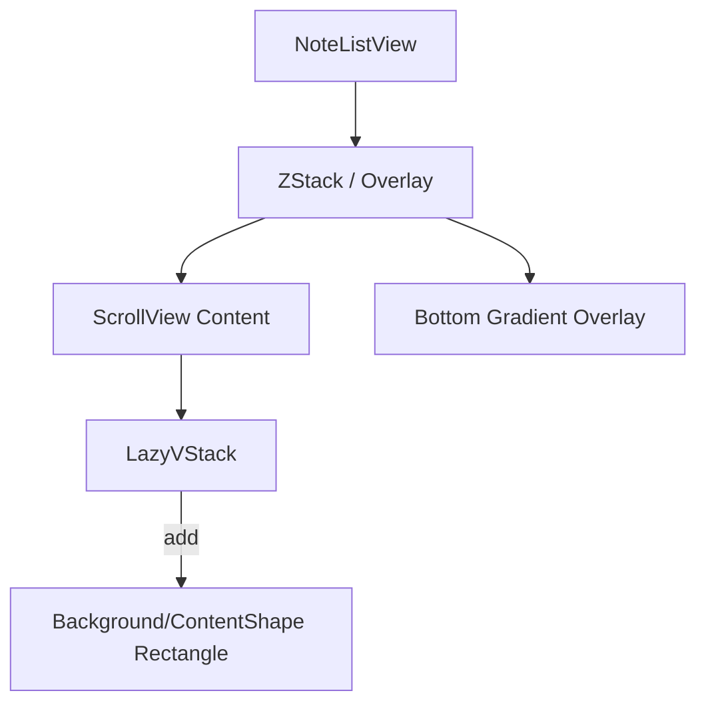

# Note List Scroll & Visual Polish

## 概述
用户反馈了两个问题：
1. **列表滚动失效**：当鼠标位于笔记之间的空隙（spacing）时，无法触发滚动。
2. **底部视觉生硬**：笔记列表滚动到底部时，内容被直接截断，视觉效果不佳，需要添加模糊/渐变过渡效果。

## 当前实现
当前 `NoteListView.swift` 中：
- 使用 `ScrollView` 包含 `LazyVStack`。
- `LazyVStack` 设置了 `spacing: 12`。
- 只有具体的 `NoteItemView` 有背景和点击区域，`LazyVStack` 的空隙处（spacing）没有设置点击区（contentShape）或背景，导致在空隙处滚动事件穿透，未能被 ScrollView 捕获（或者被下层视图捕获但不处理）。
- `noteListContentView` 直接展示 ScrollView，底部没有遮罩或渐变处理。



## 方案

### 🚀 推荐方案

#### 解决滚动问题
给 `LazyVStack` 添加一个几乎透明的背景或 `contentShape`，确保整个列表区域（包括间隙）都能接收触控/滚动事件。
- 修改位置：`NoteListView.swift` 中的 `noteListContentView`。

#### 解决底部视觉问题
在 `noteListContentView` 或其 ScrollView 上层叠加一个底部渐变遮罩（LinearGradient），使内容在底部呈现淡出效果，而不是生硬截断。
- 修改位置：`NoteListView.swift` 中的 `noteListContentView`。



**优缺点：**
- **优点**：改动小，直接解决用户痛点，符合 SwiftUI 标准做法。
- **缺点**：遮罩颜色可能需要适配暗色/亮色模式（当前项目看来主要是暗色透明风格，使用黑色半透明渐变即可）。

### 代码修改位置

[NoteListView.swift](vscode://file/Volumes/Cache/X/Sources/View/NoteListView.swift:772)

1. **LazyVStack**:
   ```swift
   LazyVStack(...) {
       ...
   }
   // 添加几乎透明背景以捕获事件
   .background(Color.black.opacity(0.001)) 
   ```

2. **ScrollView Overlay**:
   ```swift
   ScrollView(...) {
       ...
   }
   .overlay(
       LinearGradient(...)
           .frame(height: 30)
           .allowsHitTesting(false),
       alignment: .bottom
   )
   ```

## 测试用例

### 验证滚动空隙
1. 打开笔记列表。
2. 确保至少有 3-4 条笔记，使得列表可以滚动。
3. 将鼠标光标精确放置在两个笔记之间的空白区域（12px spacing 区域）。
4. 尝试滚动鼠标滚轮。
5. **预期结果**：列表应正常滚动，不会无响应。

### 验证底部渐变
1. 打开笔记列表。
2. 滚动列表，观察底部边界。
3. **预期结果**：底部边缘上方应有一层淡淡的黑色/暗色渐变，使划出屏幕的笔记看起来是“淡出”或更柔和地消失，而不是被一条线切断。

## 任务总结与结论
1. **滚动修复**：通过为 `LazyVStack` 添加透明背景 (`Color.black.opacity(0.001)`)，成功解决了笔记间隙无法响应滚动的 Bug，提升了列表交互的连贯性。
2. **视觉优化**：
   - **问题**：原列表底部内容被生硬截断，且滚动至底部时视觉效果不佳。
   - **方案**：引入了基于 `ultraThinMaterial`（超薄磨砂材质）的渐变遮罩。
   - **实现细节**：遮罩宽度精确锁定为 **274px**（基于笔记组件内部布局计算所得），高度设定为 **35px**。采用 `UnevenRoundedRectangle` 仅对底部两角应用 **20px** 圆角，并配合 `Mask` 技术对内容层进行同步裁剪，确保了画面边缘的绝对整洁（无内容溢出）和右侧功能区按钮的无干扰显示。

## 任务耗时
- 任务开始时间：1156
- 任务结束时间：1332
- 任务总耗时：96 分钟
