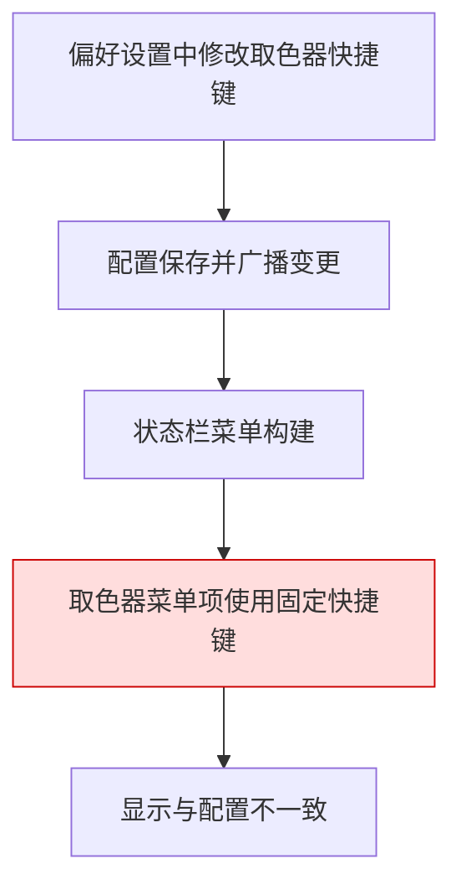
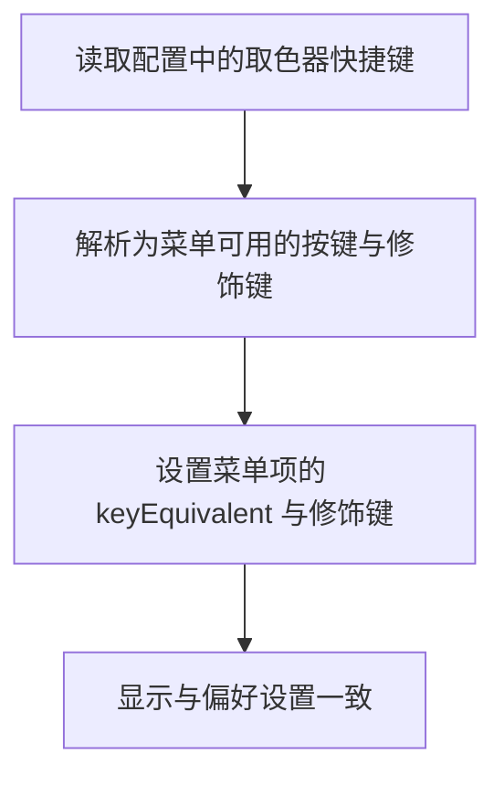
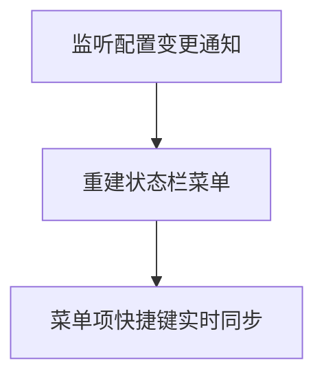
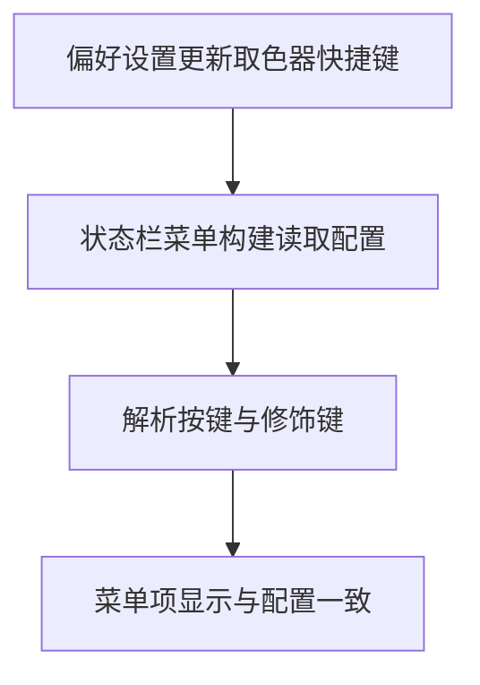

# 状态栏取色器快捷键显示修复

## 概述
状态栏菜单里的“取色器”快捷键显示与偏好设置中的配置不一致，需要让菜单显示与当前配置保持一致。

## 当前实现

## 方案
### 推荐方案🚀 方案一：菜单构建时读取配置并解析为菜单快捷键

优点：实现简单、改动集中、与现有配置同步。
缺点：当配置更新后仍需菜单重建才能立即刷新显示。
代码修改位置：
[AppDelegate.swift](vscode://file/Volumes/Cache/X/Sources/App/AppDelegate.swift:855)
[AppDelegate.swift](vscode://file/Volumes/Cache/X/Sources/App/AppDelegate.swift:287)

### 方案二：在配置变更时主动重建状态栏菜单

优点：菜单显示可即时更新。
缺点：需要新增监听逻辑，影响面略大。
代码修改位置：
[AppDelegate.swift](vscode://file/Volumes/Cache/X/Sources/App/AppDelegate.swift:31)
[AppDelegate.swift](vscode://file/Volumes/Cache/X/Sources/App/AppDelegate.swift:759)

## 测试用例
1. 打开偏好设置，修改“取色器”快捷键为另一组组合键并保存。
2. 打开状态栏菜单，检查“取色器”菜单项右侧快捷键显示是否与偏好设置一致。
3. 将取色器快捷键重置为默认值，再次验证状态栏菜单显示是否一致。

## 任务总结与结论
已将状态栏菜单“取色器”快捷键从固定值改为读取配置并解析显示，确保菜单展示与偏好设置一致。

## 任务耗时
- 任务开始时间：1243
- 任务结束时间：1258
- 任务总耗时：15 分钟
