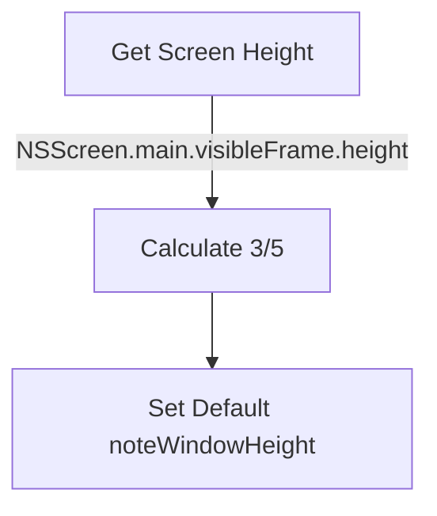

# Note Window Default Height Adjustment

## 概述
用户要求修改笔记窗口高度的默认值，使其为屏幕高度的 **3/5** (60%)。

## 当前实现
在 `FloatingButtonConfig.swift` 中，静态默认配置 `default` 将 `noteWindowHeight` 初始化为：
```swift
noteWindowHeight: NSScreen.main?.visibleFrame.height ?? 500
```
这将默认高度设置为当前屏幕的**全部可见高度**（减去 Dock 和菜单栏）。

## 方案

### 🚀 推荐方案
修改 `FloatingButtonConfig.default` 的初始化逻辑，将高度计算改为屏幕可见高度的 3/5。



**代码修改位置：**
[FloatingButtonConfig.swift](vscode://file/Volumes/Cache/X/Sources/Model/FloatingButtonConfig.swift:309)

```swift
// 旧代码
noteWindowHeight: NSScreen.main?.visibleFrame.height ?? 500,

// 新代码
noteWindowHeight: (NSScreen.main?.visibleFrame.height ?? 900) * 0.6,
```
*备注：将 fallback 值调整为 900（常见屏幕高度），避免无屏幕环境计算出过小数值 (500 * 0.6 = 300)。*

## 测试用例
1. **新用户/重置配置**：删除应用配置/数据库，重启应用。
2. **验证高度**：打开笔记窗口。
3. **预期结果**：笔记窗口的高度应大约占据屏幕高度的 60%，而不是铺满整个屏幕高度。

## 任务总结与结论
已成功修改 `FloatingButtonConfig.swift` 中的默认配置。将 `noteWindowHeight` 的初始化逻辑由屏幕全高调整为 `(visibleFrame.height ?? 900) * 0.6`，即屏幕高度的五分之三。此更改将优化新用户的默认体验，避免笔记窗口初始即铺满全屏。

## 任务耗时
- 任务开始时间：1335
- 任务结束时间：1337
- 任务总耗时：2 分钟
