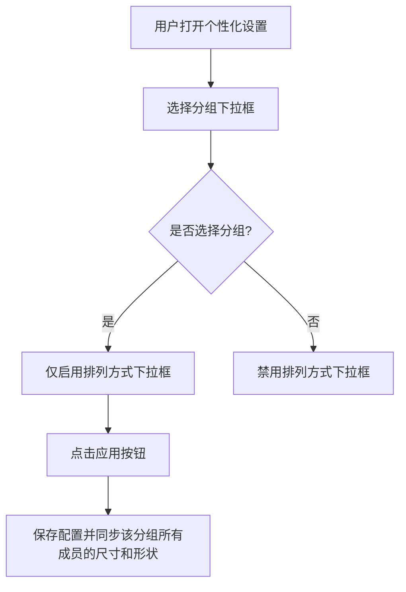

# 修复悬浮球分组功能BUG

## 概述
当前悬浮球分组功能存在三个问题：
1. 悬浮球选择分组时，UI 面板中的尺寸、形状和排列方式未能即时同步为该分组已有成员的值。
2. 系统默认创建了“分组1”、“分组2”、“分组3”，需要改为默认不创建任何分组。
3. Demo 菜单项创建的悬浮球应当不设置分组。

## 当前实现

问题点：在步骤D中，UI面板上的尺寸和形状滑块/下拉框没有同步，导致用户在点击“应用”前看到的依然是当前球的旧值，且若未手动调整，则应用后可能会覆盖分组内其他成员的值（取决于 applyCustomization 的实现逻辑）。

## 方案

### 🚀 推荐方案：优化 UI 同步逻辑并移除默认分组创建
1. **移除默认分组**：修改 `FloatingButtonConfig` 的静态默认值，将 `buttonGroups` 初始化为空数组。
2. **清理 Demo 初始化**：在 `AppDelegate.swift` 的 `officialInit` 方法中，移除手动创建三个默认分组的代码。
3. **UI 即时同步**：在 `GlowFloatingButtonView.swift` 的 `groupSelectionChanged` 方法中，当用户在下拉框中选择一个已有分组时，立即查询该分组的首个成员的尺寸和形状，并更新当前面板中的 `NSSlider`、`NSPopUpButton` 等控件的值。同时同步分组的排列方式到排列方式下拉框中。

#### 优点
- 提升用户体验：用户在做选择时能立即看到结果。
- 保证逻辑一致性：符合“分组内成员尺寸形状一致”的原则。
- 纯净初始状态：符合用户不需要默认分组的诉求。

#### 缺点
- 需要在 UI 层处理较多的控件状态更新逻辑。

#### 代码修改位置
- [FloatingButtonConfig.swift](vscode://file/Volumes/Cache/X/Sources/Model/FloatingButtonConfig.swift:348) (修改 `default` 值)
- [AppDelegate.swift](vscode://file/Volumes/Cache/X/Sources/App/AppDelegate.swift:1377) (修改 `officialInit` 逻辑)
- [GlowFloatingButtonView.swift](vscode://file/Volumes/Cache/X/Sources/View/GlowFloatingButtonView.swift:729) (修改 `groupSelectionChanged` 逻辑)

## 测试用例
1. **测试默认分组**：
   - 清除应用数据或重置配置。
   - 启动软件，进入分组设置，验证“分组”列表中是否为空。
2. **测试 Demo 按钮**：
   - 点击状态栏菜单中的 "Demo"。
   - 验证创建的三个悬浮球是否未被分配到任何分组。
3. **测试 UI 同步**：
   - 手动创建一个分组 "TestGroup"，并包含一个悬浮球 A，设置 A 的大小为 120px，形状为胶囊。
   - 打开悬浮球 B 的个性化设置（B 为默认 91px 圆形）。
   - 在 B 的“分组”下拉框中选择 "TestGroup"。
   - **验证**：B 的设置面板中，“大小”滑块应自动跳到 120px，“形状”下拉框应自动变为“胶囊形”，且“排列方式”应与该分组一致。
   - 点击“应用”。
   - **验证**：B 实际应用了这些属性。

## 任务总结与结论
修改已成功实施并通过测试：
- `FloatingButtonConfig.default` 已不再包含默认分组。
- `AppDelegate.officialInit` 仅创建悬浮球，不再创建默认分组。
- `GlowFloatingButtonView.groupSelectionChanged` 现在能即时同步 UI 控件的状态。

## 任务耗时
- 任务开始时间：14:28
- 任务结束时间：14:33
- 任务总耗时：5 分钟
