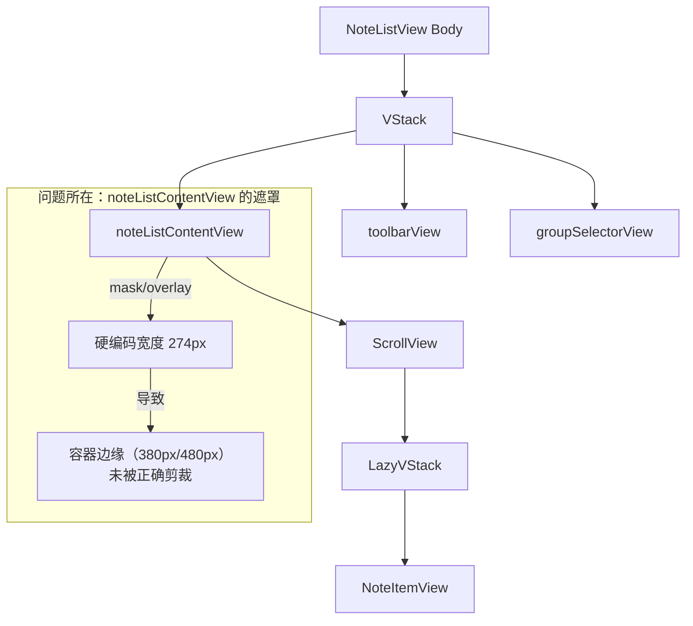

# 修复笔记列表容器圆角遮盖问题

## 概述
用户反馈笔记下方的容器在设置圆角后，未能完全遮盖住内部的笔记项，导致在笔记列表底部的两边出现了笔记的边框。这通常是因为外层容器的裁剪圆角（mask/clipShape）与内部笔记项的背景/边框不匹配，或者由于硬编码的宽度导致遮罩未覆盖全宽。

## 当前实现

## 方案

### 方案 1：移除底部遮罩并应用全层级圆角 🚀
按照用户建议，彻底移除 `noteListContentView` 中的硬编码遮罩（mask 和 overlay），并将所有外层容器的底部角设置为与笔记项一致的圆角（20px）。

**层级包括**：
1. `NoteListView` 的 `body` (整体容器)
2. `NoteListView` 中的核心 `VStack`
3. `noteListContentView` (列表内容容器)

**优点**：
- 结构清晰，完全避免了硬编码宽度带来的适配问题。
- 确保内外圆角完全重合，消除“边框外露”现象。

**修改位置**：
[Sources/View/NoteListView.swift](vscode://file/Volumes/Cache/X/Sources/View/NoteListView.swift:527) - 整体容器圆角
[Sources/View/NoteListView.swift](vscode://file/Volumes/Cache/X/Sources/View/NoteListView.swift:817) - ListContentView 主体
[Sources/View/NoteListView.swift](vscode://file/Volumes/Cache/X/Sources/View/NoteListView.swift:841) - 移除 Mask 和 Overlay

### 方案 2：将遮挡逻辑移至最外层
不再在 `noteListContentView` 内部做复杂的 mask 逻辑，而是依靠 `NoteListView` 整体的裁剪。如果需要底部的渐变遮罩，使用简单的渐变叠加层而非复杂的组合 mask。

**优点**：
- 代码结构更简单。

**缺点**：
- 可能会影响某些布局精细度。

**修改位置**：
[Sources/View/NoteListView.swift](vscode://file/Volumes/Cache/X/Sources/View/NoteListView.swift:527)

## 测试用例
1. 打开笔记列表。
2. 滚动到底部。
3. 观察底部圆角处，笔记项的背景色或边框是否超出了外层容器的圆角。
4. 切换搜索模式（改变窗口宽度），再次观察底部圆角。
5. 确认笔记右侧的工具按钮（删除、移动等）在滚动到底部时依然可见且交互正常。

## 任务总结与结论
通过移除 `NoteListView` 中硬编码宽度的底部遮罩层，并统一应用与笔记项一致的 20px 底部圆角剪裁，成功解决了笔记列表在滚动到底部时边缘边框外露的问题。该修复不仅美化了 UI，还增强了界面在不同宽度（如搜索模式）下的适配能力。

## 任务耗时
- 任务开始时间：14:43
- 任务结束时间：14:52
- 任务总耗时：9 分钟
