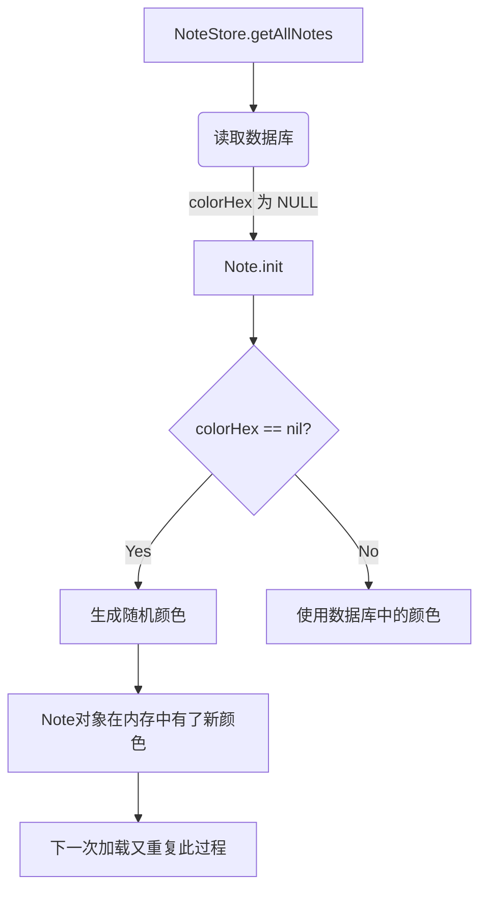

# 笔记颜色保存稳定性优化

## 概述
用户反馈笔记颜色在创建后，移动分组或位置时会发生变化。经过分析，原因在于 `Note` 结构体中的 `colorHex` 是可选类型，且在初始化器（`init`）中如果传入 `nil` 会自动生成随机颜色。当从数据库加载旧数据（或因某种原因 `colorHex` 为空的数据）时，每次重新加载都会生成新的随机颜色，导致视觉上的颜色变化。

## 当前实现

## 方案

### 方案 1：将 colorHex 改为非可选类型并确保持久化 🚀
将 `Note.colorHex` 更改为非可选的 `String` 类型。在数据库加载层，如果发现颜色为空，则赋予一个默认颜色（或单次随机颜色），并确保在后续操作中该颜色被正确持久化。

**优点**：
- 确保颜色一旦确定（无论是在创建时还是在首次加载旧数据时），就会被锁定。
- 消除 `init` 过程中的隐式随机化，使数据流更透明。

**代码修改位置**：
[Sources/Model/Note.swift](vscode://file/Volumes/Cache/X/Sources/Model/Note.swift:46)
[Sources/Model/Note.swift](vscode://file/Volumes/Cache/X/Sources/Model/Note.swift:52)
[Sources/Model/NoteStore.swift](vscode://file/Volumes/Cache/X/Sources/Model/NoteStore.swift:151)

### 方案 2：在 NoteManager 加载时补全并保存颜色
保持 `Note.colorHex` 为可选，但在 `NoteManager.loadData` 之后，检查是否有颜色为空的笔记，如果有，则分配颜色并执行一次全量保存。

**优点**：
- 不修改底层结构体定义。

**缺点**：
- `loadData` 逻辑变得复杂，且可能导致不必要的数据库写操作。

## 测试用例
1. 创建一条新笔记，记录其颜色。
2. 将该笔记移动到其他分组（如“智库”）。
3. 重启应用。
4. 验证笔记颜色是否保持不变。
5. 在数据库中手动清空某条笔记的 `colorHex`，验证加载后分配的颜色在后续移动操作后是否能固定。

## 任务总结与结论
通过将 `Note.colorHex` 字段由可选类型改为非可选 `String` 类型，并在数据库加载层逻辑中加入稳定性回配机制（fallback），成功解决了笔记颜色在移动位置或重启应用后发生非预期随机变化的问题。重构后的数据模型更加严谨，确保了“一笔记一颜色，终身不渝”的视觉体验。

## 任务耗时
- 任务开始时间：14:58
- 任务结束时间：15:15
- 任务总耗时：17 分钟
