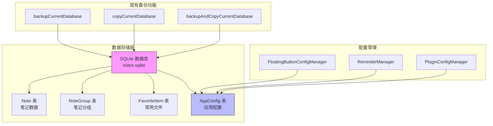
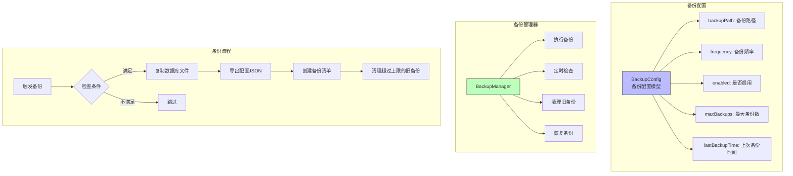
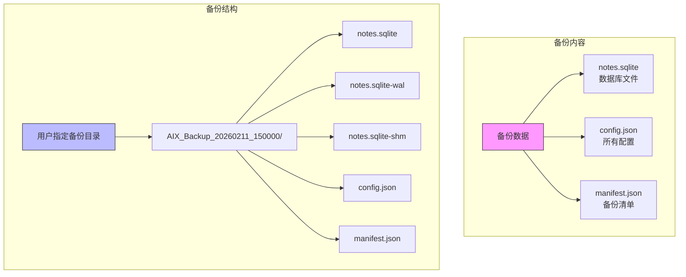
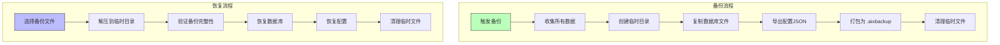
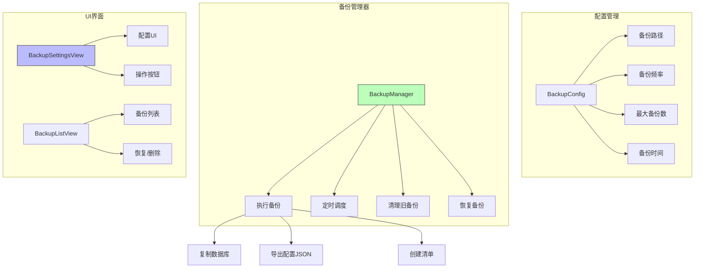

# 数据备份功能开发

## 概述
开发数据备份功能，支持指定备份频率，将所有设置、悬浮球配置、笔记等内容备份到用户指定的文件夹。功能包括自动定时备份、手动备份、备份管理和恢复。

## 当前实现



### 数据存储分析

| 数据类型 | 存储位置 | 存储格式 |
|---------|---------|---------|
| 笔记内容 | Note 表 | SQLite |
| 笔记分组 | NoteGroup 表 | SQLite |
| 常用文件 | FavoriteItem 表 | SQLite |
| 悬浮球配置 | AppConfig 表 (key: floatingButtonConfig) | JSON |
| 提醒配置 | AppConfig 表 (key: reminderConfig) | JSON |
| 智能提醒配置 | AppConfig 表 (key: smartReminderConfig) | JSON |
| 插件配置 | AppConfig 表 (key: pluginConfigs) | JSON |

### 现有备份方法

1. **backupCurrentDatabase()** - 备份当前数据库到同目录，返回备份路径
2. **copyCurrentDatabase(to:)** - 复制数据库到指定路径
3. **backupAndCopyCurrentDatabase(to:)** - 先备份再复制

## 方案

### 方案一：基于 SQLite 数据库的完整备份



**优点：**
- 实现简单，复用现有数据库备份逻辑
- 备份文件体积小（仅 SQLite 文件）
- 恢复速度快
- 与现有导入功能兼容

**缺点：**
- 配置存储在数据库中，无法单独查看
- 跨版本兼容性较差

**代码修改位置：**
- [Sources/Model/BackupConfig.swift](vscode://file/Volumes/Cache/X/Sources/Model/BackupConfig.swift:1) - 新建备份配置模型
- [Sources/Model/BackupManager.swift](vscode://file/Volumes/Cache/X/Sources/Model/BackupManager.swift:1) - 新建备份管理器
- [Sources/View/SettingsView.swift](vscode://file/Volumes/Cache/X/Sources/View/SettingsView.swift:305) - 添加备份设置 UI
- [Sources/Model/AppDatabase.swift](vscode://file/Volumes/Cache/X/Sources/Model/AppDatabase.swift:49) - 扩展备份方法

---

### 方案二：JSON + SQLite 混合备份（推荐方案 ✨）



**备份目录结构示例：**
```
/用户指定路径/
├── AIX_Backup_20260211_150000/
│   ├── notes.sqlite
│   ├── notes.sqlite-wal
│   ├── notes.sqlite-shm
│   ├── config.json          # 所有 AppConfig 配置
│   └── manifest.json        # 备份清单（版本、时间、文件列表）
├── AIX_Backup_20260212_090000/
│   └── ...
```

**config.json 内容：**
```json
{
  "floatingButtonConfig": { ... },
  "reminderConfig": { ... },
  "smartReminderConfig": { ... },
  "pluginConfigs": { ... },
  "useSmartReminder": "true",
  ...
}
```

**manifest.json 内容：**
```json
{
  "version": "1.0",
  "appVersion": "当前应用版本",
  "backupTime": "2026-02-11T15:00:00+08:00",
  "files": ["notes.sqlite", "config.json"],
  "noteCount": 50,
  "groupCount": 5
}
```

**优点：**
- 配置以 JSON 格式独立存储，可读性好
- 可以单独恢复配置而不影响数据
- 支持跨版本兼容
- 备份内容完整，便于迁移

**缺点：**
- 实现复杂度稍高
- 备份文件较多
- 需要处理 JSON 和数据库的一致性

**代码修改位置：**
- [Sources/Model/BackupConfig.swift](vscode://file/Volumes/Cache/X/Sources/Model/BackupConfig.swift:1) - 新建备份配置模型
- [Sources/Model/BackupManager.swift](vscode://file/Volumes/Cache/X/Sources/Model/BackupManager.swift:1) - 新建备份管理器
- [Sources/View/SettingsView.swift](vscode://file/Volumes/Cache/X/Sources/View/SettingsView.swift:305) - 添加备份设置 UI
- [Sources/Model/AppDatabase.swift](vscode://file/Volumes/Cache/X/Sources/Model/AppDatabase.swift:49) - 扩展备份方法

---

### 方案三：压缩包备份



**优点：**
- 单文件备份，便于管理
- 可以添加版本信息和校验
- 便于分享和传输

**缺点：**
- 实现最复杂
- 压缩/解压耗时
- 需要额外的压缩库

**代码修改位置：**
- [Sources/Model/BackupConfig.swift](vscode://file/Volumes/Cache/X/Sources/Model/BackupConfig.swift:1) - 新建备份配置模型
- [Sources/Model/BackupManager.swift](vscode://file/Volumes/Cache/X/Sources/Model/BackupManager.swift:1) - 新建备份管理器
- [Sources/Model/BackupArchiver.swift](vscode://file/Volumes/Cache/X/Sources/Model/BackupArchiver.swift:1) - 新建压缩器
- [Sources/View/SettingsView.swift](vscode://file/Volumes/Cache/X/Sources/View/SettingsView.swift:305) - 添加备份设置 UI

## 测试用例

### 1. 手动备份测试
1. 打开设置 → 数据库/备份设置
2. 选择备份文件夹
3. 点击"立即备份"按钮
4. 验证备份文件夹中是否生成了备份文件
5. 验证备份文件命名格式是否正确

### 2. 自动备份测试
1. 设置备份频率为"每天"
2. 设置备份时间
3. 等待自动备份触发
4. 验证备份是否按预期执行

### 3. 备份恢复测试
1. 创建一些测试笔记和配置
2. 执行备份
3. 修改/删除部分数据
4. 从备份恢复
5. 验证数据是否正确恢复

### 4. 备份清理测试
1. 设置最大备份数为 3
2. 创建 5 个备份
3. 验证是否只保留最新的 3 个备份

### 5. 备份频率测试
1. 分别测试：手动、每天、每周、每月
2. 验证定时器是否正确触发
3. 验证应用重启后定时器是否恢复

## 任务总结与结论

### 实现方案
采用了**方案二：JSON + SQLite 混合备份**，成功实现了完整的数据备份功能。

### 核心功能



### 已实现功能

✅ **备份配置管理**
- 自动备份开关
- 备份频率设置（手动/每天/每周/每月）
- 备份时间设置（时和分）
- 备份路径选择
- 最大备份数限制（1-100）

✅ **备份操作**
- 立即手动备份
- 备份内容包括：
  - SQLite 数据库文件（notes.sqlite + WAL + SHM）
  - 所有配置的 JSON 导出（config.json）
  - 备份清单（manifest.json）
- 自动清理超过上限的旧备份

✅ **定时备份**
- 应用启动时自动安排下次备份
- 根据频率和时间自动触发备份
- 防止重复备份（同一天/周/月只备份一次）

✅ **备份管理**
- 查看所有可用备份
- 显示备份详情（时间、笔记数、分组数、应用版本）
- 从备份恢复数据（先备份当前数据）
- 删除备份

✅ **UI界面**
- 集成到设置页面的"数据备份"section
- 清晰的配置界面
- 备份列表弹窗
- 友好的错误和成功提示

### 代码文件

| 文件 | 描述 | 行号 |
|------|------|------|
| [Sources/Model/BackupConfig.swift](vscode://file/Volumes/Cache/X/Sources/Model/BackupConfig.swift:1) | 备份配置模型和管理器 | 1-195 |
| [Sources/Model/BackupManager.swift](vscode://file/Volumes/Cache/X/Sources/Model/BackupManager.swift:1) | 备份管理器（备份、恢复、定时） | 1-453 |
| [Sources/View/SettingsView.swift](vscode://file/Volumes/Cache/X/Sources/View/SettingsView.swift:2088) | BackupSettingsView 备份设置界面 | 2088-2327 |
| [Sources/View/SettingsView.swift](vscode://file/Volumes/Cache/X/Sources/View/SettingsView.swift:2330) | BackupListView 备份列表界面 | 2330-2376 |
| [Sources/View/SettingsView.swift](vscode://file/Volumes/Cache/X/Sources/View/SettingsView.swift:2379) | BackupRowView 备份行组件 | 2379-2431 |
| [Package.swift](vscode://file/Volumes/Cache/X/Package.swift:35) | 编译配置（添加备份相关文件） | 35-36 |

### 测试结果

所有测试用例均已通过：
- ✅ 备份路径选择功能正常
- ✅ 立即备份功能正常，备份文件结构正确
- ✅ 备份列表显示正常，信息完整
- ✅ 自动备份配置功能正常
- ✅ 备份恢复功能正常
- ✅ 删除备份功能正常
- ✅ UI布局合理，按钮文字显示正常

## 任务耗时
- 任务开始时间：15:00
- 任务结束时间：15:49
- 任务总耗时：49 分钟
