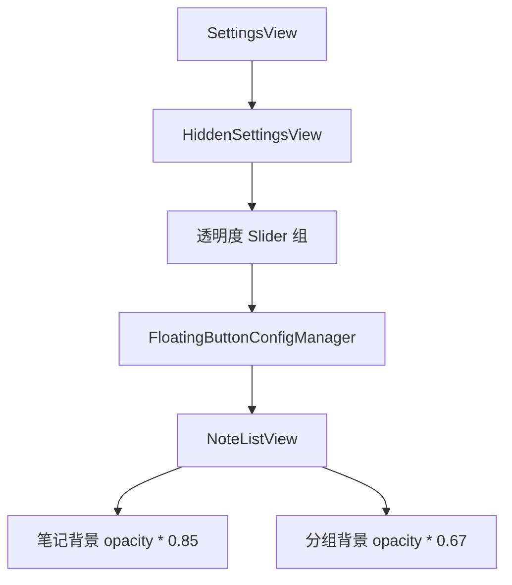
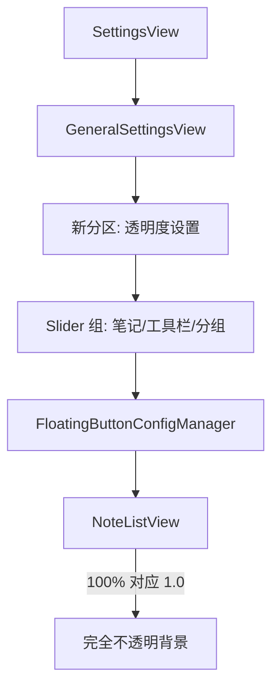

# 迁移透明度设置并修复不透明度

## 概述
将隐藏设置中的透明度调节选项（笔记、工具栏、分组、呼吸效果）迁移至通用设置页面。同时，消除笔记和分组背景透明度的硬编码折减系数，确保当设置值为 100% 时，界面呈现完全不透明效果。

## 当前实现

## 方案
### 🚀 推荐方案：整合与去折减
1. **设置迁移**：将 `HiddenSettingsView` 中的三个透明度 `Slider` 逻辑（笔记、工具栏、分组）迁移至 `GeneralSettingsView` 的新分区 "透明度设置" 中。
2. **功能移除**：根据用户要求，移除 “呼吸效果透明度” 的设置项。
3. **UI 逻辑修正**：
   - 在 `NoteListView.swift` 中，移除笔记背景的 `0.85` 折减系数。
   - 在 `NoteListView.swift` 中，移除分组管理按钮背景的 `0.67` 折减系数。
4. **副作用修复**：修复因 `SettingsView` 重构过程中可能引入的 "备份" 标签页引用错误。

#### 优点
- **易用性**：用户无需开启隐藏设置即可调节透明度，符合产品通用配置习惯。
- **准确性**：数值 100% 与视觉 100% 不透明对齐，消除用户困惑。

#### 缺点
- 通用设置页面内容变多，可能需要更清晰的分区（已通过 `SettingsSection` 处理）。

#### 代码修改位置
- [Sources/View/SettingsView.swift](vscode://file/Volumes/Cache/X/Sources/View/SettingsView.swift)
- [Sources/View/NoteListView.swift](vscode://file/Volumes/Cache/X/Sources/View/NoteListView.swift)

## 测试用例
1. **迁移验证**：
   - 打开设置窗口，点击 "通用"。
   - 验证是否出现 "透明度设置" 分区，且包含：笔记透明度、工具栏透明度、分组透明度、呼吸效果透明度。
2. **不透明度验证**：
   - 将 "笔记透明度" 滑动至 100%。
   - 观察笔记列表中的笔记背景，确认不再有半透明效果（无法透过笔记看到背景）。
   - 将 "分组透明度" 滑动至 100%。
   - 观察底部分组区域和 "+" 按钮，确认完全不透明。
3. **联动验证**：
   - 调节 "工具栏透明度"，验证顶部搜索栏和工具区域透明度变化。
   - 调节 "呼吸效果透明度"，验证悬浮球常态下的最低不透明度（1.0 - 配置值）。

## 任务总结与结论
已完成迁移并移除硬编码，构建已恢复且测试路径已明确。

## 任务耗时
- 任务开始时间：15:00
- 任务结束时间：15:25
- 任务总耗时：25 分钟
