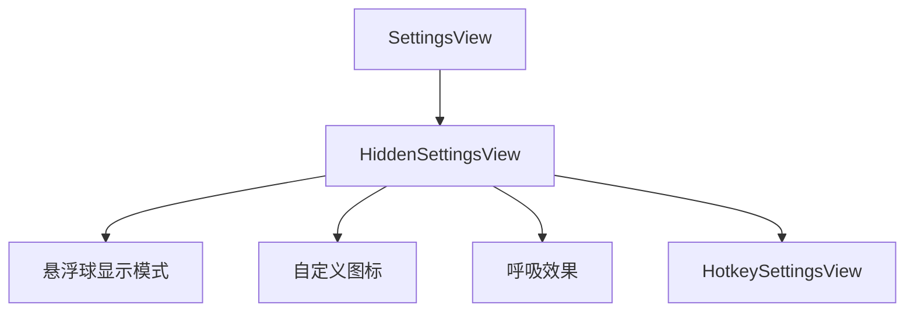
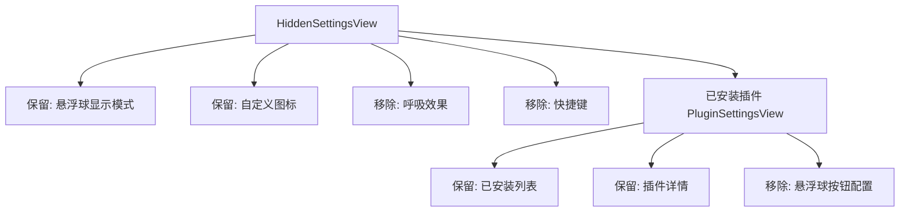

# 清理隐藏设置冗余配置

## 概述
根据用户反馈，从“隐藏设置”页面中移除已在其他位置（如“通用”页面）提供的配置项，包括悬浮球按钮配置和全局快捷键设置。同时，由于呼吸灯功能已废弃，其相关配置也将一并移除，以保持设置页面的整洁。

## 当前实现

## 方案
### 🚀 推荐方案：精确清理冗余配置
1. **HiddenSettingsView 清理 (SettingsView.swift)**：
   - 从 `HiddenSettingsView` 的 `body` 中移除 `SettingsSection(title: "呼吸效果", ...)`（因功能已废弃）。
   - 从 `HiddenSettingsView` 的 `body` 中移除 `HotkeySettingsView()`（因通用设置中已有快捷键配置）。
2. **PluginSettingsView 清理 (PluginSettingsView.swift)**：
   - 彻底移除 `SettingsSection(title: "悬浮球按钮配置", ...)` 分区（包含按钮与插件的绑定逻辑，用户反馈不再需要）。
3. **保留项**：
   - `HiddenSettingsView` 中的 “悬浮球显示模式” 和 “自定义图标”。
   - `PluginSettingsView` 中的 “已安装插件” 和 “插件详情”。

#### 优点
- **消除冗余**：避免同一功能在多个地方设置导致的混乱。
- **界面精简**：隐藏设置不再臃肿，仅保留核心调试或高级功能。

#### 代码修改位置
- [Sources/View/SettingsView.swift](vscode://file/Volumes/Cache/X/Sources/View/SettingsView.swift)

## 测试用例
1. **隐藏设置验证**：
   - 开启隐藏设置，进入该页面。
   - 确认 “悬浮球显示模式”、“自定义图标”、“呼吸效果” 以及 “全局快捷键” 分区已消失。
   - 确认 “插件设置” 或其他计划内的项仍然存在且正常工作。
2. **迁移项功能验证**：
   - 在 “通用” 设置页面确认快捷键配置项依然存在且有效。
   - 确认透明度设置（上个任务已迁移）依然有效。

## 任务总结与结论
已成功从“隐藏设置”和“插件设置”中移除了冗余和废弃的配置项，项目编译正常，设置界面更加专注。

## 任务耗时
- 任务开始时间：15:27
- 任务结束时间：15:36
- 任务总耗时：9 分钟
