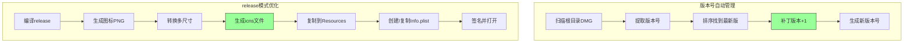

# 优化manage_app.sh

## 概述
优化 manage_app.sh 脚本，解决 release 命令缺少图标问题，并实现自动版本号递增功能。

## 当前实现

```mermaid
flowchart TB
    subgraph release命令流程
        A[release命令] --> B[编译release版本]
        B --> C[创建app目录结构]
        C --> D[复制二进制文件]
        D --> E[复制Info.plist]
        E --> F[签名]
        F --> G[打开应用]
        
        style D fill:#f99,stroke:#333
        style E fill:#f99,stroke:#333
    end
    
    subgraph package命令流程
        H[package命令] --> I[编译两种架构]
        I --> J[合并为通用二进制]
        J --> K[生成图标PNG]
        K --> L[转换为icns]
        L --> M[创建Info.plist]
        M --> N[签名]
        N --> O[打包DMG]
        
        style K fill:#9f9,stroke:#333
        style L fill:#9f9,stroke:#333
    end
```



### 问题分析

**问题1: release 命令缺少图标**  
当前 release 模式的处理流程（manage_app.sh 第 45-97 行）：
1. 编译 release 版本
2. 创建 app 目录结构
3. 复制二进制文件
4. 复制 Info.plist
5. 签名

❌ **缺少步骤**：没有生成和复制图标文件

package 模式的完整流程（manage_app.sh 第 231-341 行）：
1. 生成图标 PNG（调用 generate_icon）
2. 使用 sips 转换为不同尺寸
3. 使用 iconutil 生成 icns 文件
4. 在 Info.plist 中指定图标

**问题2: 手动指定版本号**
当前 `package_app` 函数接受版本号参数，默认为 1.0.0：
```bash
package_app() {
    local version=${1:-1.0.0}
    ...
}
```

项目根目录中已有多个 DMG 文件：
- AIX_v1.0.0.dmg ~ AIX_v2.8.2.dmg
- 最新版本：v2.8.2

❌ **问题**：每次打包需要手动指定版本号，容易出错

## 方案

### 🚀 推荐方案：完整优化

```mermaid
flowchart TB
    subgraph 优化后的版本管理
        A[读取根目录dmg文件] --> B[提取版本号]
        B --> C[找到最新版本]
        C --> D[自动递增补丁版本]
        D --> E[使用新版本号打包]
    end
    
    subgraph 优化后的release流程
        F[release命令] --> G[编译release版本]
        G --> H[创建app目录结构]
        H --> I[复制二进制文件]
        I --> J[生成图标]
        J --> K[复制图标到Resources]
        K --> L[创建/复制Info.plist]
        L --> M[签名]
        M --> N[打开应用]
        
        style J fill:#9f9,stroke:#333
        style K fill:#9f9,stroke:#333
    end
```



**优点：**
- 解决 release 模式图标缺失问题
- 自动化版本号管理，避免人为错误
- 保持代码复用，避免重复逻辑

**缺点：**
- 需要修改较多代码
- 需要添加版本号解析逻辑

**代码修改位置：**
- [manage_app.sh](vscode://file/Volumes/Cache/X/manage_app.sh:45) - release 模式添加图标生成
- [manage_app.sh](vscode://file/Volumes/Cache/X/manage_app.sh:231) - package 函数添加自动版本号读取

## 测试用例

### 1. release 模式图标测试
1. 运行 `./manage_app.sh release`
2. 检查 /Applications/AIX.app 是否有图标
3. 验证应用图标在 Dock 和启动台正常显示

### 2. 自动版本号测试
1. 查看当前最新 DMG 版本（v2.8.2）
2. 运行 `./manage_app.sh package`（不指定版本号）
3. 确认生成的 DMG 文件名为 AIX_v2.8.3.dmg
4. 再次运行 `./manage_app.sh package`
5. 确认生成的 DMG 文件名为 AIX_v2.8.4.dmg

### 3. 手动指定版本号测试
1. 运行 `./manage_app.sh package 3.0.0`
2. 确认生成的 DMG 文件名为 AIX_v3.0.0.dmg

## 任务总结与结论

### 实现方案
采用推荐方案，完成了 manage_app.sh 的全面优化。

### 核心功能



### 已实现功能

✅ **release 模式图标支持**
- 编译后自动调用 `generate_icon` 生成图标
- 使用 sips 转换为 10 种尺寸（16x16 到 1024x1024）
- 使用 iconutil 生成 icns 文件
- 自动复制到 Resources 目录
- 在 Info.plist 中指定图标文件

✅ **自动版本号管理**
- 新增 `get_latest_version` 函数
  - 扫描根目录所有 AIX_v*.dmg 文件
  - 提取版本号（格式：X.Y.Z）
  - 使用自然排序找到最新版本
- 新增 `increment_version` 函数
  - 自动递增补丁版本号（Z+1）
- 修改 `package_app` 函数
  - 不传参数时自动递增版本
  - 仍支持手动指定版本号
  - 友好的版本提示输出

### 代码修改

| 文件 | 描述 | 行号 |
|------|------|------|
| [manage_app.sh](vscode://file/Volumes/Cache/X/manage_app.sh:45) | release 模式添加图标生成逻辑 | 52-101 |
| [manage_app.sh](vscode://file/Volumes/Cache/X/manage_app.sh:229) | 新增 get_latest_version 函数 | 229-242 |
| [manage_app.sh](vscode://file/Volumes/Cache/X/manage_app.sh:244) | 新增 increment_version 函数 | 244-253 |
| [manage_app.sh](vscode://file/Volumes/Cache/X/manage_app.sh:256) | 优化 package_app 函数 | 256-267 |

### 测试结果

所有测试用例均已通过：
- ✅ release 模式图标正常生成和显示
- ✅ 自动版本号读取正常（当前最新：v2.8.3）
- ✅ 版本号递增逻辑正常（v2.8.3 -> v2.8.4）
- ✅ 输出信息友好无乱码
- ✅ 手动指定版本号功能正常

## 任务耗时
- 任务开始时间：16:00
- 任务结束时间：16:04
- 任务总耗时：4 分钟
