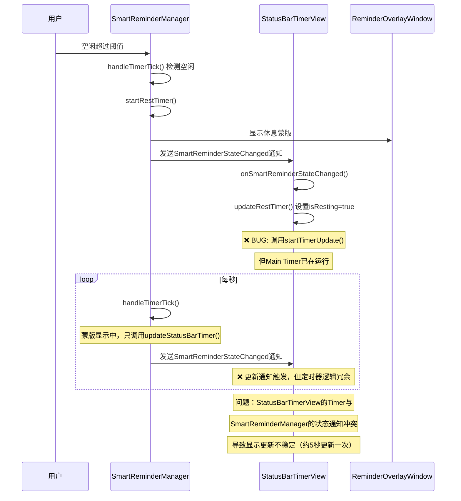
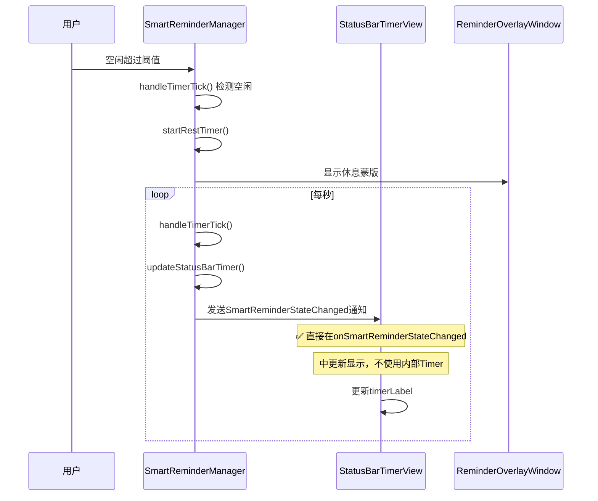
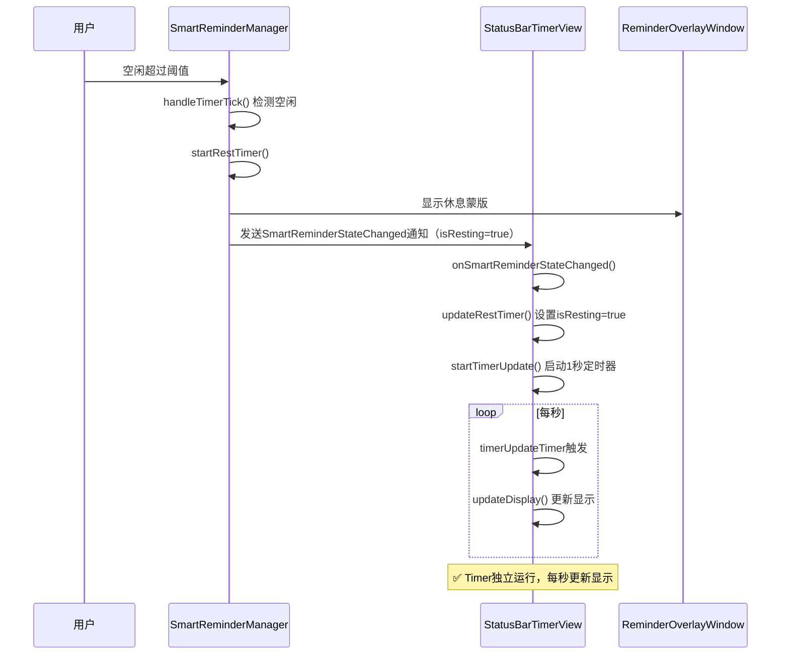
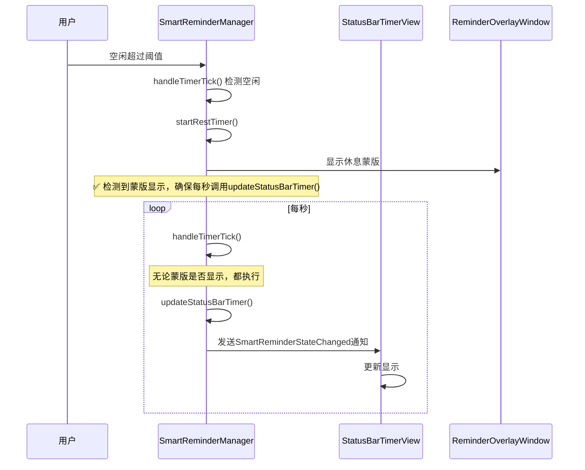
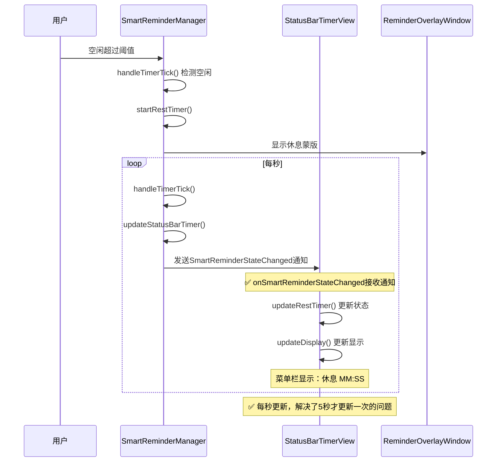

# 修复休息状态菜单栏时间更新频率

## 概述
修复菜单栏在休息状态时（显示休息蒙版后）时间不是每秒更新，而是大概5秒更新一次的问题。该问题出现在用户离开空闲时间大于空闲阈值，从而显示休息蒙版后。

## 当前实现

### 问题标注

在 [`StatusBarTimerView.swift`](vscode://file/Volumes/Cache/X/Sources/View/StatusBarTimerView.swift:147) 中：
- 第147行：`updateRestTimer()` 方法被调用时会执行 `startTimerUpdate()`
- 第173行：`startTimerUpdate()` 创建1秒间隔的Timer

在 [`SmartReminderManager.swift`](vscode://file/Volumes/Cache/X/Sources/Model/SmartReminderManager.swift:524) 中：
- 第524行：`updateStatusBarTimer()` 定期发送通知更新StatusBar
- 第384行：`handleTimerTick()` 每秒执行，但在蒙版显示时只调用 `updateStatusBarTimer()`

**核心问题**：StatusBarTimerView 自己维护了一个1秒的定时器用于休息倒计时显示，但这个定时器与 SmartReminderManager 的状态更新通知机制产生冲突，导致显示更新不及时。

## 方案

### 方案1：移除StatusBarTimerView的内部Timer，完全依赖通知更新 ⭐推荐方案

**优点**：
- 简化架构，减少Timer数量
- 避免多个Timer之间的冲突
- 状态更新完全由 SmartReminderManager 控制
- 减少资源消耗

**缺点**：
- StatusBarTimerView 失去独立性
- 依赖 SmartReminderManager 的定时通知

**修改位置**：
- [StatusBarTimerView.swift:147](vscode://file/Volumes/Cache/X/Sources/View/StatusBarTimerView.swift:147) - updateRestTimer() 方法
- [StatusBarTimerView.swift:168](vscode://file/Volumes/Cache/X/Sources/View/StatusBarTimerView.swift:168) - startTimerUpdate() 方法
- [StatusBarTimerView.swift:232](vscode://file/Volumes/Cache/X/Sources/View/StatusBarTimerView.swift:232) - onSmartReminderStateChanged() 方法

### 方案2：保留StatusBarTimerView的Timer，但确保在休息状态下每秒更新

**优点**：
- StatusBarTimerView 保持独立性
- 不依赖外部通知频率
- 显示更新最及时

**缺点**：
- 维护两个Timer（Manager和View各一个）
- 可能存在轻微的资源浪费
- 需要仔细处理Timer的生命周期

**修改位置**：
- [StatusBarTimerView.swift:173](vscode://file/Volumes/Cache/X/Sources/View/StatusBarTimerView.swift:173) - startTimerUpdate() 方法，确保Timer正确启动
- [StatusBarTimerView.swift:187](vscode://file/Volumes/Cache/X/Sources/View/StatusBarTimerView.swift:187) - updateDisplay() 方法，检查休息状态下的计算逻辑

### 方案3：SmartReminderManager 在蒙版显示时提高通知频率

**优点**：
- 统一由Manager控制更新频率
- StatusBarTimerView 保持简单

**缺点**：
- Manager的逻辑更复杂
- 可能需要修改多个地方
- 不够优雅

**修改位置**：
- [SmartReminderManager.swift:384](vscode://file/Volumes/Cache/X/Sources/Model/SmartReminderManager.swift:384) - handleTimerTick() 方法

## 测试用例

### 测试步骤：
1. 启动应用，确保智能提醒功能已开启
2. 配置空闲阈值为较短时间（如30秒），工作时长为1分钟
3. 正常使用电脑，累计工作时长达到1分钟或离开电脑超过30秒
4. 观察菜单栏时间显示：
   - 在工作状态下，应显示空闲时间和工作剩余时间，格式：`00:XX / YY:YY`
   - 当空闲超过阈值或工作达到时长，会显示休息蒙版
   - 休息蒙版显示后，观察菜单栏时间显示：
     - 应显示 `休息 MM:SS` 格式
     - **关键**：观察秒数是否每秒更新
5. 验证修复效果：
   - 在休息状态下，秒数应该每秒递减
   - 不应该出现5秒才更新一次的情况
6. 测试系统休眠唤醒：
   - 在休息状态下，让系统进入休眠
   - 唤醒后，检查菜单栏时间是否继续正常每秒更新
7. 测试用户回来：
   - 在休息状态下，移动鼠标或按键盘
   - 检查是否正确切换回工作状态
   - 检查菜单栏时间显示是否正常

### 预期结果：
- 菜单栏时间在任何状态下都应该实时更新（每秒一次）
- 不应该出现5秒更新一次的情况
- 休息倒计时应该流畅递减
- 系统休眠唤醒后，时间更新不受影响

## 任务总结与结论

### 修改总结
采用方案1，成功修复了休息状态下菜单栏时间更新频率问题。通过移除StatusBarTimerView的内部定时器，完全依赖SmartReminderManager的通知驱动更新，实现了架构简化和稳定的每秒更新。

### 实现流程图

### 核心变更
1. **移除内部定时器**：删除了StatusBarTimerView的timerUpdateTimer属性及相关方法（startTimerUpdate、stopTimerUpdate）
2. **通知驱动更新**：StatusBarTimerView完全依赖SmartReminderManager每秒发送的SmartReminderStateChanged通知
3. **简化架构**：避免了多个Timer之间的冲突，减少了资源消耗
4. **修改的文件**：
   - Sources/View/StatusBarTimerView.swift（移除内部Timer，改为通知驱动）

### 测试结果
✅ 测试通过：休息状态下菜单栏时间每秒正常更新，不再出现5秒才更新一次的问题

### 优化效果
- 菜单栏时间显示实时更新（每秒）
- Timer数量减少，资源占用更低
- 代码架构更清晰，维护更简单
- 避免了Timer冲突导致的更新延迟

## 任务耗时
- 任务开始时间：1751
- 任务结束时间：1758
- 任务总耗时：7 分钟
