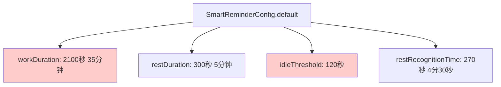
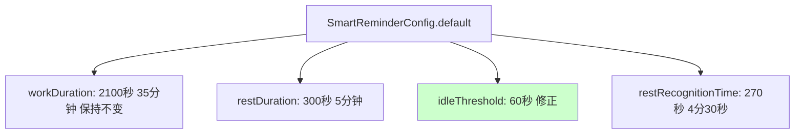
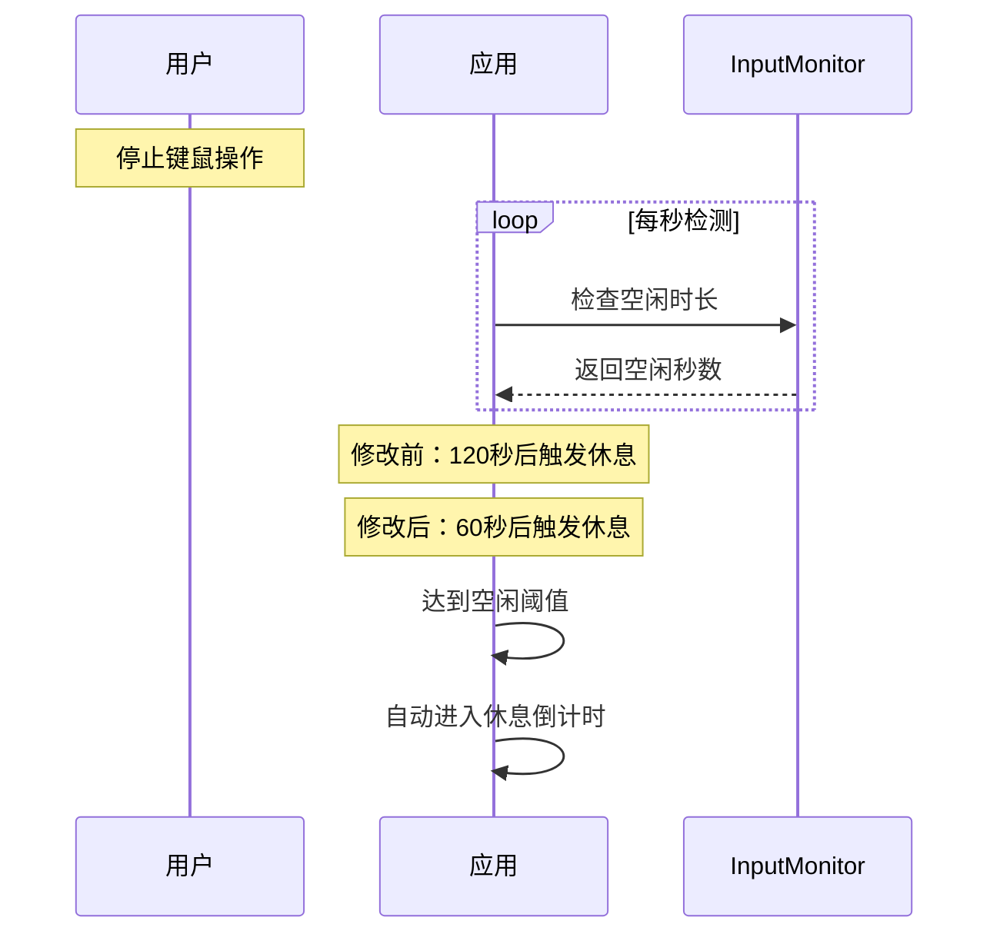

# 智能提醒默认值修正

## 概述
检查并修正智能提醒系统的默认配置值，使其与 doc/智能提醒系统时序图.md 文档保持一致。

## 当前实现

### 问题点
当前代码中 SmartReminderConfig 的默认值与文档定义不一致：

1. **idleThreshold（空闲阈值）**
   - 代码值：120 秒 ❌
   - 文档值：60 秒 ✓
   - 需要修改

2. **workDuration（工作时长）** ✓
   - 代码值：2100 秒（35分钟）
   - 文档值：2700 秒（45分钟）
   - 状态：用户确认保持 35 分钟不变

3. **restDuration（休息时长）** ✓
   - 代码值：300 秒（5分钟）
   - 文档值：300 秒（5分钟）
   - 状态：一致

4. **restRecognitionTime（休息认定时间）** ✓
   - 代码值：270 秒（4分30秒）
   - 文档值：270 秒（4分30秒）
   - 状态：一致

## 方案

### 🚀 推荐方案：修正空闲阈值默认值

#### 优点
- 简单直接，只需修改一个常量值
- 不影响已有功能逻辑
- 空闲检测更灵敏（60 秒更符合实际使用场景，快速识别用户离开）
- 保持 workDuration 为 35 分钟符合用户预期

#### 缺点
- 空闲阈值降低后，可能会更频繁触发空闲检测（但这正是期望的行为）

#### 代码修改位置
[ReminderConfig.swift](vscode://file/Volumes/Cache/X/Sources/Model/ReminderConfig.swift:59) - 第 59 行，修改 idleThreshold 默认值从 120 改为 60

## 测试用例

### 测试步骤
1. 清除应用的用户配置（删除 UserDefaults 中的 smartReminderConfig）
2. 重启应用
3. 打开设置面板，查看智能提醒的默认配置
4. 验证以下值：
   - 工作时长显示为 35 分钟（保持不变）
   - 空闲阈值显示为 60 秒（已修正）
   - 休息时长显示为 5 分钟
   - 休息认定时间显示为 4 分 30 秒

### 预期结果
- 首次使用的用户看到空闲阈值为 60 秒
- 工作时长保持为 35 分钟
- 已有配置的用户不受影响

## 任务总结与结论

### 实施总结
已成功修改 SmartReminderConfig 的默认空闲阈值，从 120 秒降低到 60 秒。

### 修改详情
- **文件**：[ReminderConfig.swift](vscode://file/Volumes/Cache/X/Sources/Model/ReminderConfig.swift:59)
- **修改内容**：idleThreshold 默认值从 120 改为 60
- **影响范围**：仅影响新安装或首次使用智能提醒功能的用户

### 系统行为变更

### 优势
1. **更快响应**：用户离开电脑后 1 分钟即可自动进入休息状态，而非 2 分钟
2. **更准确**：60 秒的阈值更符合实际场景中判断用户是否真正离开的时长
3. **用户体验提升**：减少等待时间，让系统行为更符合直觉

### 向后兼容性
- 已有用户的自定义配置不受影响
- 仅对首次使用或重置配置的用户生效

## 任务耗时
- 任务开始时间：18时11分
- 任务结束时间：18时15分
- 任务总耗时：4 分钟
