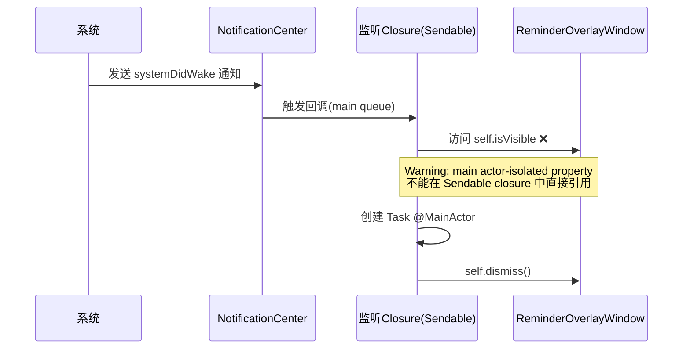
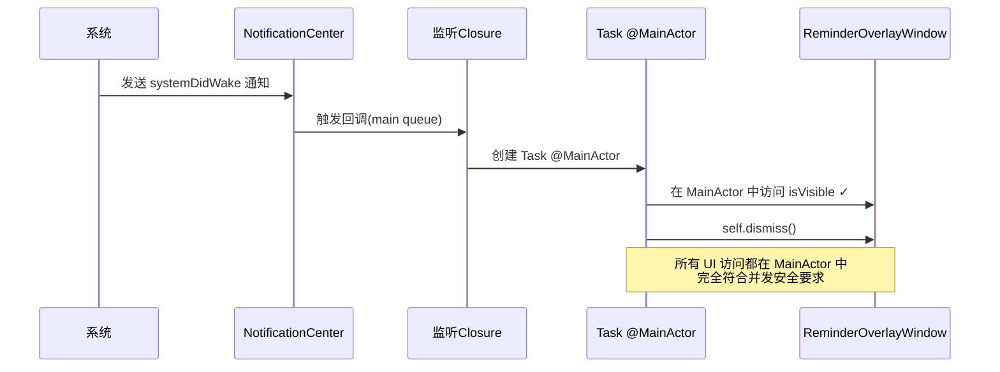
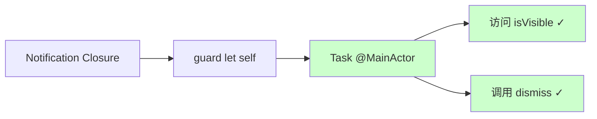

# 修复ReminderOverlayWindow并发警告

## 概述
修复 ReminderOverlayWindow.swift 中系统唤醒监听器的 Swift 并发警告，确保在 Sendable closure 中正确访问 main actor-isolated 属性。

## 当前实现



### 问题点
在 [ReminderOverlayWindow.swift](vscode://file/Volumes/Cache/X/Sources/View/ReminderOverlayWindow.swift:59) 第 59 行：

```swift
) { [weak self] _ in
    guard let self = self, self.isVisible else { return }  // ❌ Warning
    print("🌅 蒙版检测到系统唤醒，自动关闭蒙版")
    Task { @MainActor in
        self.dismiss()
    }
}
```

**警告原因**：
- `isVisible` 是 NSWindow 的属性，属于 main actor-isolated
- closure 被标记为 Sendable（Swift 6 并发要求）
- 在 Sendable closure 中直接访问 main actor-isolated 属性违反并发安全规则
- 即使指定了 `queue: .main`，编译器仍需要显式的并发标注

## 方案

### 🚀 推荐方案：将整个逻辑移入 MainActor 上下文



#### 修改后代码
```swift
) { [weak self] _ in
    guard let self = self else { return }
    Task { @MainActor in
        guard self.isVisible else { return }
        print("🌅 蒙版检测到系统唤醒，自动关闭蒙版")
        self.dismiss()
    }
}
```

#### 优点
- 完全消除并发警告
- 所有 UI 相关操作（isVisible、dismiss）都在 MainActor 中执行
- 逻辑清晰，符合 Swift 6 并发模型
- 不需要额外的 `@MainActor` 标注

#### 缺点
- 无明显缺点

#### 代码修改位置
[ReminderOverlayWindow.swift](vscode://file/Volumes/Cache/X/Sources/View/ReminderOverlayWindow.swift:59) - 第 59-63 行，将 isVisible 检查移入 Task @MainActor 块中

## 测试用例

### 测试步骤
1. 运行 Swift Build 任务，确认 warning 已消失
2. 启动应用，开启智能提醒
3. 触发休息蒙版显示
4. 将 Mac 设置为休眠（关闭盖子或手动休眠）
5. 唤醒 Mac
6. 验证：
   - 蒙版自动关闭
   - 控制台输出 "🌅 蒙版检测到系统唤醒，自动关闭蒙版"
   - 无闪退或异常行为

### 预期结果
- 编译无 warning
- 系统唤醒时蒙版正确关闭
- 并发安全性得到保障

## 任务总结与结论

### 实施总结
已成功修复 ReminderOverlayWindow 中的 Swift 并发警告，将 main actor-isolated 属性访问移入 MainActor 上下文。

### 修改详情
- **文件**：[ReminderOverlayWindow.swift](vscode://file/Volumes/Cache/X/Sources/View/ReminderOverlayWindow.swift:59)
- **修改内容**：
  - 将 `guard let self = self, self.isVisible` 拆分
  - 将 `isVisible` 检查移入 `Task { @MainActor in }` 块
  - 确保所有 UI 访问都在 MainActor 中执行

### 代码对比

**修改前**：
```swift
) { [weak self] _ in
    guard let self = self, self.isVisible else { return }  // ❌ Warning
    print("🌅 蒙版检测到系统唤醒，自动关闭蒙版")
    Task { @MainActor in
        self.dismiss()
    }
}
```

**修改后**：
```swift
) { [weak self] _ in
    guard let self = self else { return }
    Task { @MainActor in
        guard self.isVisible else { return }  // ✓ No Warning
        print("🌅 蒙版检测到系统唤醒，自动关闭蒙版")
        self.dismiss()
    }
}
```

### 并发安全性提升



### 优势
1. **完全消除警告**：符合 Swift 6 并发安全要求
2. **逻辑清晰**：所有 UI 操作明确在 MainActor 中执行
3. **运行时安全**：避免潜在的数据竞争问题

## 任务耗时
- 任务开始时间：18时18分
- 任务结束时间：18时20分
- 任务总耗时：2 分钟
