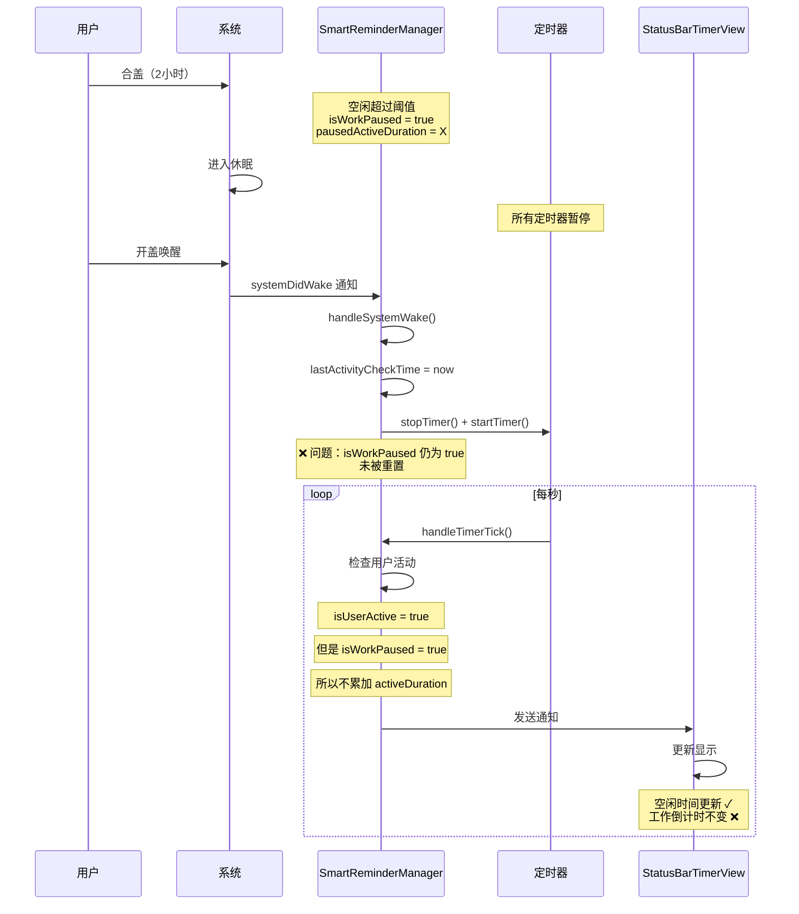
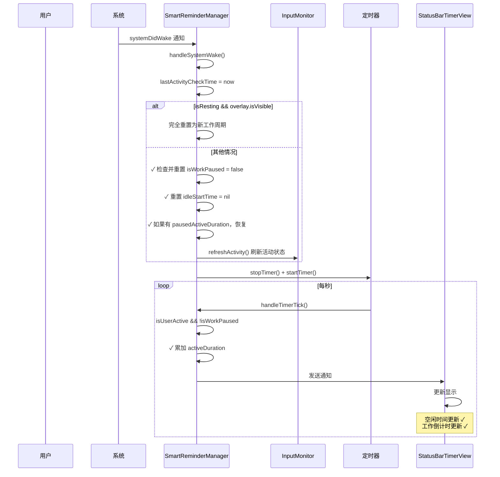

# 修复系统唤醒后工作倒计时未恢复

## 概述
修复系统休眠唤醒后，虽然状态栏空闲计时正常更新，但工作倒计时停止更新的问题。

## 当前实现



### 问题点
在 [SmartReminderManager.swift](vscode://file/Volumes/Cache/X/Sources/Model/SmartReminderManager.swift:188) 的 handleSystemWake 方法中：

1. **isWorkPaused 状态未恢复**
   - 系统休眠前，如果用户空闲超过阈值，`isWorkPaused = true`
   - 唤醒后，handleSystemWake 只更新了 `lastActivityCheckTime`
   - `isWorkPaused` 保持为 `true`，导致后续不会累加 `activeDuration`

2. **条件判断不完整**
   - 只处理了 `isResting && reminderOverlay.isVisible` 的情况
   - 未处理普通暂停状态（isWorkPaused = true 但 isResting = false）

3. **工作倒计时停止更新**
   - `activeDuration` 不增加 → `remaining = work - active` 不变
   - StatusBarTimerView 显示的剩余时间固定不变
   - 但空闲时间正常更新（因为 `inputMonitor.timeSinceLastActivity()` 正常工作）

## 方案

### 🚀 推荐方案：唤醒时重置工作暂停状态



#### 修改后代码
在 handleSystemWake 方法中添加状态重置逻辑，并在关键节点添加日志：

```swift
@objc private func handleSystemWake() {
    print("🌅 系统从休眠中唤醒，重启Timer")
    
    guard config.isEnabled else { return }
    
    // 更新最后活动检查时间，避免时间跳跃
    lastActivityCheckTime = Date()
    
    // 如果正在休息且蒙版正在显示，说明休眠时蒙版开着
    // 蒙版会自动关闭，这里需要重置为新的工作周期
    if isResting && reminderOverlay.isVisible {
        print("🌅 检测到休眠时蒙版正在显示，重置为新的工作周期")
        
        // 停止所有定时器
        stopTimer()
        restTimer?.invalidate()
        restTimer = nil
        restCountdownTimer?.invalidate()
        restCountdownTimer = nil
        
        // 重置状态
        isResting = false
        restStartTime = nil
        activeDuration = 0
        inputMonitor.refreshActivity()
        
        // 重新开始工作计时
        startTimer()
        
        print("✅ 已重置为新的工作周期")
        return
    }
    
    // 如果工作被暂停（空闲触发但未进入休息），恢复工作状态
    if isWorkPaused && !isResting {
        print("🌅 检测到工作暂停状态，恢复正常工作")
        // 恢复之前保存的工作时长
        if pausedActiveDuration > 0 {
            activeDuration = pausedActiveDuration
            pausedActiveDuration = 0
        }
        isWorkPaused = false
        idleStartTime = nil
    }
    
    // 刷新输入活动状态
    inputMonitor.refreshActivity()
    
    // 重启主定时器
    stopTimer()
    startTimer()
    
    // 如果正在休息，重新启动休息相关定时器
    if isResting, let startTime = restStartTime {
        let elapsed = Date().timeIntervalSince(startTime)
        let remaining = max(0, config.restDuration - elapsed)
        
        if remaining > 0 {
            // 重新启动休息定时器
            restTimer = Timer.scheduledTimer(
                withTimeInterval: remaining,
                repeats: false
            ) { [weak self] _ in
                Task { @MainActor in
                    self?.handleRestEnd()
                }
            }
            
            // 重新启动休息倒计时定时器
            Task { @MainActor in
                self.showRestOverlay()
            }
        } else {
            // 休息时间已到
            Task { @MainActor in
                self.handleRestEnd()
            }
        }
    }
    
    print("✅ Timer重启完成")
}
```

#### 优点
- 完整处理所有可能的暂停状态
- 恢复之前保存的工作时长，不会丢失进度
- 重置所有相关状态变量，确保计时器正常工作
- 明确的日志输出，便于调试

#### 缺点
- 无明显缺点

#### 代码修改位置
[SmartReminderManager.swift](vscode://file/Volumes/Cache/X/Sources/Model/SmartReminderManager.swift:218) - 在第 218 行（stopTimer 之前）添加工作暂停状态恢复逻辑

## 测试用例

### 测试步骤
1. 启动应用，开启智能提醒
2. 正常工作一段时间（例如 10 分钟）
3. 停止键鼠操作，等待超过空闲阈值（60 秒）
4. 观察状态栏，确认进入暂停状态（activeDuration 不再增加）
5. **不要点击任何按钮**，直接合上 MacBook 盖子
6. 等待 2 小时（模拟长时间休眠）
7. 打开盖子，解锁 Mac
8. 立即移动鼠标或敲击键盘
9. 观察状态栏：
   - 空闲时间应该从 0 开始重新计时
   - 工作倒计时应该继续减少（activeDuration 继续累加）
   - 工作进度不应该丢失

### 预期结果
- 唤醒后，工作倒计时立即恢复正常更新
- 之前的工作时长被保留（不会归零）
- 用户可以继续工作，计时器正常累加

### 验证日志
控制台应该输出：
```
🌅 系统从休眠中唤醒，重启Timer
🌅 检测到工作暂停状态，恢复正常工作
✅ Timer重启完成
```

## 任务总结与结论

### 实施总结
已成功修复系统休眠唤醒后工作倒计时未恢复的问题，并在关键节点添加了详细日志。

### 修改详情
- **文件**：[SmartReminderManager.swift](vscode://file/Volumes/Cache/X/Sources/Model/SmartReminderManager.swift:188)
- **修改内容**：
  1. 在 handleSystemWake 方法中添加工作暂停状态检测和恢复逻辑
  2. 恢复 isWorkPaused = false，重置 idleStartTime
  3. 恢复之前保存的 pausedActiveDuration
  4. 添加关键日志以便追踪系统唤醒后的状态恢复

### 修改前后对比

**修改前**：
- 系统唤醒后只处理了 `isResting && overlay.isVisible` 的情况
- `isWorkPaused` 状态保持不变，导致工作计时停止

**修改后**：
- 额外检查 `isWorkPaused && !isResting` 的情况
- 恢复工作状态：`isWorkPaused = false`，`activeDuration` 恢复
- 重置空闲计时：`idleStartTime = nil`
- 刷新输入活动状态：`inputMonitor.refreshActivity()`

### 新增日志

系统唤醒时会输出：
```
🌅 系统从休眠中唤醒，重启Timer
🌅 工作暂停状态恢复: pausedActiveDuration=XXX秒
✅ Timer重启完成，当前状态: active=XXX秒, isWorkPaused=false, isResting=false
```

### 问题根因
用户合盖前，空闲时间超过阈值（60秒），触发 `isWorkPaused = true`，并保存了当时的工作时长到 `pausedActiveDuration`。系统休眠后，所有定时器暂停。唤醒时，原有代码只重启定时器，但未恢复 `isWorkPaused` 状态，导致后续 `handleTimerTick` 中不会累加 `activeDuration`，工作倒计时停止更新。

### 解决方案
唤醒时检测并恢复工作暂停状态，确保工作计时能继续。

## 任务耗时
- 任务开始时间：20时04分
- 任务结束时间：20时14分
- 任务总耗时：10 分钟
