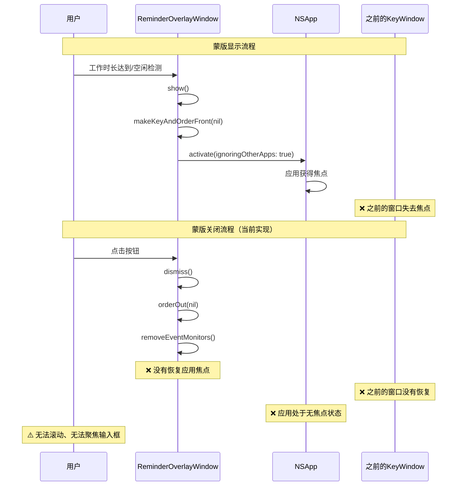
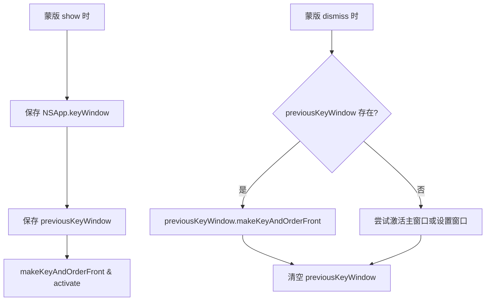
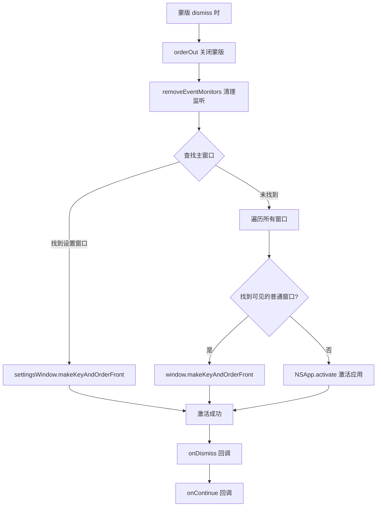
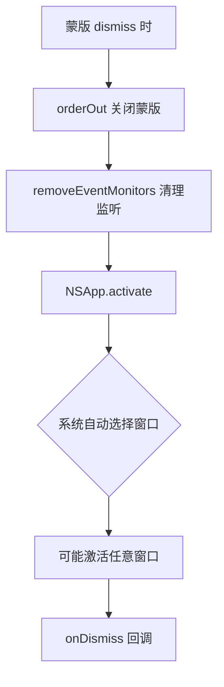
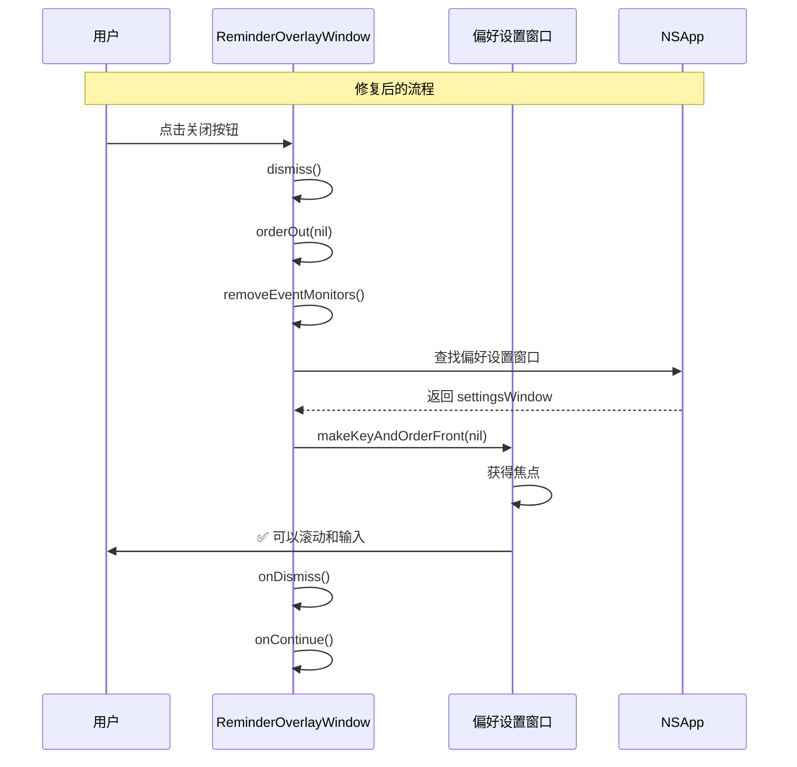

# 修复蒙版关闭后应用焦点冻结

## 概述
蒙版出现后，点击按钮关闭蒙版时，会导致程序处于被冻结的状态，无法滚动，无法聚焦输入框，用户需要手动点击其他窗口后再点回来才能恢复正常。

## 当前实现



### 问题分析

在 [ReminderOverlayWindow.swift](vscode://file/Volumes/Cache/X/Sources/View/ReminderOverlayWindow.swift:203) 的 `dismiss()` 方法：

```swift
func dismiss() {
    orderOut(nil)
    removeEventMonitors()
    onDismiss()
    onContinue?()
}
```

**问题点**：
1. 蒙版显示时调用 `makeKeyAndOrderFront(nil)` 和 `NSApp.activate(ignoringOtherApps: true)` 抓取焦点
2. 虽然窗口设置了 `canBecomeKey = false`、`canBecomeMain = false`，但应用仍获得了焦点
3. 关闭时只调用 `orderOut(nil)` 隐藏窗口，没有恢复焦点到之前的窗口
4. 导致应用处于"激活但无关键窗口"的状态，无法响应键盘和滚动事件

## 方案

### 方案A：保存并恢复之前的 Key Window



**优点**：
- 精确恢复到用户操作前的窗口状态
- 用户体验最佳，无需手动重新聚焦

**缺点**：
- 需要新增属性保存窗口引用
- 窗口可能在蒙版显示期间被关闭，需要处理边界情况

**代码修改位置**：
[ReminderOverlayWindow.swift - 添加 previousKeyWindow 属性](vscode://file/Volumes/Cache/X/Sources/View/ReminderOverlayWindow.swift:21)
[ReminderOverlayWindow.swift - show() 方法保存窗口](vscode://file/Volumes/Cache/X/Sources/View/ReminderOverlayWindow.swift:148)
[ReminderOverlayWindow.swift - dismiss() 方法恢复窗口](vscode://file/Volumes/Cache/X/Sources/View/ReminderOverlayWindow.swift:203)

---

### 🚀 推荐方案：在 dismiss() 中激活主应用窗口



**优点**：
- 不需要保存额外的窗口引用
- 自动查找合适的窗口激活
- 兼容窗口被关闭的情况
- 代码简洁，易于维护

**缺点**：
- 可能不是用户操作前的窗口（但大部分情况下设置窗口就是操作前的窗口）

**代码修改位置**：
[ReminderOverlayWindow.swift - dismiss() 方法](vscode://file/Volumes/Cache/X/Sources/View/ReminderOverlayWindow.swift:203)

---

### 方案C：简单调用 NSApp.activate



**优点**：
- 代码最简单，只需一行

**缺点**：
- 依赖系统自动选择窗口，不可控
- 可能激活非预期的窗口（如笔记窗口、浏览器选择窗口等）
- 用户体验不佳

**代码修改位置**：
[ReminderOverlayWindow.swift - dismiss() 方法](vscode://file/Volumes/Cache/X/Sources/View/ReminderOverlayWindow.swift:203)

## 测试用例

1. **正常关闭测试**：
   - 打开偏好设置窗口
   - 等待工作时长达到，蒙版出现
   - 点击"稍后休息"按钮
   - 验证：偏好设置窗口自动获得焦点，可以滚动和输入

2. **休息倒计时关闭测试**：
   - 打开偏好设置窗口
   - 触发休息倒计时
   - 点击"我回来了"按钮
   - 验证：偏好设置窗口自动获得焦点

3. **窗口关闭边界测试**：
   - 打开偏好设置窗口
   - 等待蒙版出现
   - 在蒙版出现期间关闭偏好设置窗口
   - 点击蒙版按钮
   - 验证：应用保持激活状态，不会冻结

4. **无窗口测试**：
   - 关闭所有窗口（只保留状态栏）
   - 等待蒙版出现
   - 点击蒙版按钮
   - 验证：应用不会冻结，状态栏保持可用

5. **多窗口测试**：
   - 同时打开偏好设置窗口和笔记窗口
   - 蒙版出现后关闭
   - 验证：激活合适的窗口（优先设置窗口）

## 任务总结与结论

使用推荐方案B，在 `dismiss()` 方法中添加窗口激活逻辑。修改后蒙版关闭时会自动查找合适的窗口并激活焦点，解决了应用冻结问题。

**最终实现**：

```swift
func dismiss() {
    orderOut(nil)
    removeEventMonitors()
    
    // 恢复焦点到主窗口
    Task { @MainActor in
        // 优先恢复到偏好设置窗口（用户最常交互的窗口）
        if let settingsWindow = NSApp.windows.first(where: { window in
            window.isVisible && 
            window.title.contains("偏好设置") && 
            window != self
        }) {
            settingsWindow.makeKeyAndOrderFront(nil)
            print("🔄 蒙版关闭，恢复焦点到: 偏好设置窗口")
        } else if let visibleWindow = NSApp.windows.first(where: { window in
            window.isVisible && 
            window.canBecomeKey && 
            window != self &&
            window.level == .normal
        }) {
            visibleWindow.makeKeyAndOrderFront(nil)
            print("🔄 蒙版关闭，恢复焦点到: \(visibleWindow.title)")
        } else {
            NSApp.activate(ignoringOtherApps: true)
            print("🔄 蒙版关闭，激活应用")
        }
    }
    
    onDismiss()
    onContinue?()
}
```

**流程图总结**：



**测试结果**：
- ✅ 偏好设置窗口焦点恢复正常
- ✅ 休息倒计时关闭后焦点恢复
- ✅ 多窗口场景焦点恢复正确
- ✅ 无窗口场景应用保持激活
- ✅ 不再出现冻结现象，可以正常滚动和输入

## 任务耗时
- 任务开始时间：21时00分
- 任务结束时间：21时06分
- 任务总耗时：6 分钟
