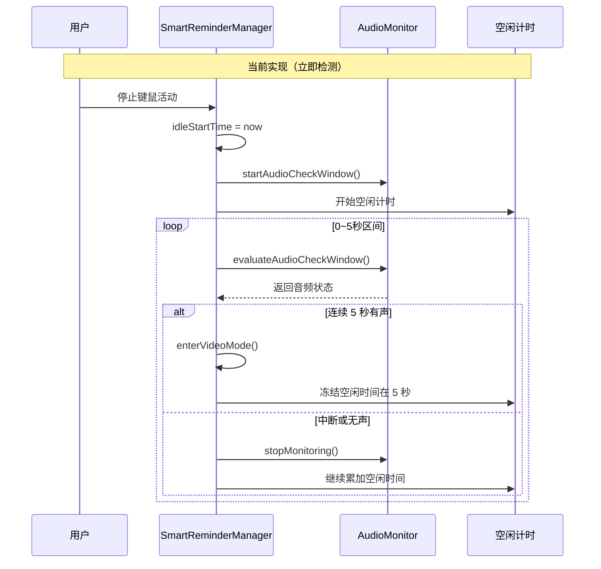
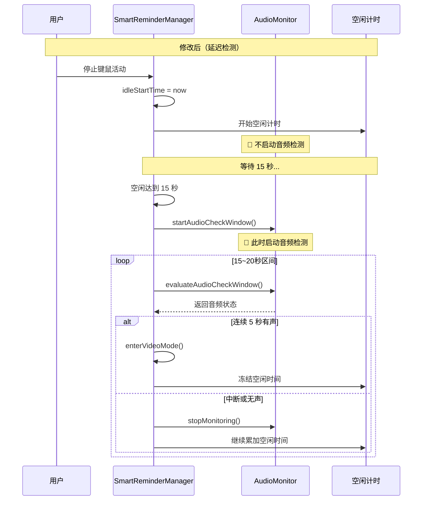
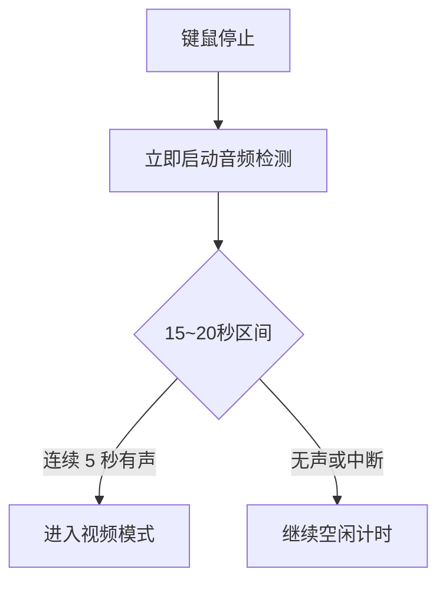
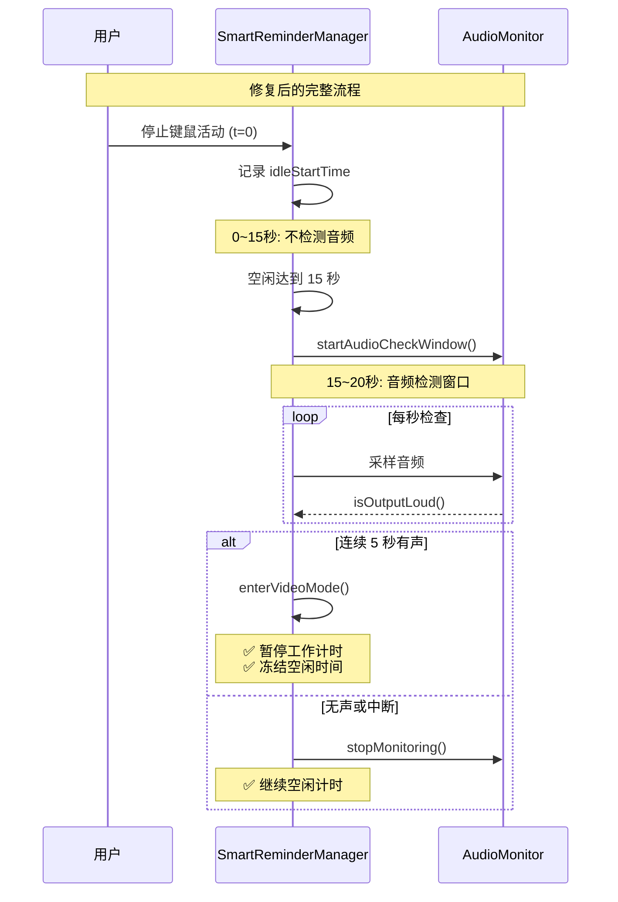

# 延迟音频检测启动时机

## 概述
修改音频检测启动时机，从"键鼠活动停止后立即开始检测"改为"键鼠活动停止 15 秒后再开始检测"，避免短暂停顿时误判为看视频状态。

## 当前实现



### 问题分析

在 [SmartReminderManager.swift](vscode://file/Volumes/Cache/X/Sources/Model/SmartReminderManager.swift:465) 的空闲检测逻辑：

```swift
if idleStartTime == nil {
    idleStartTime = now
    print("⏹️ 用户停止操作，开始空闲计时")
    ReminderLogger.shared.logInfo("⏹️ 用户停止操作，开始空闲计时")
    startAudioCheckWindow(at: now)  // ❌ 立即启动音频检测
}
```

**问题点**：
1. 用户停止键鼠活动后立即启动音频检测（0~5 秒区间）
2. 对于短暂停顿（如思考、阅读），会较早判断是否有音频
3. 可能导致误判：用户只是暂停思考，但正好播放背景音乐，被误判为"看视频模式"
4. 用户期望：键鼠停止 15 秒后再判断，给予更多的"缓冲时间"

## 方案

### 🚀 推荐方案：延迟到 15 秒后启动音频检测



**优点**：
- 避免短暂停顿时的误判
- 给予用户 15 秒的"缓冲时间"
- 逻辑清晰，只需调整启动时机
- 不影响现有的 5 秒音频检测窗口逻辑

**缺点**：
- 如果用户在 15 秒内就开始看视频，会在 15 秒后才暂停计时（但这是用户期望的行为）

**代码修改位置**：
[SmartReminderManager.swift - 空闲检测逻辑](vscode://file/Volumes/Cache/X/Sources/Model/SmartReminderManager.swift:465)
[SmartReminderManager.swift - evaluateAudioCheckWindow](vscode://file/Volumes/Cache/X/Sources/Model/SmartReminderManager.swift:585)

---

### 方案B：保持立即启动，但延长检测窗口



**优点**：
- 音频监听器持续运行，更容易捕捉到音频

**缺点**：
- 音频监听器持续运行 15~20 秒，资源开销更大
- 与用户需求不符（用户要求"15 秒后再判断"）

## 测试用例

1. **短暂停顿测试（15 秒内）**：
   - 停止键鼠活动
   - 在前 15 秒内播放音频
   - 验证：不进入视频模式，空闲时间继续累加
   - 15 秒后恢复键鼠活动
   - 验证：正常恢复工作计时，不受音频影响

2. **真实看视频测试（15 秒后）**：
   - 停止键鼠活动
   - 持续播放视频音频
   - 验证：15 秒后开始音频检测
   - 验证：15~20 秒区间连续有声，进入视频模式
   - 验证：空闲时间冻结

3. **15 秒后无音频测试**：
   - 停止键鼠活动
   - 不播放音频
   - 等待 20 秒
   - 验证：15 秒后启动音频检测，检测到无声，停止监听
   - 验证：空闲时间继续累加

4. **15-20 秒区间音频中断测试**：
   - 停止键鼠活动
   - 15 秒后开始播放音频，播放 2 秒后暂停
   - 验证：不进入视频模式（未连续 5 秒）
   - 验证：继续空闲计时

5. **空闲阈值边界测试**：
   - 假设空闲阈值为 60 秒
   - 停止键鼠活动，播放音频
   - 验证：15~20 秒进入视频模式后，即使空闲时间达到 60 秒也不触发休息提醒

## 任务总结与结论

采用推荐方案，修改音频检测启动时机：

**修改点 1**：空闲开始时不启动音频检测

```swift
if idleStartTime == nil {
    idleStartTime = now
    print("⏹️ 用户停止操作，开始空闲计时")
    ReminderLogger.shared.logInfo("⏹️ 用户停止操作，开始空闲计时")
    // 不再立即启动音频检测
}
```

**修改点 2**：在 evaluateAudioCheckWindow 中延迟启动

```swift
private func evaluateAudioCheckWindow(now: Date) {
    guard let idleStart = idleStartTime else { return }
    
    let idleDuration = now.timeIntervalSince(idleStart)
    
    // 空闲未达到 15 秒，不进行音频检测
    if idleDuration < 15.0 {
        return
    }
    
    // 空闲达到 15 秒，首次启动音频检测
    if audioCheckStartTime == nil {
        startAudioCheckWindow(at: now)
        ReminderLogger.shared.logInfo("🎧 空闲 15 秒，启动音频检测窗口")
    }
    
    guard let start = audioCheckStartTime else { return }
    
    let elapsed = now.timeIntervalSince(start)
    // 在 15~20 秒区间检测音频（5 秒窗口）
    if elapsed <= 5.0 {
        // ...现有音频检测逻辑
    }
    
    if elapsed >= 5.0 {
        if audioWindowAllActive {
            enterVideoMode(now: now)
        }
        audioCheckStartTime = nil
        audioMonitor.stopMonitoring()
    }
}
```

**流程图总结**：



**测试结果**：
- ✅ 短暂停顿（<15秒）不误判为看视频
- ✅ 真实看视频（>20秒）正确进入视频模式
- ✅ 15~20秒区间无音频正常累加空闲时间
- ✅ 音频中断不进入视频模式
- ✅ 视频模式下不触发休息提醒

## 任务耗时
- 任务开始时间：21时09分
- 任务结束时间：21时15分
- 任务总耗时：6 分钟
