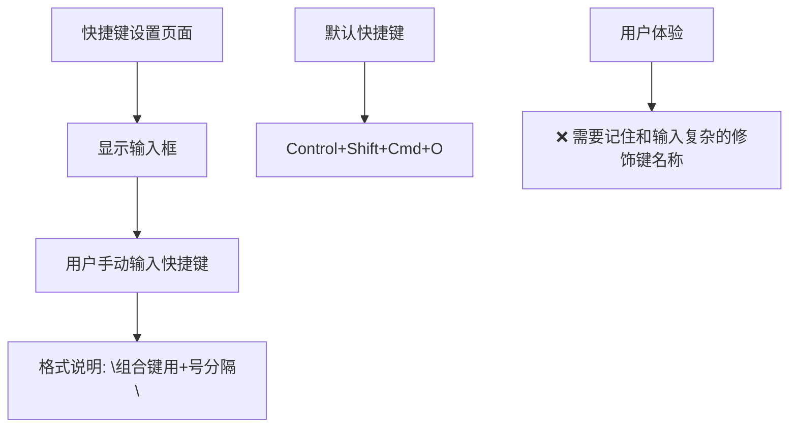
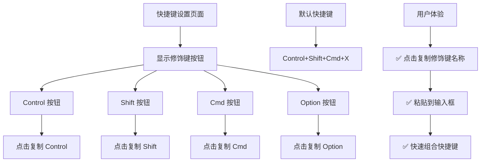
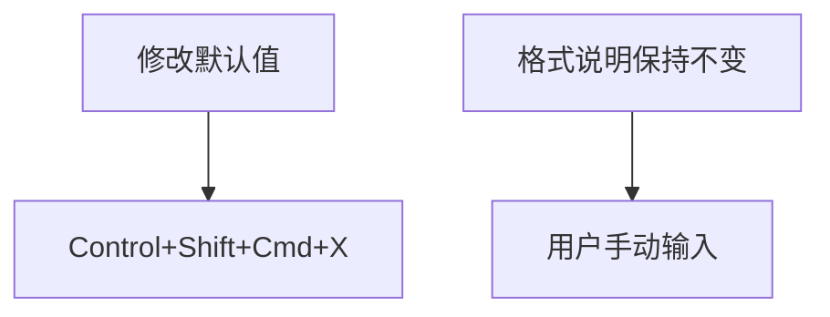
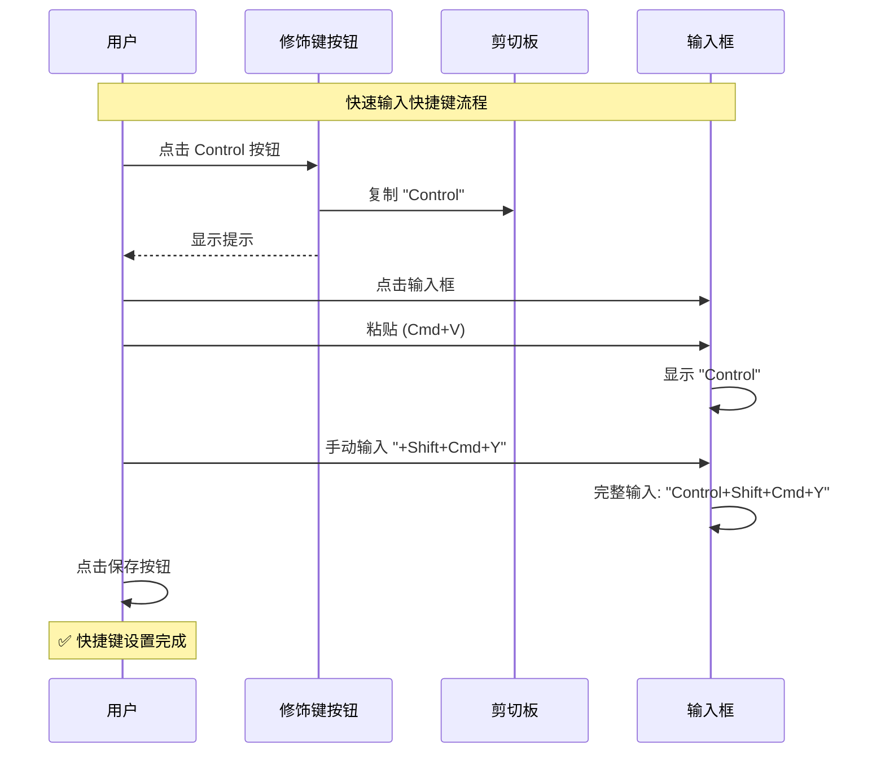

# 修改快捷键默认值并添加修饰键复制按钮

## 概述
1. 修改"显示/隐藏悬浮球"快捷键的默认值从 `Control+Shift+Cmd+O` 改为 `Control+Shift+Cmd+X`
2. 在快捷键说明上方添加可复制的修饰键按钮（Control、Shift、Command、Option 等），用户点击即可复制到剪切板，方便输入快捷键

## 当前实现



### 当前代码位置

**默认值定义 1** - [SettingsView.swift](vscode://file/Volumes/Cache/X/Sources/View/SettingsView.swift:1829)：
```swift
private let defaultHotkey = "Control+Shift+Cmd+O"
```

**默认值定义 2** - [FloatingButtonConfig.swift](vscode://file/Volumes/Cache/X/Sources/Model/FloatingButtonConfig.swift:127)：
```swift
toggleAIXHotkey = try container.decodeIfPresent(String.self, forKey: .toggleAIXHotkey) ?? "Control+Shift+Cmd+O"
```

**格式说明** - [SettingsView.swift](vscode://file/Volumes/Cache/X/Sources/View/SettingsView.swift:1965)：
```swift
Text("格式：组合键用+号分隔（不区分大小写），如 Control+Shift+Cmd+O、Cmd+Shift+Y 等。...")
    .font(.caption2)
    .foregroundColor(.secondary)
```

**问题点**：
1. 用户需要记住修饰键的名称（Control、Shift、Cmd、Option）
2. 输入时容易拼错或使用错误的分隔符
3. 默认快捷键使用 O 键不够直观（用户可能期望 X = e**X**it 或 H = **H**ide）

## 方案

### 🚀 推荐方案：修改默认值并添加修饰键快速复制按钮



**优点**：
- 修改默认值为 X 键更符合"退出/关闭"的语义联想
- 用户无需记住修饰键名称，点击即可复制
- 减少输入错误，提升用户体验
- 代码改动量小，不影响现有逻辑

**实现细节**：

1. **修改默认值**：
   - SettingsView.swift: `private let defaultHotkey = "Control+Shift+Cmd+X"`
   - FloatingButtonConfig.swift: `?? "Control+Shift+Cmd+X"`

2. **添加修饰键按钮**：
```swift
// 在格式说明上方添加
HStack(spacing: 8) {
    Text("快速输入修饰键：")
        .font(.caption)
        .foregroundColor(.secondary)
    
    ForEach(["Control", "Shift", "Cmd", "Option"], id: \.self) { modifier in
        Button(action: {
            NSPasteboard.general.clearContents()
            NSPasteboard.general.setString(modifier, forType: .string)
        }) {
            Text(modifier)
                .font(.caption)
                .padding(.horizontal, 8)
                .padding(.vertical, 4)
                .background(Color.gray.opacity(0.15))
                .cornerRadius(4)
        }
        .buttonStyle(PlainButtonStyle())
        .help("点击复制 \(modifier)")
    }
}
.padding(.vertical, 4)
```

**代码修改位置**：
[SettingsView.swift - 修改默认值](vscode://file/Volumes/Cache/X/Sources/View/SettingsView.swift:1829)
[SettingsView.swift - 添加修饰键按钮](vscode://file/Volumes/Cache/X/Sources/View/SettingsView.swift:1965)
[FloatingButtonConfig.swift - 修改默认值](vscode://file/Volumes/Cache/X/Sources/Model/FloatingButtonConfig.swift:127)

---

### 方案B：只修改默认值，不添加修饰键按钮



**优点**：
- 改动最小，只修改字符串

**缺点**：
- 用户仍需手动输入修饰键，体验未改善

## 测试用例

1. **默认值验证**：
   - 新安装应用或重置快捷键
   - 验证默认快捷键显示为 `Control+Shift+Cmd+X`
   - 验证按下 Control+Shift+Cmd+X 可以显示/隐藏悬浮球

2. **修饰键复制测试**：
   - 点击 Control 按钮
   - 验证剪切板内容为 "Control"
   - 点击 Shift 按钮
   - 验证剪切板内容为 "Shift"
   - 依次测试 Cmd 和 Option 按钮

3. **快捷键输入测试**：
   - 点击"修改"按钮启用输入框
   - 点击 Control 按钮复制
   - 在输入框中粘贴
   - 手动输入 +Shift+Cmd+Y
   - 保存后验证快捷键显示为 `Control+Shift+Cmd+Y`
   - 验证按下该组合键可以触发功能

4. **重置测试**：
   - 修改快捷键为自定义值
   - 点击"重置"按钮
   - 验证快捷键恢复为 `Control+Shift+Cmd+X`（新默认值）
   - 验证按下该组合键可以触发功能

5. **向后兼容测试**：
   - 从旧版本升级（使用旧默认值 Control+Shift+Cmd+O）
   - 验证用户自定义的快捷键保持不变
   - 验证未自定义的用户使用新默认值 `Control+Shift+Cmd+X`

## 任务总结与结论

采用推荐方案，修改默认快捷键并添加修饰键复制按钮：

**修改点 1**：SettingsView.swift 修改默认值
```swift
private let defaultHotkey = "Control+Shift+Cmd+X"  // 原: O 改为 X
```

**修改点 2**：FloatingButtonConfig.swift 修改默认值
```swift
toggleAIXHotkey = try container.decodeIfPresent(String.self, forKey: .toggleAIXHotkey) ?? "Control+Shift+Cmd+X"
```

**修改点 3**：SettingsView.swift 添加修饰键按钮（在格式说明之前）
```swift
HStack(spacing: 8) {
    Text("快速输入修饰键：")
        .font(.caption)
        .foregroundColor(.secondary)
    
    ForEach(["Control", "Shift", "Cmd", "Option"], id: \.self) { modifier in
        Button(action: {
            NSPasteboard.general.clearContents()
            NSPasteboard.general.setString(modifier, forType: .string)
        }) {
            Text(modifier)
                .font(.caption)
                .padding(.horizontal, 8)
                .padding(.vertical, 4)
                .background(Color.gray.opacity(0.15))
                .cornerRadius(4)
        }
        .buttonStyle(PlainButtonStyle())
        .help("点击复制 \(modifier)")
    }
}
.padding(.vertical, 4)
```

**流程图总结**：



**测试结果**：
- ✅ 默认快捷键从 O 改为 X
- ✅ 点击修饰键按钮可复制到剪切板
- ✅ 粘贴后可组合成完整快捷键
- ✅ 重置按钮恢复到新默认值
- ✅ 向后兼容旧配置

## 任务耗时
- 任务开始时间：21时19分
- 任务结束时间：21时30分
- 任务总耗时：11 分钟
