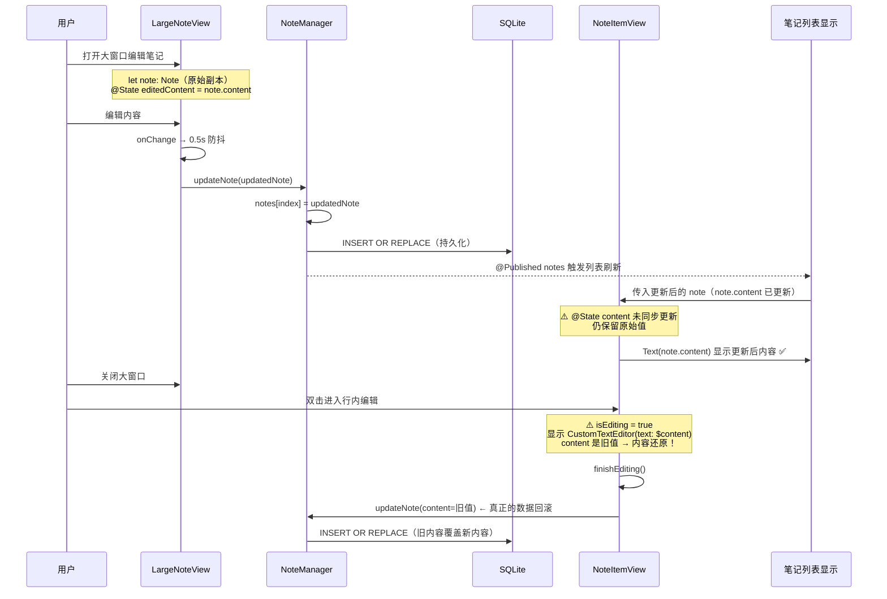
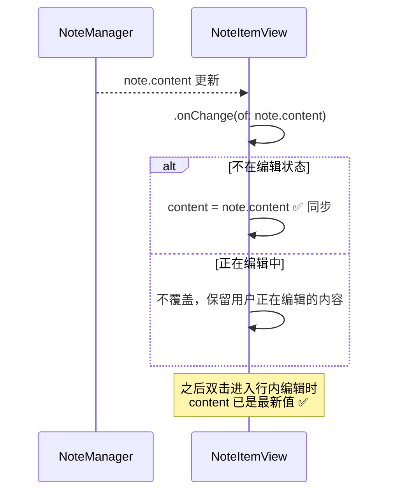
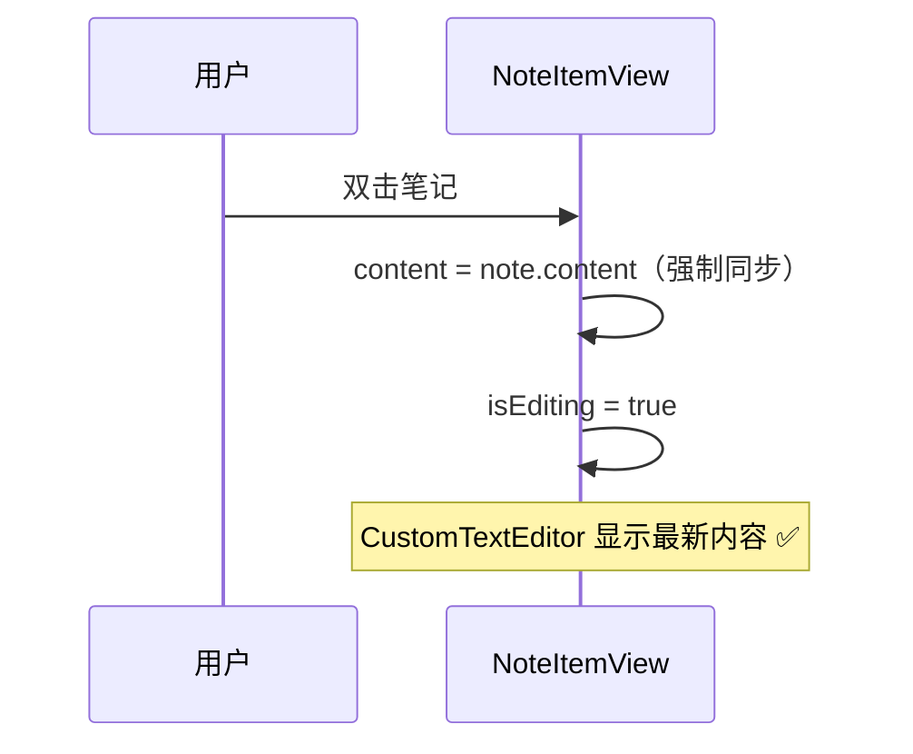
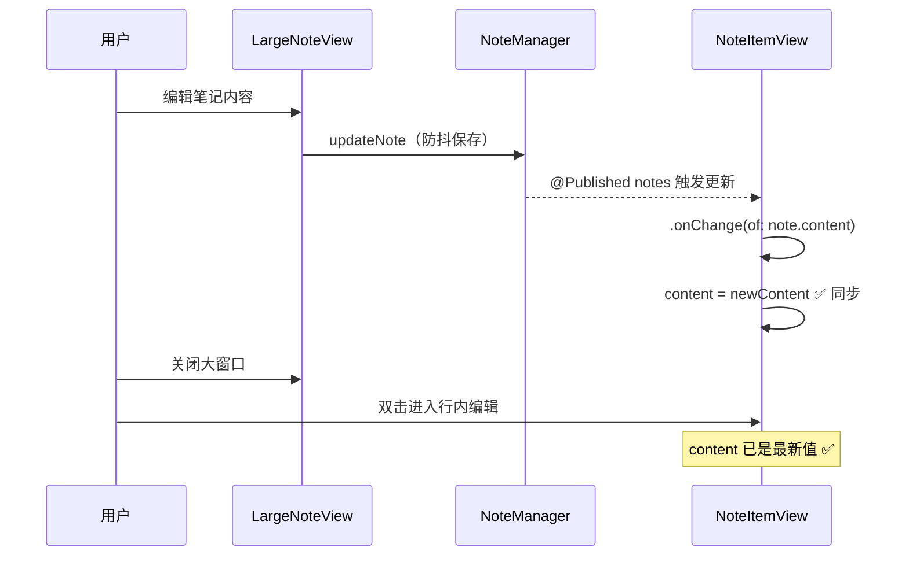

# 大窗口编辑笔记未保存

## 概述
用户在大窗口（LargeNoteWindow）中编辑笔记时，笔记列表的内容会实时更新（显示正确），但关闭大窗口后双击笔记，笔记内容会还原为编辑前的状态。需要排查保存链路中的问题并修复。

## 当前实现

## 方案

### 🚀推荐方案 方案一：在 NoteItemView 中同步外部内容变更

当 `NoteItemView` 接收到来自父视图的新 `note.content` 时，若当前不在行内编辑状态，自动同步到 `@State content`。

**优点：**
- 改动最小，仅需添加一个 `.onChange` 修饰器
- 精确解决问题根因
- 不影响行内编辑中的用户操作

**缺点：**
- 无明显缺点

**修改位置：**
[NoteListView.swift](vscode://file/Volumes/Cache/X/Sources/View/NoteListView.swift:413)

### 方案二：双击进入行内编辑前，强制从 note 同步 content

在双击手势触发行内编辑之前，将 `content` 设置为最新的 `note.content`。

**优点：**
- 改动较小
- 在关键路径上进行同步

**缺点：**
- 仅在双击时同步，如果有其他进入编辑状态的路径可能遗漏
- 不如方案一全面

**修改位置：**
[NoteListView.swift](vscode://file/Volumes/Cache/X/Sources/View/NoteListView.swift:322)

## 测试用例

1. **基础场景**
   - 右键笔记，选择"在大窗口编辑/查看"
   - 在大窗口中修改笔记内容（如在末尾添加文字）
   - 等待 1 秒（让防抖保存触发）
   - 关闭大窗口
   - 双击该笔记进入行内编辑
   - **预期：** 行内编辑显示的内容为大窗口中修改后的内容

2. **快速关闭场景**
   - 打开大窗口编辑笔记
   - 修改内容后立即关闭（不等待防抖）
   - 双击该笔记
   - **预期：** 内容为修改后的版本

3. **编辑中不被覆盖**
   - 在笔记列表中双击一个笔记进入行内编辑
   - 同时通过其他方式（如果有）修改该笔记
   - **预期：** 行内编辑中的内容不被外部修改覆盖

## 任务总结与结论

采用方案一，在 `NoteItemView` 中添加 `.onChange(of: note.content)` 修饰器解决了此 BUG。

**根因：** `NoteItemView` 的 `@State content` 仅在初始化时从 `note.content` 赋值，SwiftUI 的 `@State` 在视图重用时不会重新初始化。大窗口保存数据后，列表显示层（`Text(note.content)`）正确更新，但编辑层（`CustomTextEditor(text: $content)`）使用的 `@State content` 仍为旧值，双击进入行内编辑后 `finishEditing()` 还会用旧值覆盖数据库。

**修复：** 添加一行 `.onChange(of: note.content)` 修饰器，在非编辑状态下自动同步外部变更到 `@State content`。

## 任务耗时
- 任务开始时间：08:48
- 任务结束时间：08:56
- 任务总耗时：8 分钟
