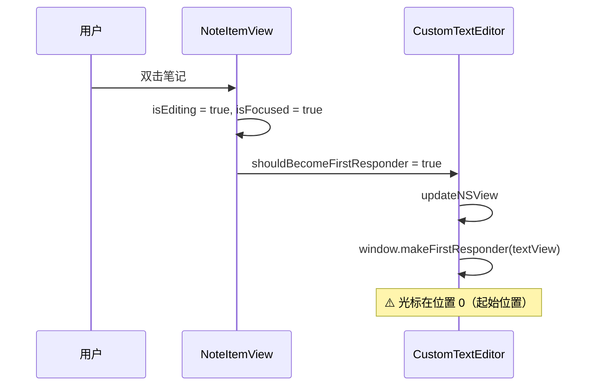
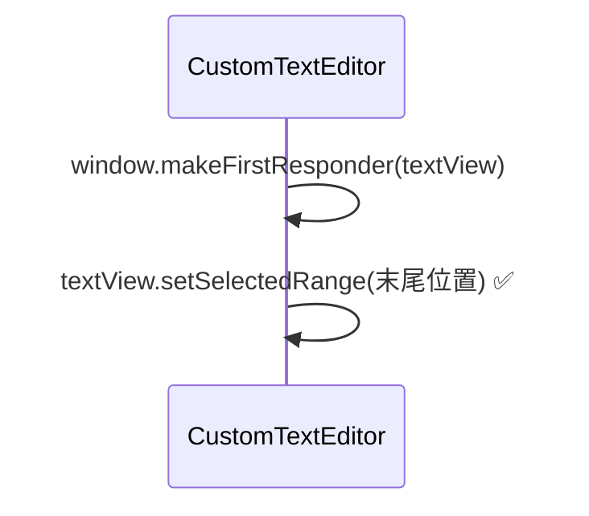
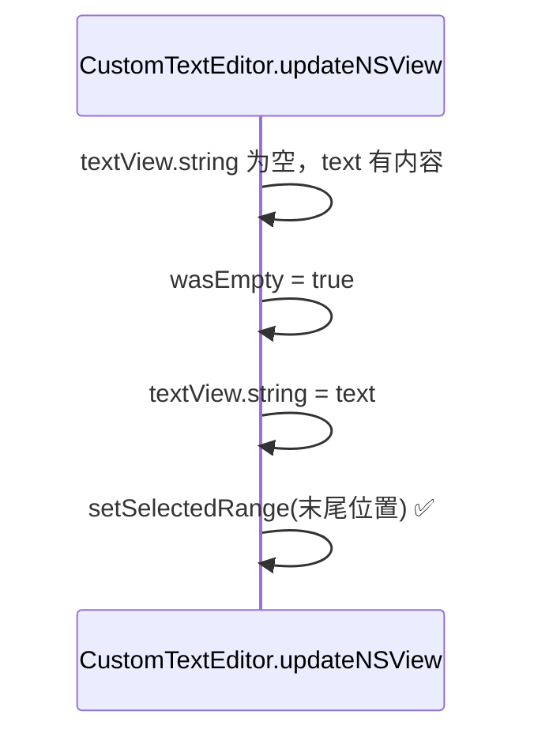

# 双击编辑笔记光标定位到末尾

## 概述
双击笔记列表项进入行内编辑时，光标默认定位在笔记内容的起始位置，需修改为定位到内容末尾，更符合追加编辑的使用习惯。

## 当前实现

## 方案

### 🚀推荐方案 方案一：成为第一响应者后将光标移到末尾

在 `CustomTextEditor` 的 `updateNSView` 中，当 textView 成为第一响应者时，同时将光标设置到文本末尾。

**优点：**
- 改动最小，一行代码
- 效果直接

**缺点：**
- 无

**修改位置：**
[NoteListView.swift](vscode://file/Volumes/Cache/X/Sources/View/NoteListView.swift:86)

## 测试用例

1. 双击笔记进入行内编辑，确认光标在内容末尾
2. 编辑完成后再次双击，光标仍在末尾
3. 多行笔记双击编辑，光标在最后一行末尾

## 任务总结与结论

修改了 `CustomTextEditor` 的 `updateNSView` 方法中的光标恢复逻辑。原逻辑在设置文本后总是恢复保存的 `selectedRanges`（位置 0），新逻辑在检测到 textView 从空文本首次填充内容时（`wasEmpty && !text.isEmpty`），直接将光标定位到文本末尾。

## 任务耗时
- 任务开始时间：08:59
- 任务结束时间：09:10
- 任务总耗时：11 分钟
