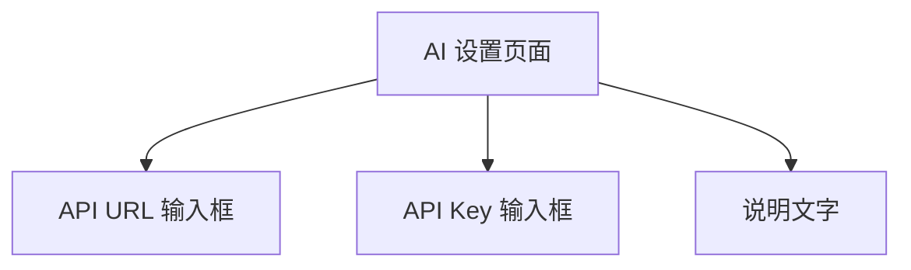
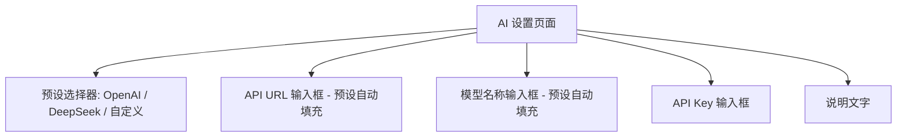
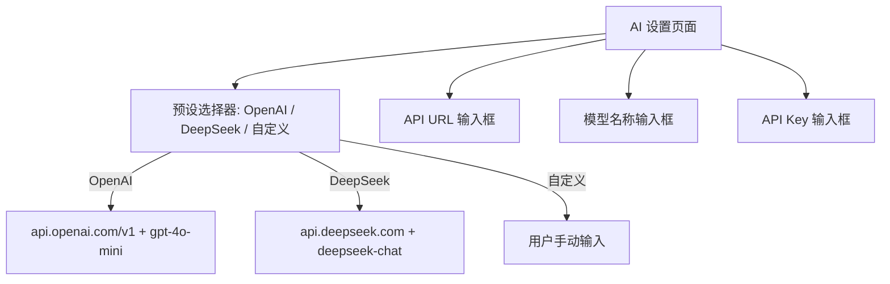

# AI设置添加DeepSeek预设

## 概述
在全局设置-AI设置页面中添加 DeepSeek 预设选项，用户可以快速切换 AI 提供商，自动填充 API URL 和模型名称。同时需要新增 `aiModel` 配置字段。

## 当前实现

当前仅支持手动输入 OpenAI 兼容接口地址和 API Key，无预设切换和模型选择功能。

## 方案

### 🚀推荐方案 方案一：添加预设选择器 + 模型字段

在 AI 设置页面顶部添加预设选择器，选择后自动填充 URL 和模型。同时增加模型名称输入框。

**优点：**
- 用户一键切换提供商
- 仍可手动修改为自定义配置
- 扩展性好，后续添加新提供商只需增加预设

**缺点：**
- 无

**修改位置：**
[FloatingButtonConfig.swift](vscode://file/Volumes/Cache/X/Sources/Model/FloatingButtonConfig.swift:37) — 新增 aiModel 字段
[FloatingButtonConfig.swift](vscode://file/Volumes/Cache/X/Sources/Model/FloatingButtonConfig.swift:747) — 新增 updateAiModel 方法
[SettingsView.swift](vscode://file/Volumes/Cache/X/Sources/View/SettingsView.swift:2082) — AISettingsView 改造

## 测试用例

1. 打开设置 → AI 设置，确认预设选择器显示
2. 选择 DeepSeek 预设，确认 URL 自动填充为 `https://api.deepseek.com`，模型填充为 `deepseek-chat`
3. 选择 OpenAI 预设，确认 URL 恢复为 `https://api.openai.com/v1`，模型填充为 `gpt-4o-mini`
4. 手动修改 URL 后，预设切换为"自定义"
5. 重启应用后配置保持不变

## 任务总结与结论

成功添加了 AI 提供商预设功能和模型字段。

修改了 FloatingButtonConfig 新增 `aiModel` 字段、ConfigManager 新增 `updateAiModel` 方法、AI 设置页面添加预设分段选择器和模型输入框。

## 任务耗时
- 任务开始时间：09:16
- 任务结束时间：09:26
- 任务总耗时：10 分钟
