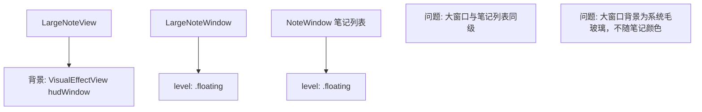
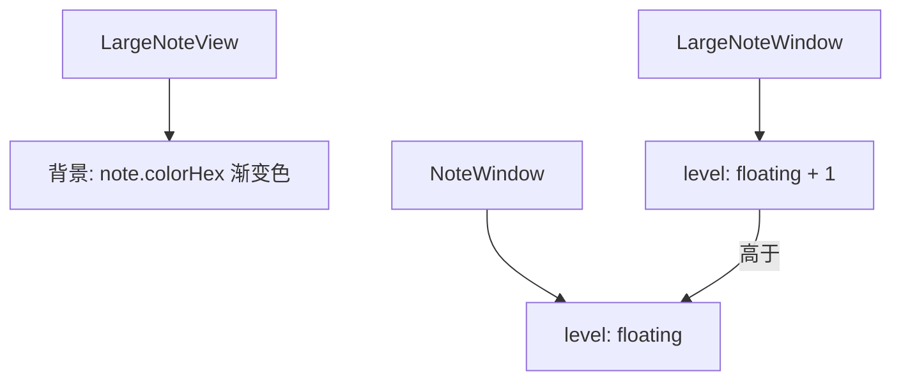
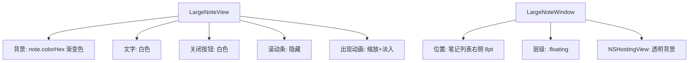

# 大窗口编辑颜色与笔记一致

## 概述
修改笔记大窗口编辑界面的背景颜色，使其与笔记卡片颜色一致（使用 `note.colorHex`），同时将大窗口层级设置在笔记列表之上。

## 当前实现

## 方案

### 🚀推荐方案 方案一：传递颜色到大窗口 + 提升窗口层级

1. 将 `note.colorHex` 传递到 `LargeNoteView`，替换背景为笔记颜色渐变
2. 将 `LargeNoteWindow` 的 `level` 设置为 `floating + 1`

**优点：**
- 视觉一致性
- 简洁直接

**缺点：**
- 无

**修改位置：**
[LargeNoteWindow.swift](vscode://file/Volumes/Cache/X/Sources/View/LargeNoteWindow.swift:32) — 窗口层级
[LargeNoteWindow.swift](vscode://file/Volumes/Cache/X/Sources/View/LargeNoteWindow.swift:115) — 背景视图

## 测试用例

1. 右键不同颜色的笔记，选择大窗口编辑，确认背景色与笔记卡片一致
2. 打开大窗口时，确认在笔记列表之上
3. 大窗口中编辑文字清晰可见

## 任务总结与结论

完成了大窗口的视觉和交互优化：

修改内容：
1. 背景改为笔记颜色渐变，与卡片风格一致
2. 窗口定位在笔记列表右侧，不被遮盖
3. 文字和关闭按钮设为白色
4. 隐藏 TextEditor 滚动条
5. 添加弹簧动画出现效果
6. 修复 NSHostingView 透明背景（消除圆角灰色尖角）

## 任务耗时
- 任务开始时间：09:32
- 任务结束时间：09:53
- 任务总耗时：21 分钟
