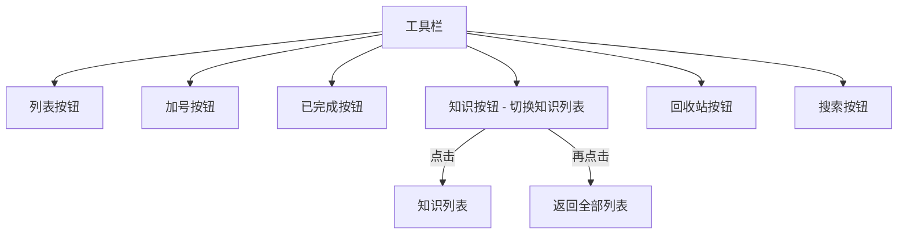
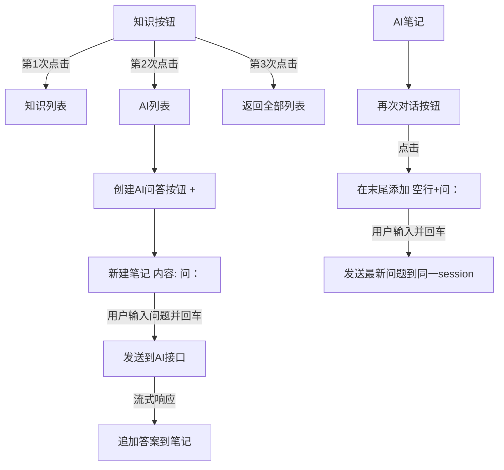
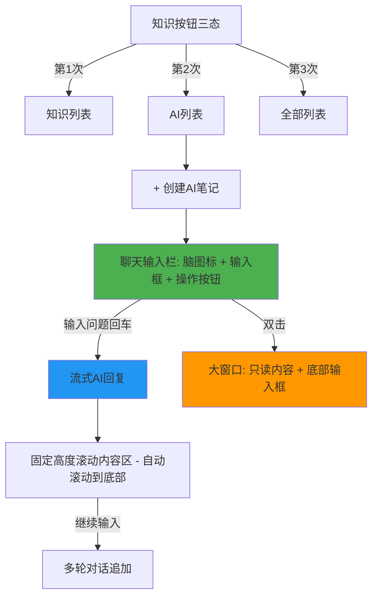

# AI笔记问答功能

## 概述
在笔记列表知识按钮上添加切换状态（知识列表/AI列表），在AI列表模式下提供AI问答笔记功能。用户创建AI笔记后以"问："开头输入问题，回车后调用AI接口获取流式回答，支持多轮对话。

## 当前实现

当前知识按钮只有两个状态：显示知识列表或返回全部列表，无AI功能。

## 方案

### 🚀推荐方案 方案一：知识按钮三态切换 + AI问答系统

#### 需要新增/修改的模块

**1. 新增 AIService 服务类** — 处理AI API调用
- OpenAI 兼容接口调用（支持流式输出）
- 会话管理（消息历史）

**2. 修改 NoteListView.swift** — 工具栏和视图
- 知识按钮改为三态切换：all → knowledge → ai → all
- AI 模式下显示创建按钮
- AI 笔记项添加"再次对话"按钮

**3. 修改 NoteListView.swift — ViewMode**
- 新增 `.ai` 视图模式

**4. 修改 Note 模型**
- 新增 `isAI` 字段标识AI笔记
- 新增 `aiSessionId` 字段关联会话

**5. 新增 NoteStore 迁移**
- 添加 isAI、aiSessionId 数据库列

**优点：**
- 架构清晰，AI 服务独立
- 会话管理支持多轮对话
- 流式输出体验好

**缺点：**
- 改动面较大，涉及多个文件

**修改位置：**
新增文件:
- Sources/Model/AIService.swift — AI API 调用服务

修改文件:
[Note.swift](vscode://file/Volumes/Cache/X/Sources/Model/Note.swift:45) — Note 结构体新增 isAI、aiSessionId 字段
[NoteStore.swift](vscode://file/Volumes/Cache/X/Sources/Model/NoteStore.swift:42) — 数据库迁移新增列
[NoteListView.swift](vscode://file/Volumes/Cache/X/Sources/View/NoteListView.swift:656) — 知识按钮三态切换逻辑
[NoteListView.swift](vscode://file/Volumes/Cache/X/Sources/View/NoteListView.swift:175) — NoteItemView 添加再次对话按钮
[NoteListView.swift](vscode://file/Volumes/Cache/X/Sources/View/NoteListView.swift:510) — ViewMode 新增 .ai

## 测试用例

1. **知识按钮切换**
   - 点击知识按钮 → 显示知识列表
   - 再点击 → 显示 AI 列表
   - 再点击 → 返回全部列表

2. **创建AI笔记**
   - 在AI模式下点击创建按钮
   - 确认新建笔记内容为"问："
   - 在"问："后输入问题并回车
   - 确认问题被发送到AI，流式输出回答

3. **再次对话**
   - 在AI笔记上点击"再次对话"
   - 确认末尾追加空行和"问："
   - 输入新问题并回车
   - 确认使用同一会话发送

4. **AI配置验证**
   - 未配置API Key时创建AI笔记提示配置
   - 使用DeepSeek预设验证API调用

## 任务总结与结论

本次任务实现了完整的 AI 笔记问答功能，最终采用聊天式交互设计，提供了良好的用户体验。

**关键实现：**
- **AIService.swift**：独立AI服务类，支持OpenAI兼容接口、SSE流式响应、多轮对话历史
- **聊天式列表项**：独立输入栏 + 只读滚动内容区，操作按钮（发送/复制/删除）始终显示
- **大窗口AI模式**：只读对话内容 + 底部输入框，白色placeholder，自动滚动
- **数据模型**：Note新增isAI/aiSessionId字段，NoteStore数据库迁移
- **实时更新**：AINoteItemView通过@StateObject观察NoteManager，确保流式内容实时显示

**迭代过程：**
从最初的内联编辑方案 → "问："前缀保护方案 → 最终聊天式交互方案，经历多轮反馈优化

## 任务耗时
- 任务开始时间：09:56
- 任务结束时间：11:43
- 任务总耗时：107 分钟
