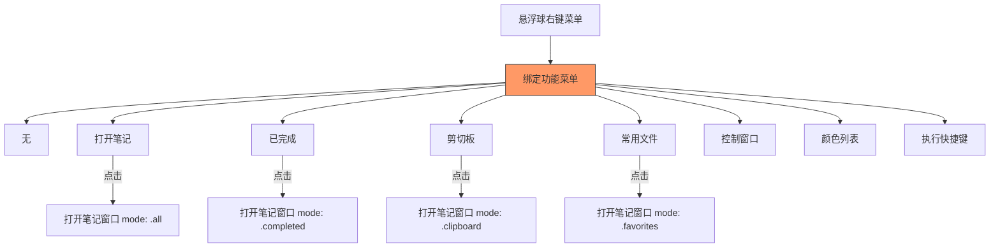
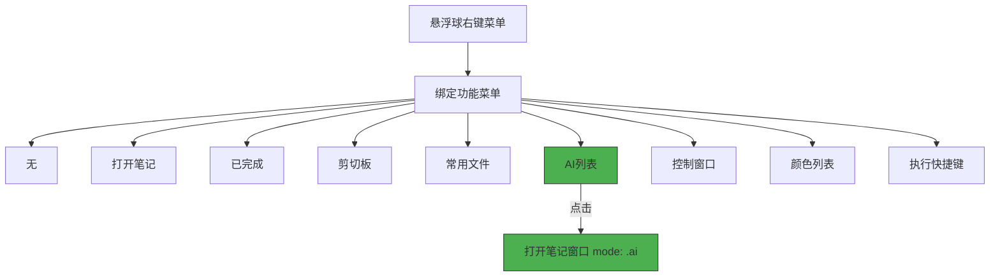
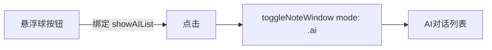

# 悬浮球绑定AI列表功能

## 概述
在悬浮球右键菜单的可绑定功能中添加"AI列表"选项，用户绑定后点击悬浮球可直接打开AI对话列表。

## 当前实现

当前缺少 AI 列表绑定选项。

## 方案

### 🚀推荐方案 方案一：新增 ButtonAction.showAIList

**优点：**
- 改动极小，与现有架构完美一致
- 复用 toggleNoteWindow 方法，仅需传入 mode: .ai

**缺点：**
- 无

**修改位置：**
[FloatingButtonConfig.swift](vscode://file/Volumes/Cache/X/Sources/Model/FloatingButtonConfig.swift:233) — ButtonAction 枚举添加 showAIList case + iconName
[AppDelegate.swift](vscode://file/Volumes/Cache/X/Sources/App/AppDelegate.swift:491) — handleFloatingButtonClicked 添加 case .showAIList 处理

## 测试用例

1. **绑定AI列表**
   - 右键悬浮球 → 选择按钮 → 选择"AI列表"
   - 确认按钮图标变为 brain.head.profile
2. **点击打开AI列表**
   - 点击绑定了AI列表的悬浮球按钮
   - 确认打开笔记窗口并直接显示AI列表模式
3. **设置面板同步**
   - 在设置面板中也能选择AI列表绑定

## 任务总结与结论

改动极小，仅新增一个枚举值和两处对应处理即完成功能。

## 任务耗时
- 任务开始时间：11:47
- 任务结束时间：11:55
- 任务总耗时：8 分钟
