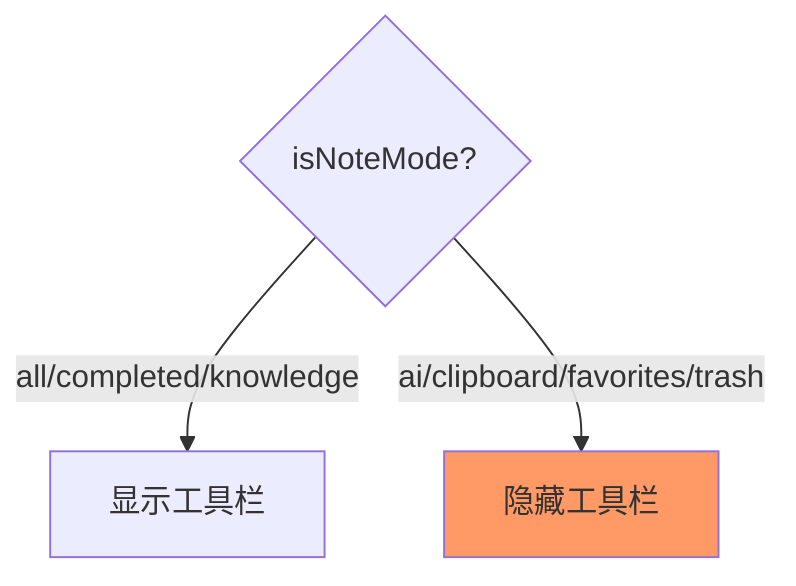
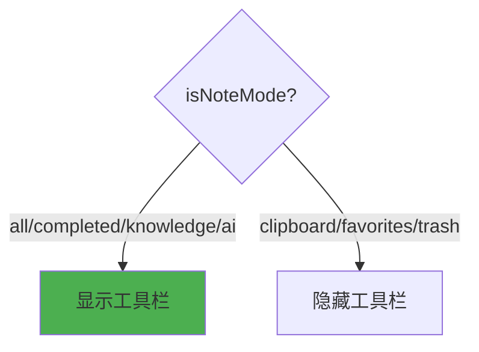

# AI列表显示工具栏

## 概述
通过悬浮球绑定打开的AI列表需要显示工具栏，与知识按钮切换进入AI模式的效果一致。

## 当前实现

AI模式未包含在 isNoteMode 判断中，导致工具栏被隐藏。

## 方案

### 🚀推荐方案 方案一：isNoteMode 添加 .ai 判断

**优点：** 一行代码修复
**缺点：** 无

**修改位置：**
[NoteListView.swift](vscode://file/Volumes/Cache/X/Sources/View/NoteListView.swift:756) — isNoteMode 添加 openMode == .ai

## 测试用例
1. 通过悬浮球绑定打开AI列表，确认显示完整工具栏
2. 确认工具栏功能正常（切换模式、创建AI笔记等）

## 任务总结与结论

一行修复，在 isNoteMode 判断中添加 `openMode == .ai`。

## 任务耗时
- 任务开始时间：12:04
- 任务结束时间：12:08
- 任务总耗时：4 分钟
