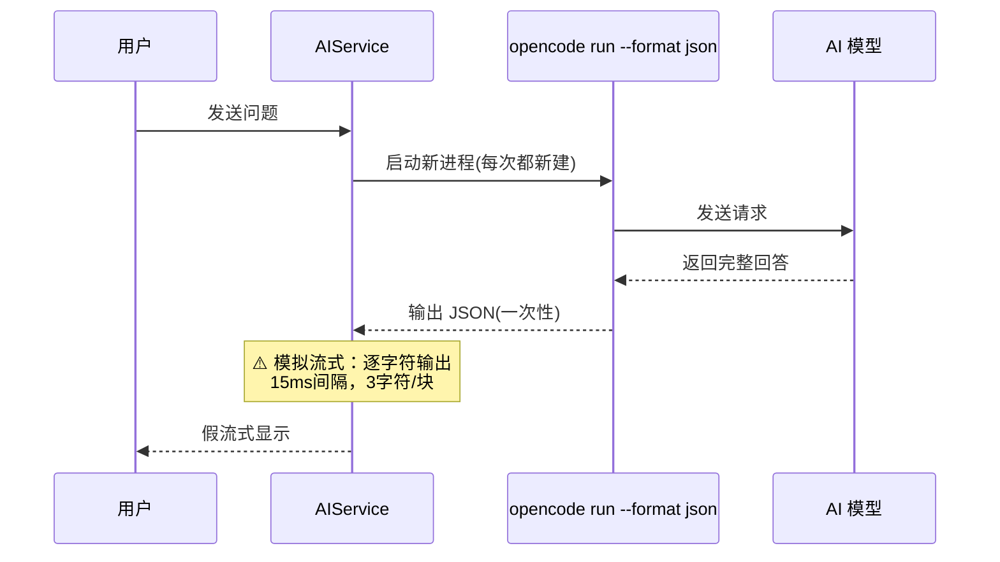
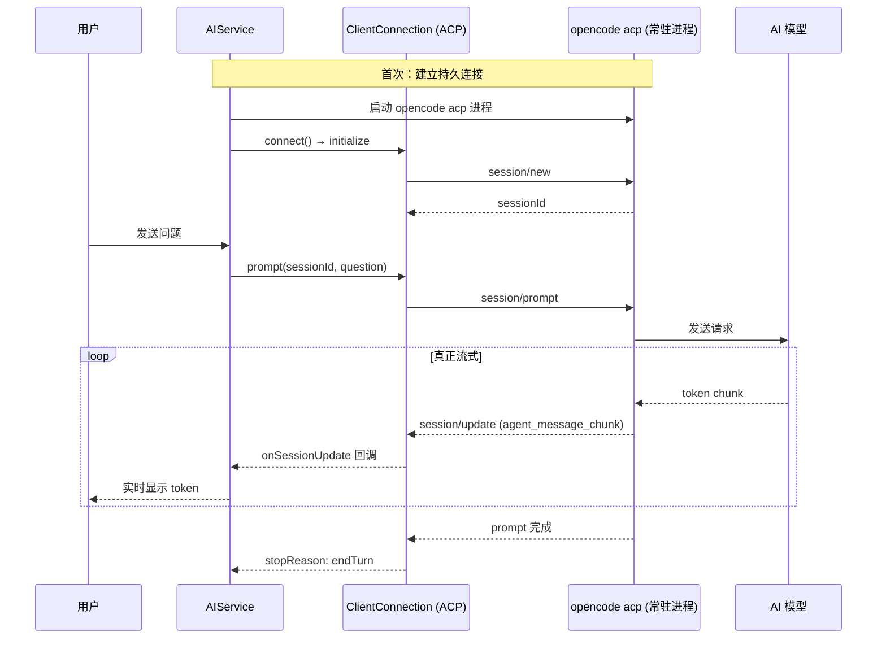
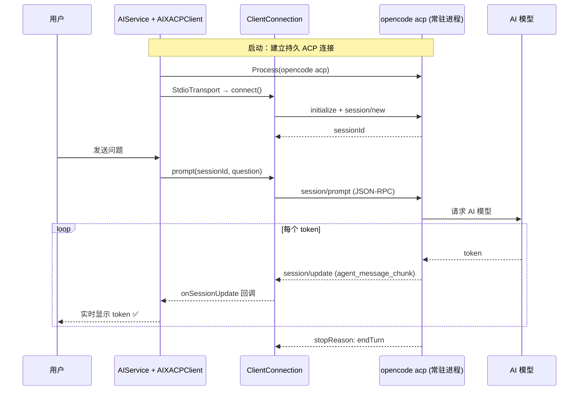

# 集成 opencode ACP 协议实现真正流式输出

## 概述
将 AIX 应用中的 opencode 后端从 CLI 模式（`opencode run --format json`，只能一次性返回完整回答）切换为 ACP 协议模式（`opencode acp`，通过 JSON-RPC 的 `session/update` 通知流式推送 `agent_message_chunk` 事件），实现真正的逐 token 流式输出。

## 当前实现

## 方案

### 🚀推荐方案 方案一：集成 aptove/swift-sdk（ACP Swift SDK）

**优点：**
- 真正的逐 token 流式输出，体验与 OpenAI SSE 一致
- ACP 是标准化协议，opencode 原生支持
- 进程常驻，不用每次新建，响应更快
- 多轮对话天然支持（同一 session）
- aptove/swift-sdk 是完整的 Swift 6 ACP 实现

**缺点：**
- 新增外部依赖（aptove/swift-sdk + swift-log + swift-collections）
- 需要管理 opencode acp 进程的生命周期

**代码修改位置：**
[Package.swift](vscode://file/Volumes/Cache/X/Package.swift:1) — 添加 swift-sdk 依赖
[AIService.swift](vscode://file/Volumes/Cache/X/Sources/Model/AIService.swift:1) — 替换 CLI 后端为 ACP 协议

### 方案二：保持 CLI 方式 + 模拟流式

维持 `opencode run --format json` 调用，完整回答后逐字符模拟流式。

**优点：**
- 无需新增依赖
- 实现简单

**缺点：**
- 不是真正的流式，用户需等待完整回答后才能看到内容
- 每次新建进程，启动慢
- 模拟流式体验差

**代码修改位置：**
无需修改（已实现）

## 测试用例

1. **基础对话测试**：
   - 打开 AIX 应用
   - 在设置中将 AI 模式切换为 "opencode"
   - 创建新笔记，输入 `问：你好，请简单介绍自己`
   - 点击发送
   - 预期：应看到逐字/逐词流式输出回答，而非整块一次性显示

2. **多轮对话测试**：
   - 在同一笔记中继续输入 `问：刚才你说的第一点是什么？`
   - 发送后，AI 应能回忆上一轮内容
   - 预期：ACP 会话保持连接，多轮对话有上下文

3. **取消测试**：
   - 发送问题后，在流式输出过程中点击取消
   - 预期：输出立即停止

4. **错误恢复测试**：
   - 断开网络后发送问题
   - 预期：显示错误信息，下次重连自动恢复

## 任务总结与结论

成功将 AIX 的 opencode AI 后端从 CLI 模式升级为 ACP 协议模式：

**改动文件：**
- Package.swift — 添加 aptove/swift-sdk (ACP Swift SDK) 依赖
- AIService.swift — 新增 AIXACPClient 类实现 ACP Client 协议，替换 CLI 调用为 ACP 连接
- FloatingButtonConfig.swift — 新增 opencode 模式配置项
- SettingsView.swift — 新增 opencode 设置面板

**关键改进：**
- 真正流式输出（ACP agent_message_chunk），告别模拟逐字符
- 进程常驻，不再每次请求都新建 opencode 进程
- 多轮对话自动上下文保持（同一 ACP session）

## 任务耗时
- 任务开始时间：18:55
- 任务结束时间：18:57
- 任务总耗时：2 分钟
