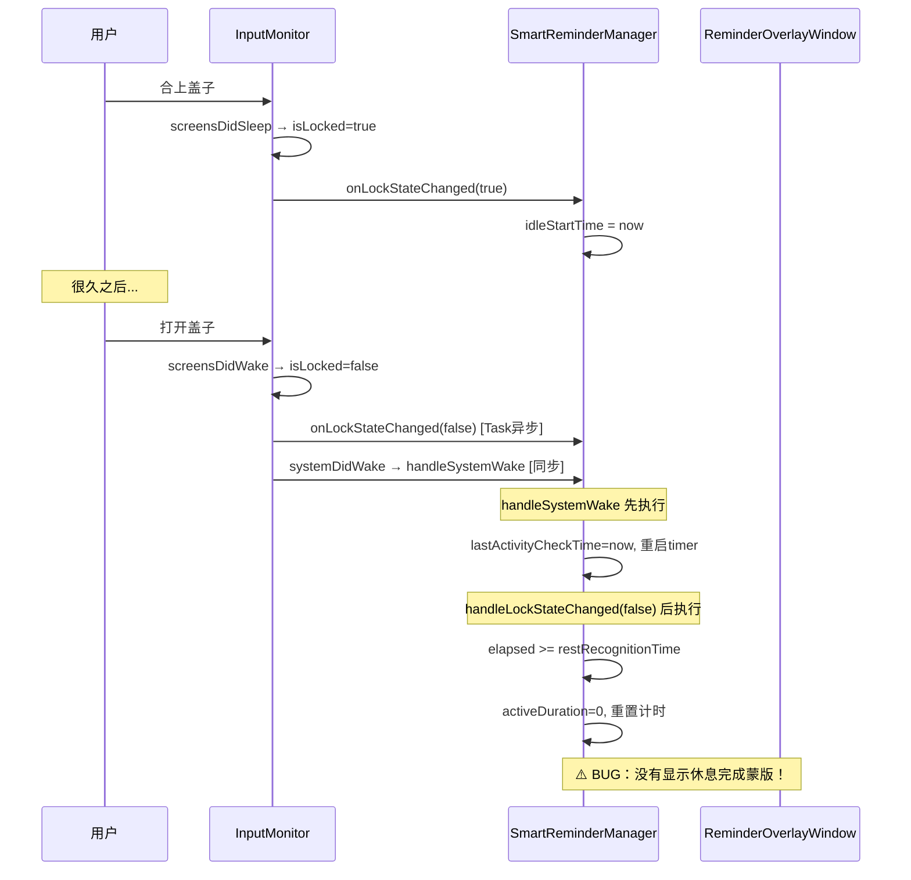
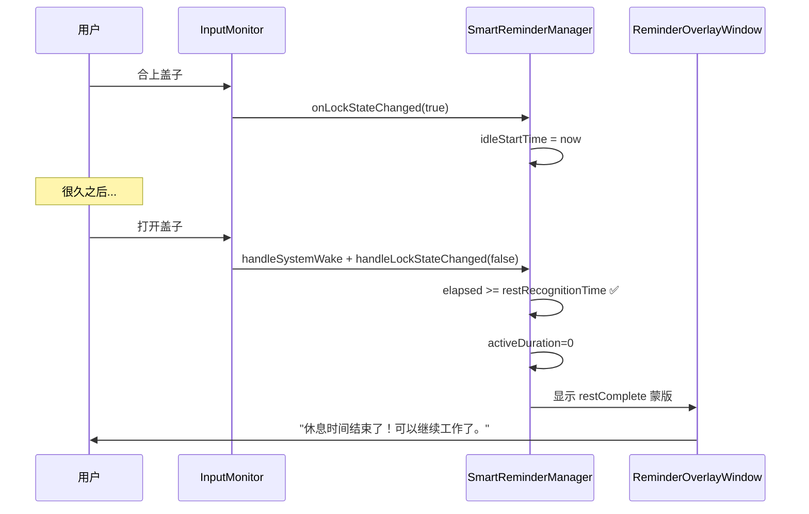
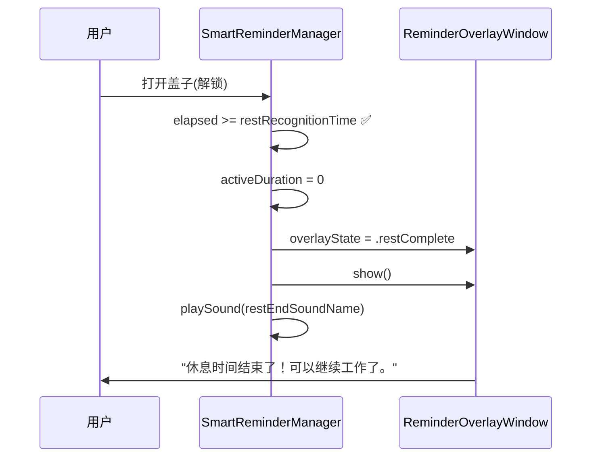

# 盒盖唤醒后不显示休息完成蒙版

## 概述
用户合上笔记本盖子休息很久后，打开盖子解锁，没有看到"休息完成"蒙版提示。用户期望合盖视为休息，唤醒后应的显示"休息完成"蒙版通知。

## 当前实现

## 方案

### 🚀推荐方案 方案一：在锁屏解锁后识别为充足休息时，显示休息完成蒙版

**优点：**
- 修改最小，只需在 `handleLockStateChanged(false)` 的充足休息分支中添加蒙版显示
- 逻辑清晰，用户体验完整

**缺点：**
- 无

**代码修改位置：**
[SmartReminderManager.swift](vscode://file/Volumes/Cache/X/Sources/Model/SmartReminderManager.swift:320) — `handleLockStateChanged` 方法中，充足休息分支添加蒙版显示

### 方案二：在 handleSystemWake 中判断盒盖时长并显示蒙版

在 `handleSystemWake` 中检测是否有足够长的 `idleStartTime`，直接处理。

**优点：**
- 唤醒入口统一处理

**缺点：**
- `handleSystemWake` 中 `idleStartTime` 可能已被 `handleLockStateChanged(true)` 设置，时序可能冲突
- `handleSystemWake` 是 `@objc` 方法，与 MainActor 隔离有潜在风险

**代码修改位置：**
[SmartReminderManager.swift](vscode://file/Volumes/Cache/X/Sources/Model/SmartReminderManager.swift:189) — `handleSystemWake` 方法

## 测试用例

1. **盒盖唤醒测试**：
   - 启动 AIX，开启智能提醒功能，设置工作时长为 1 分钟，休息认定时间为 1 分钟
   - 使用电脑 30 秒（累计一些工作时长）
   - 合上笔记本盖子，等待超过 1 分钟
   - 打开盖子并解锁
   - 预期：看到"休息完成"蒙版提示

2. **短暂盒盖不触发**：
   - 合上盖子 10 秒后打开
   - 预期：不显示休息完成蒙版，继续正常工作倒计时

## 任务总结与结论

在 `handleLockStateChanged(false)` 中检测到盒盖休息超过认定阈值后，添加了蒙版展示逻辑：

修改文件：SmartReminderManager.swift — `handleLockStateChanged` 方法，充足休息分支添加 8 行代码。

## 任务耗时
- 任务开始时间：19:07
- 任务结束时间：19:12
- 任务总耗时：5 分钟
