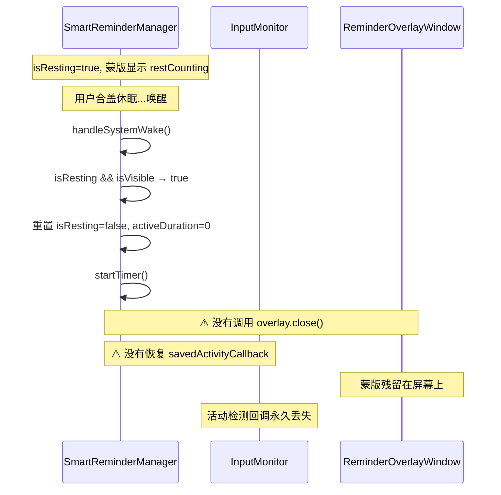
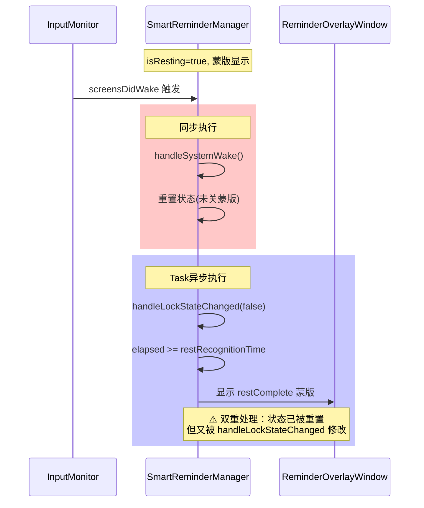
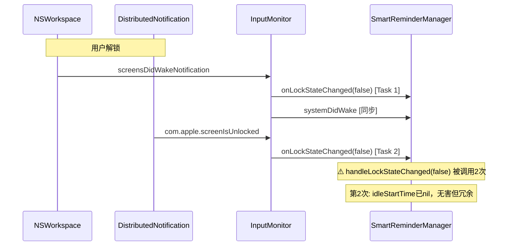
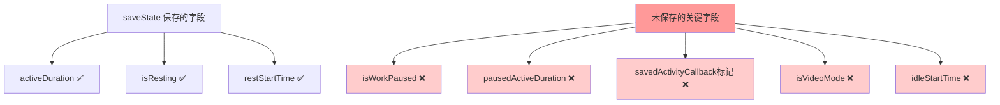
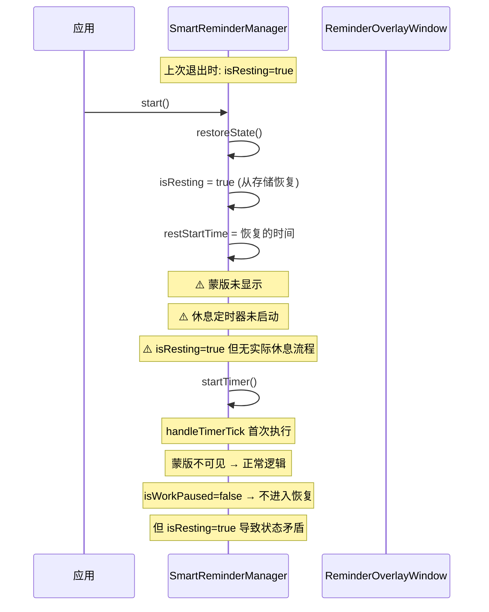
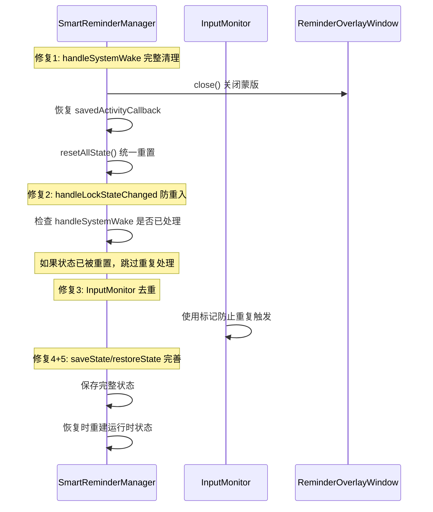
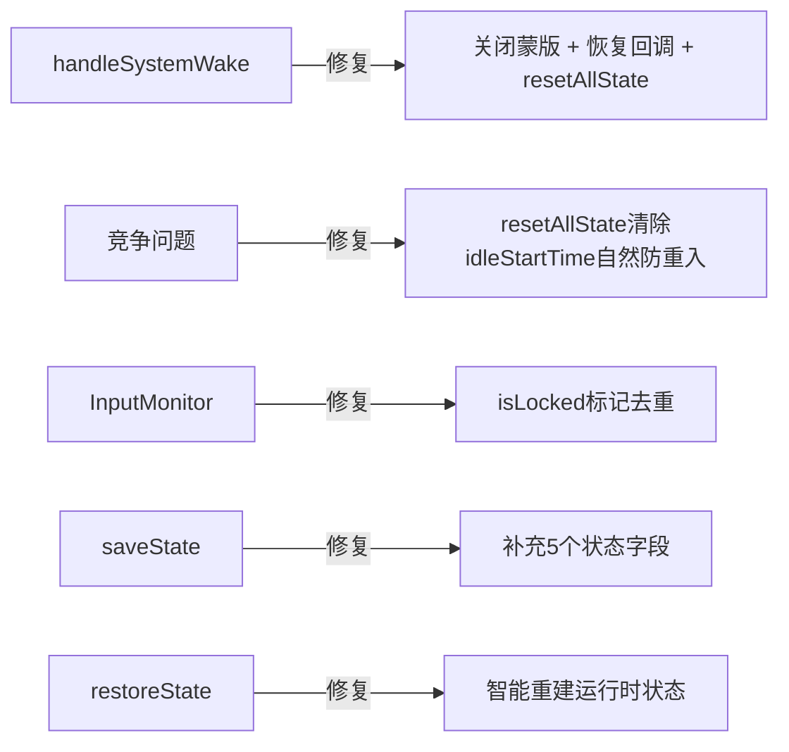

# 修复智能提醒系统边界情况

## 概述
深入分析智能提醒系统代码后，发现5个边界情况问题需要修复：3个严重、2个中等。

## 当前实现

### 问题1：handleSystemWake 不关闭蒙版和恢复回调

### 问题2：handleSystemWake 与 handleLockStateChanged 竞争

### 问题3：双重通知触发

### 问题4：saveState 状态不完整

### 问题5：restoreState 不恢复运行时状态

## 方案

### 🚀推荐方案 方案一：全面修复所有5个问题

**优点：**
- 彻底解决所有边界情况
- 状态管理更加健壮

**缺点：**
- 修改量较大，需要仔细测试

**代码修改位置：**
[SmartReminderManager.swift handleSystemWake](vscode://file/Volumes/Cache/X/Sources/Model/SmartReminderManager.swift:199) — 添加蒙版关闭和回调恢复
[SmartReminderManager.swift handleLockStateChanged](vscode://file/Volumes/Cache/X/Sources/Model/SmartReminderManager.swift:308) — 添加防重入检查
[InputMonitor.swift](vscode://file/Volumes/Cache/X/Sources/Model/InputMonitor.swift:70) — 去重处理
[SmartReminderManager.swift saveState](vscode://file/Volumes/Cache/X/Sources/Model/SmartReminderManager.swift:1017) — 补充保存字段
[SmartReminderManager.swift restoreState](vscode://file/Volumes/Cache/X/Sources/Model/SmartReminderManager.swift:1033) — 补充恢复逻辑

## 测试用例

1. **蒙版显示中盒盖再打开**：
   - 工作到弹出蒙版 → 进入休息倒计时状态 → 合盖 → 等待 → 开盖解锁
   - 预期：旧蒙版关闭，显示新的"休息完成"蒙版，活动检测正常

2. **短暂盒盖（< restRecognitionTime）后打开**：
   - 合盖 30 秒后打开
   - 预期：不显示蒙版，工作倒计时继续

3. **应用退出重启后状态恢复**：
   - 工作 10 分钟后退出应用
   - 重新启动
   - 预期：工作时长从 10 分钟继续

4. **快速多次锁屏解锁**：
   - 快速连续按 Ctrl+Cmd+Q 锁屏再解锁
   - 预期：不显示错误蒙版，状态正常

## 任务总结与结论

修复了智能提醒系统中5个边界情况问题：

修改文件：
- SmartReminderManager.swift — handleSystemWake/saveState/restoreState
- InputMonitor.swift — 锁屏通知去重

## 任务耗时
- 任务开始时间：19:26
- 任务结束时间：19:37
- 任务总耗时：11 分钟
