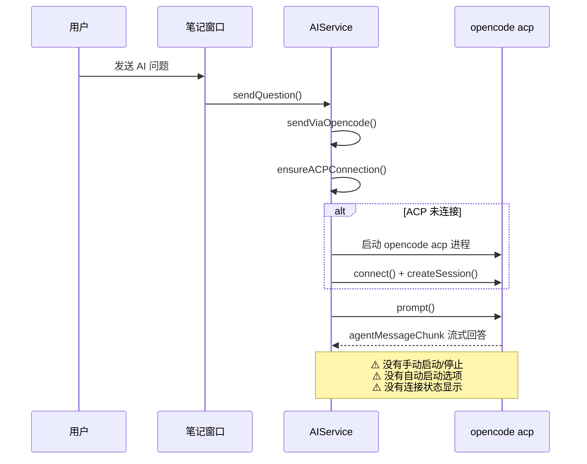
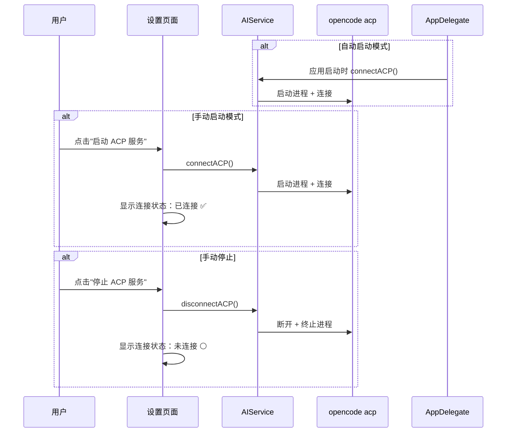
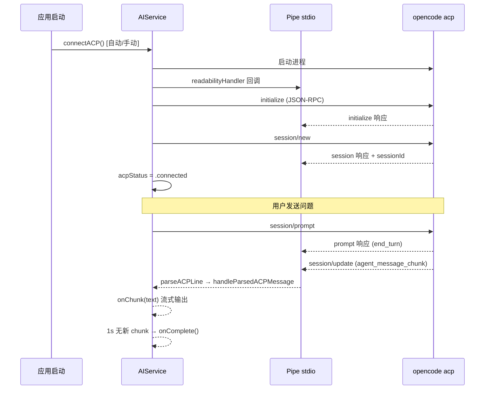

# ACP 服务启动控制

## 概述
当前 opencode ACP 服务是懒加载的（首次发 AI 消息时才建立连接），用户无法主动管理 ACP 服务的生命周期。需要在设置中添加手动启动/停止按钮和自动启动选项。

## 当前实现

## 方案

### 🚀推荐方案 方案一：在设置中添加 ACP 服务控制面板

**优点：**
- 用户可控，灵活选择自动或手动
- 自动启动可减少首次 AI 查询延迟
- 连接状态一目了然

**缺点：**
- 自动启动会多占一个后台进程

**代码修改位置：**
[FloatingButtonConfig.swift](vscode://file/Volumes/Cache/X/Sources/Model/FloatingButtonConfig.swift:40) — 添加 `acpAutoStart: Bool` 配置字段
[AIService.swift](vscode://file/Volumes/Cache/X/Sources/Model/AIService.swift:7) — 添加 `acpStatus` 状态属性，公开 `connectACP()`/`disconnectACP()` 方法
[SettingsView.swift](vscode://file/Volumes/Cache/X/Sources/View/SettingsView.swift:2222) — opencode 设置区域添加控制面板
[AppDelegate.swift](vscode://file/Volumes/Cache/X/Sources/App/AppDelegate.swift:29) — 启动时检查并自动连接

## 测试用例

1. **手动启动**：进入设置 → opencode 配置 → 点击"启动 ACP 服务" → 状态变为"已连接"
2. **手动停止**：点击"停止 ACP 服务" → 状态变为"未连接"
3. **自动启动**：开启"应用启动时自动启动" → 重启应用 → ACP 自动连接
4. **首次使用无延迟**：ACP 已连接时发 AI 消息 → 立即收到回答

## 任务总结与结论

已完成 ACP 服务启动控制功能的实现，包含以下核心改动：

1. **手动 JSON-RPC 实现**：移除 aptove/swift-sdk 依赖，直接通过 Pipe + readabilityHandler 实现 JSON-RPC 2.0 over stdio 通信
2. **消息格式适配**：解析路径修正为 `params.update.sessionUpdate` + `params.update.content`（而非 SDK 假定的 `params.type`）
3. **延迟完成机制**：解决 prompt 响应先于 chunks 到达的时序问题，使用 Timer 在最后一个 chunk 后 1 秒触发 onComplete
4. **ACP 状态管理**：添加 `acpStatus` 枚举（disconnected/connecting/connected），设置页面实时显示连接状态
5. **自动启动**：AppDelegate 启动时检查 `acpAutoStart` 配置，自动连接 ACP 服务

## 任务耗时
- 任务开始时间：19:40
- 任务结束时间：20:43
- 任务总耗时：63 分钟
