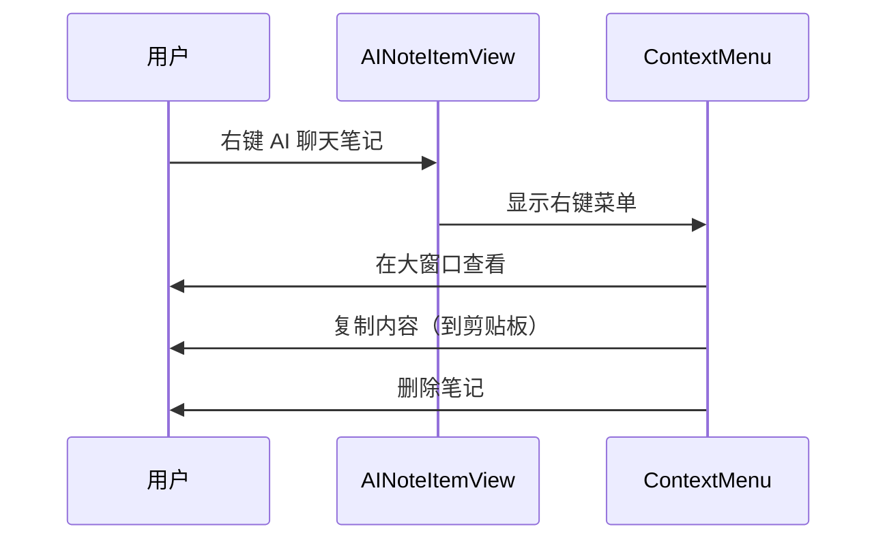
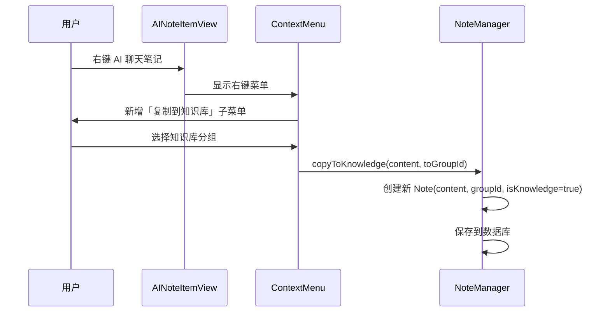
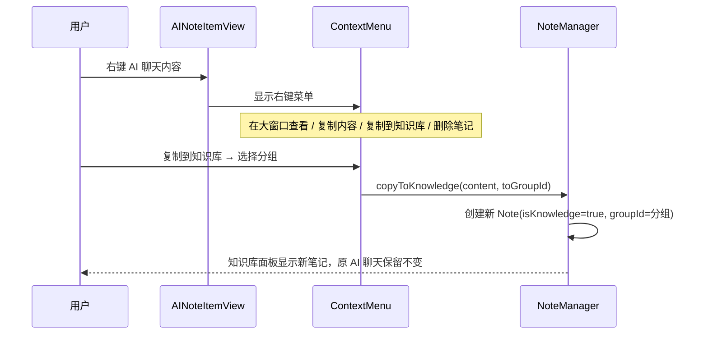

# AI聊天复制到知识库

## 概述
在 AI 聊天列表项的右键菜单中，新增"复制到知识库"子菜单，列出所有知识库分组，点击后将聊天内容**复制**（非移动）为一条新的知识库笔记。

## 当前实现

## 方案

### 🚀 推荐方案：右键菜单 + copyToKnowledge 方法

**优点**：
- 实现简单，复用现有 addNote 机制
- 不影响原 AI 笔记（复制而非移动）
- 与普通笔记的"保存为知识"子菜单风格一致

**缺点**：
- 无

**代码修改位置**：
[NoteListView.swift](vscode://file/Volumes/Cache/X/Sources/View/NoteListView.swift:326) — AI 笔记右键菜单，添加"复制到知识库"子菜单
[Note.swift](vscode://file/Volumes/Cache/X/Sources/Model/Note.swift:172) — NoteManager，添加 copyToKnowledge 方法

## 测试用例
1. 创建一个 AI 聊天笔记并获得回复
2. 右键点击聊天内容区域
3. 确认菜单中出现「复制到知识库」子菜单
4. 悬停显示所有知识库分组
5. 点击某个分组
6. 切换到知识库面板，确认该分组下多了一条新笔记，内容与 AI 聊天一致
7. 确认原 AI 聊天笔记未被删除或修改

## 任务总结与结论
在 AI 聊天列表项右键菜单中新增了「复制到知识库」子菜单功能。NoteManager 新增 `copyToKnowledge` 方法创建知识库笔记副本，与现有「保存为知识」（移动）功能互补，为用户提供了非破坏性的知识归档方式。

## 任务耗时
- 任务开始时间：20:51
- 任务结束时间：21:08
- 任务总耗时：17 分钟
