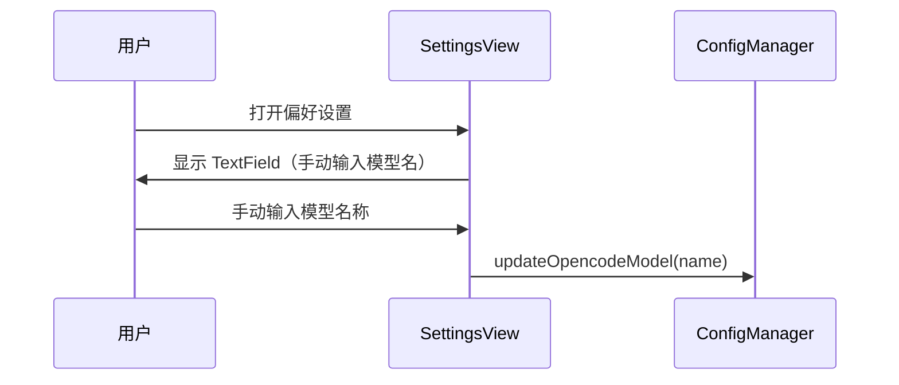
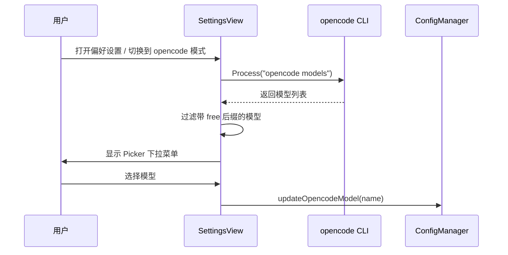

# opencode模型动态查询

## 概述
偏好设置中 opencode 模型选择从手动输入改为下拉选择，模型列表通过 `opencode models` CLI 命令动态查询并过滤 free 后缀模型。

## 当前实现

## 方案

### 🚀 推荐方案：Picker 下拉 + 异步 CLI 查询

**优点**：
- 模型列表始终最新
- 用户无需记忆模型名称
- 自动过滤免费模型，操作便捷

**缺点**：
- 首次打开设置时有短暂加载延迟

**代码修改位置**：
[SettingsView.swift](vscode://file/Volumes/Cache/X/Sources/View/SettingsView.swift:2229) — 将 TextField 改为 Picker，添加模型查询逻辑

## 测试用例
1. 打开偏好设置，切换到 AI 设置 opencode 模式
2. 确认模型选择为下拉菜单
3. 下拉菜单显示从 `opencode models` 查询到的 free 模型
4. 选择一个模型，确认配置已保存

## 任务总结与结论
将 opencode 模型选择从手动 TextField 改为 Picker 下拉菜单，通过 `opencode models` CLI 命令动态查询并过滤 `-free` 后缀的免费模型。页面 onAppear 时自动加载，并提供刷新按钮。

## 任务耗时
- 任务开始时间：21:12
- 任务结束时间：21:26
- 任务总耗时：14 分钟
