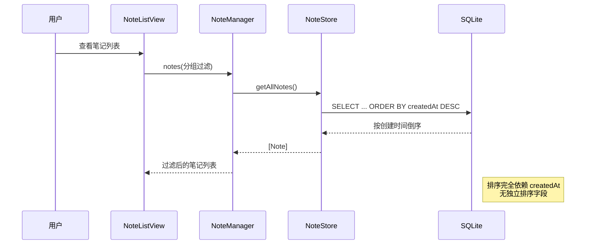
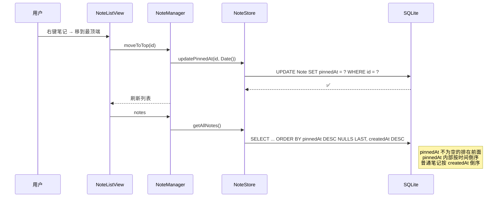
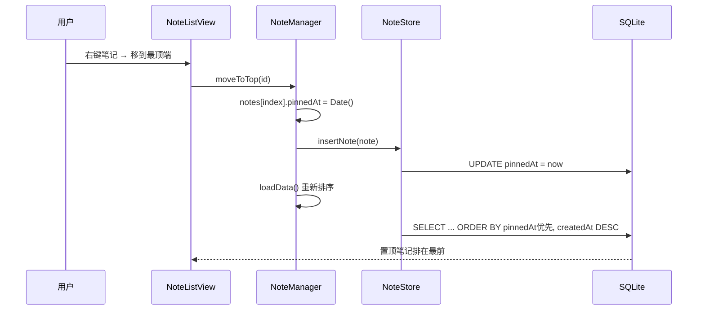

# 笔记右键移到最顶端

## 概述
在笔记 item 的右键菜单中添加"移到最顶端"选项，将选中的笔记排到当前列表的最前面。

## 当前实现

当前排序机制：
- Note 表没有独立的排序字段
- 所有排序通过 `ORDER BY createdAt DESC` 实现
- NoteGroup 有 `sortOrder` 字段但 Note 没有

## 方案

### 🚀推荐方案：新增 pinnedAt 字段

**优点**：
- 保留原始创建时间
- 支持多个置顶笔记（按置顶时间排序）
- 可扩展：将来可加"取消置顶"
- 数据库迁移简单（ALTER TABLE ADD COLUMN）

**缺点**：
- 需要数据库迁移
- 新增一个可空字段

**修改位置**：
[Note.swift](vscode://file/Volumes/Cache/X/Sources/Model/Note.swift:6) — 添加 pinnedAt 属性
[NoteStore.swift](vscode://file/Volumes/Cache/X/Sources/Model/NoteStore.swift:61) — 迁移 + 修改 INSERT/SELECT SQL
[NoteStore.swift](vscode://file/Volumes/Cache/X/Sources/Model/NoteStore.swift:152) — 修改 getAllNotes 排序
[Note.swift](vscode://file/Volumes/Cache/X/Sources/Model/Note.swift:119) — NoteManager 添加 moveToTop 方法
[NoteListView.swift](vscode://file/Volumes/Cache/X/Sources/View/NoteListView.swift:326) — 右键菜单添加选项

### 方案二：修改 createdAt 时间戳

右键"移到最顶端"时将 `createdAt` 更新为当前时间。

**优点**：
- 无需数据库迁移
- 实现极简

**缺点**：
- 丢失原始创建时间（UI 中会显示错误的创建日期）
- 不可逆

## 测试用例
1. 在任意笔记分组中创建多条笔记
2. 右键最底部的笔记，点击"移到最顶端"
3. 验证该笔记出现在列表第一位
4. 再右键另一条笔记"移到最顶端"，验证它排在之前置顶的笔记之上
5. 验证 AI 聊天列表中的笔记也支持"移到最顶端"
6. 验证知识库笔记也支持"移到最顶端"
7. 重启应用后验证置顶状态持久化

## 任务总结与结论
通过新增 `pinnedAt` 可空时间字段实现笔记置顶功能。数据库排序改为 `CASE WHEN pinnedAt IS NOT NULL THEN 0 ELSE 1 END, pinnedAt DESC, createdAt DESC`，确保置顶笔记始终在前且按置顶时间倒序。

修改文件：Note.swift（模型+NoteManager）、NoteStore.swift（迁移+SQL）、NoteListView.swift（右键菜单）

## 任务耗时
- 任务开始时间：21:36
- 任务结束时间：23:12
- 任务总耗时：96 分钟
