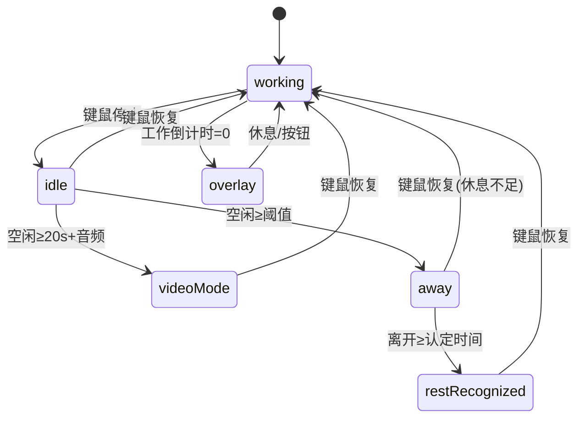
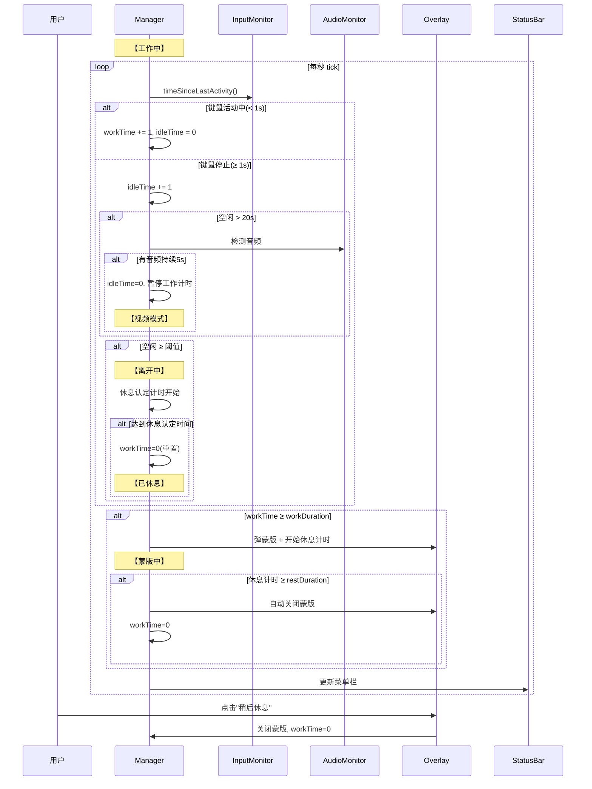
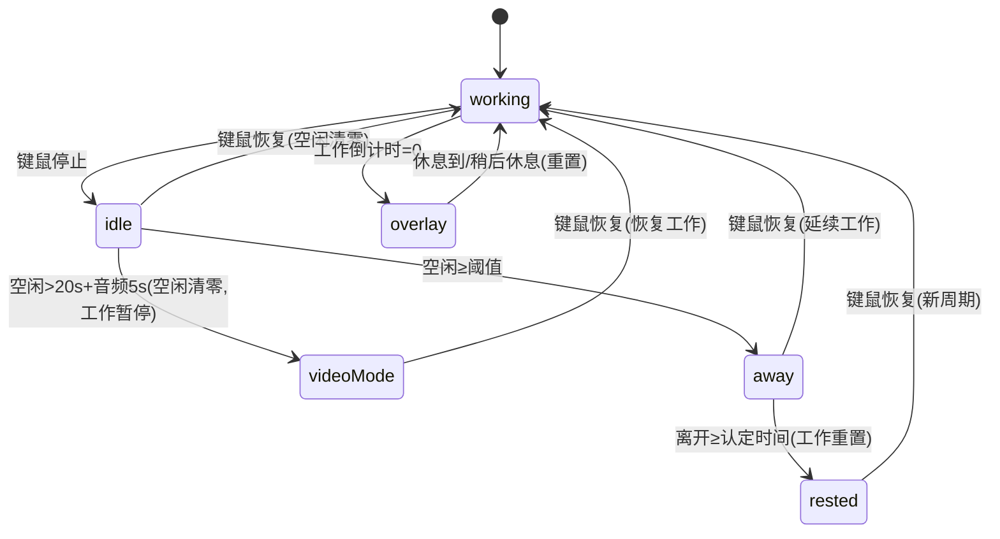

# 重写智能提醒核心代码

## 概述
完全根据用户描述的逻辑重写智能提醒核心代码，不参考现有实现。复用 InputMonitor 和 AudioActivityMonitor 基础检测，拆分文件确保单文件不过大。

## 当前实现

存在实现细节与需求描述不完全匹配的问题，需要完全重写。

## 方案

### 🚀推荐方案：按需求描述全新实现

状态机严格对应用户描述：

**文件拆分**：
- SmartReminderManager.swift (~200行) — 核心状态机 + tick
- SmartReminderManager+Extensions.swift (~150行) — 音频检测、锁屏/唤醒、持久化、辅助方法

**修改位置**：
[SmartReminderManager.swift](vscode://file/Volumes/Cache/X/Sources/Model/SmartReminderManager.swift:1) — 重写
新增：SmartReminderManager+Extensions.swift

## 测试用例
1. 键鼠活动时菜单栏空闲=00:00
2. 键鼠停止后空闲正常递增
3. 键鼠恢复后空闲清零
4. 播放视频不操作 → 20s后空闲清零/工作暂停
5. 恢复键鼠 → 工作继续
6. 空闲超过阈值 → 离开 → 达到休息认定 → 工作重置
7. 工作倒计时归零 → 蒙版弹出
8. 休息时间到 → 蒙版自动关闭
9. 点"稍后休息" → 蒙版关闭 → 工作重置

## 任务总结与结论
完全按需求描述重写智能提醒核心代码。

修改文件：
- SmartReminderManager.swift: 完全重写 (297行)
- SmartReminderManager+Extensions.swift: 新增 (160行)
- ReminderOverlayWindow.swift: 保持 (194行)
- Package.swift: 添加新源文件

## 任务耗时
- 任务开始时间：08:56
- 任务结束时间：09:20
- 任务总耗时：24 分钟
