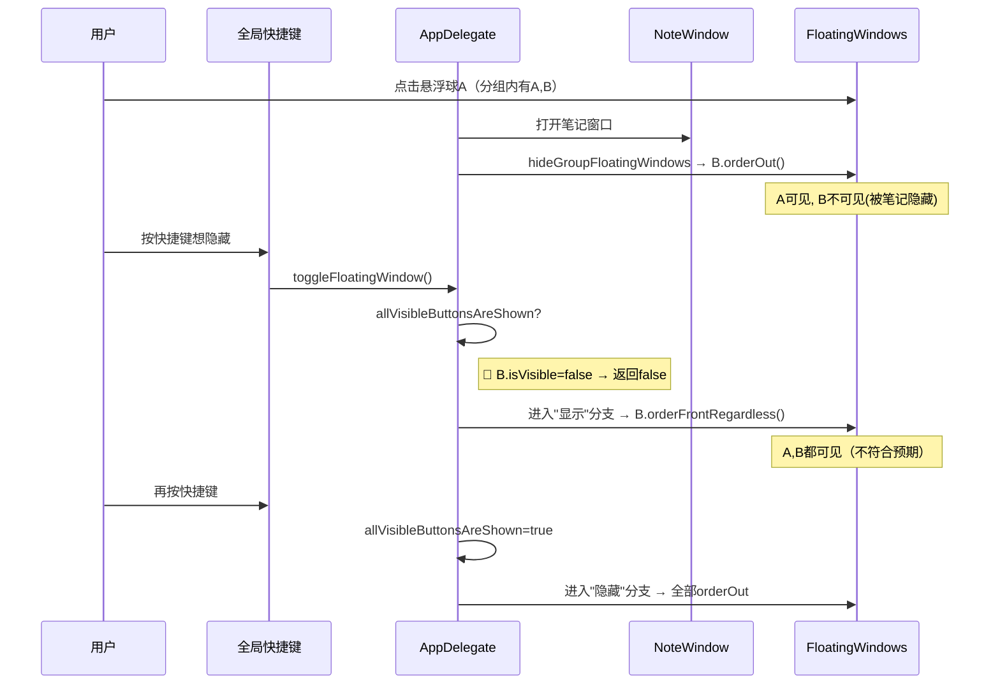
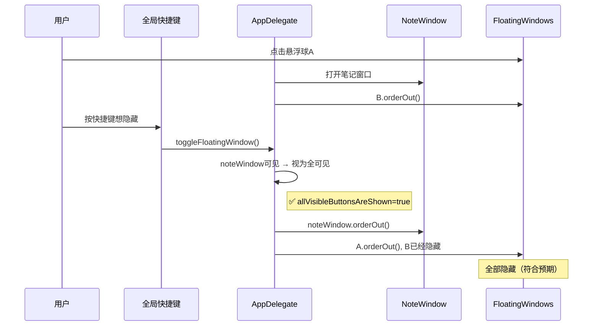

# 修复笔记窗口打开时快捷键隐藏悬浮球需按两次

## 概述
当笔记窗口打开时，同分组的其他悬浮球被隐藏。此时按全局快捷键隐藏悬浮球，会先恢复被隐藏的悬浮球（显示分支），再按才隐藏（隐藏分支）。期望：直接隐藏。

## 当前实现

## 方案

### 🚀推荐方案：笔记窗口打开时视为"全可见"

当 `noteWindow.isVisible == true` 时，说明有分组悬浮球被笔记窗口临时隐藏。此时 `allVisibleButtonsAreShown` 应视为 `true`，直接进入隐藏分支。

**优点**：
- 改动极小（1处判断条件）
- 逻辑清晰：笔记窗口打开 = 用户在使用中 = 视为可见状态

**修改位置**：
[AppDelegate.swift](vscode://file/Volumes/Cache/X/Sources/App/AppDelegate.swift:1238) — toggleFloatingWindow() 中 allVisibleButtonsAreShown 判断

## 测试用例
1. 打开笔记窗口（有分组悬浮球），按快捷键，验证一次即可隐藏所有悬浮球和笔记窗口
2. 再按快捷键，验证悬浮球全部恢复
3. 无笔记窗口时，快捷键正常 toggle

## 任务总结与结论
在 `toggleFloatingWindow()` 的 `allVisibleButtonsAreShown` 判断中加入笔记窗口状态检查。当笔记窗口打开时，视为所有悬浮球"可见"，直接进入隐藏分支。

修改位置：AppDelegate.swift toggleFloatingWindow() 方法，仅 1 处判断条件。

## 任务耗时
- 任务开始时间：09:26
- 任务结束时间：09:43
- 任务总耗时：17 分钟
