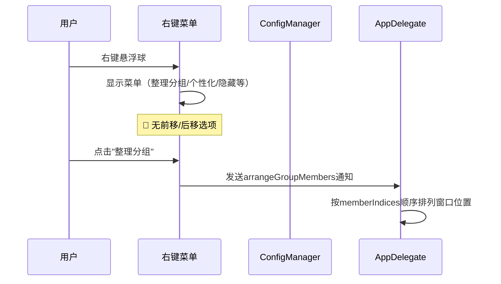
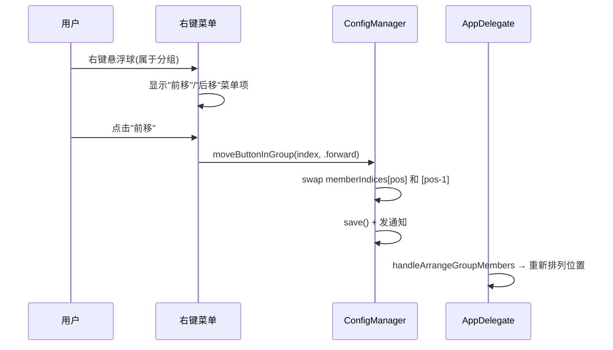

# 悬浮球分组内前移后移

## 概述
在有分组的悬浮球右键菜单添加"前移"和"后移"按钮，改变悬浮球在组内的相对位置。

## 当前实现

分组位置由 `memberIndices` 数组顺序决定。当前无法改变成员在数组中的位置。

## 方案

### 🚀推荐方案：交换 memberIndices 数组中的位置

**修改位置**：
[FloatingButtonConfig.swift](vscode://file/Volumes/Cache/X/Sources/Model/FloatingButtonConfig.swift:713) — 添加 moveButtonInGroup 方法
[GlowFloatingButtonView.swift](vscode://file/Volumes/Cache/X/Sources/View/GlowFloatingButtonView.swift:407) — 在"整理分组"下方添加前移/后移菜单项

## 测试用例
1. 右键分组中的悬浮球，验证显示"前移"/"后移"选项
2. 已在最前的球，"前移"应为灰色/不可点
3. 已在最后的球，"后移"应为灰色/不可点
4. 点击"前移"，验证悬浮球位置前移
5. 点击"后移"，验证悬浮球位置后移

## 任务总结与结论
在 FloatingButtonConfigManager 添加 `moveButtonInGroup` 方法（交换 memberIndices 数组位置），在右键菜单添加"前移"/"后移"选项。移动后自动触发 `arrangeGroupMembers` 通知重新排列窗口位置。

## 任务耗时
- 任务开始时间：10:01
- 任务结束时间：10:30
- 任务总耗时：29 分钟
