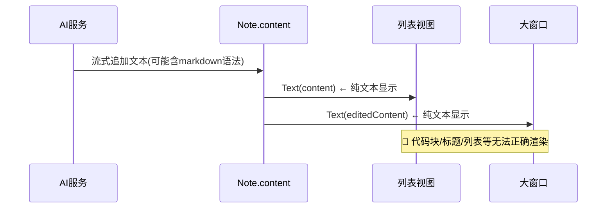
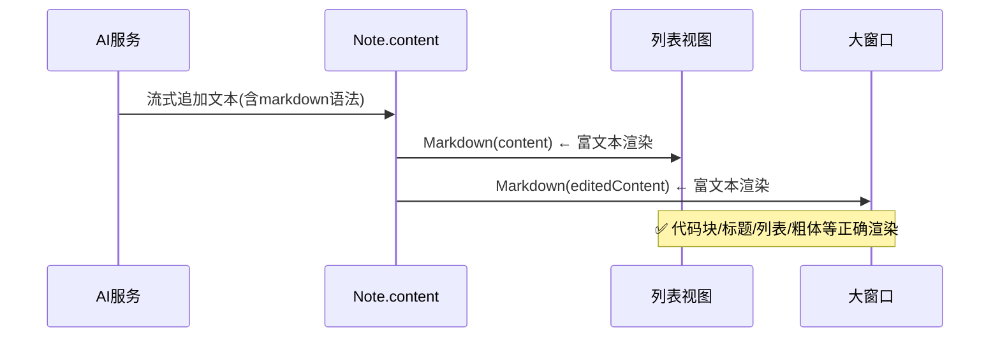

# AI内容Markdown渲染

## 概述
AI列表和大窗口的聊天内容支持 Markdown 解析和渲染，使用 swift-markdown-ui 库。

## 当前实现

## 方案

### 🚀推荐方案：使用 swift-markdown-ui 库

**修改位置**：
[Package.swift](vscode://file/Volumes/Cache/X/Package.swift:15) — 添加 swift-markdown-ui 依赖
[NoteListView.swift](vscode://file/Volumes/Cache/X/Sources/View/NoteListView.swift:330) — AINoteItemView 中 Text → Markdown
[LargeNoteWindow.swift](vscode://file/Volumes/Cache/X/Sources/View/LargeNoteWindow.swift:210) — aiConversationView 中 Text → Markdown

## 测试用例
1. AI 回复包含代码块 → 正确渲染为格式化代码
2. AI 回复包含标题 → 正确渲染为大号粗体
3. AI 回复包含列表 → 正确渲染为列表
4. 大窗口内容显示同上

## 任务总结与结论
使用 swift-markdown-ui 库实现 AI 聊天内容的 Markdown 渲染，包括代码块、标题、列表、粗体、引用等。通过自定义暗色主题适配深色界面。流式传输中使用 Text 保证性能，完成后切换到 Markdown。Mermaid 流程图通过 WKWebView + mermaid.js CDN 渲染，并解决了 WebView 拦截滚动事件的问题。

## 任务耗时
- 任务开始时间：10:38
- 任务结束时间：11:55
- 任务总耗时：77 分钟
