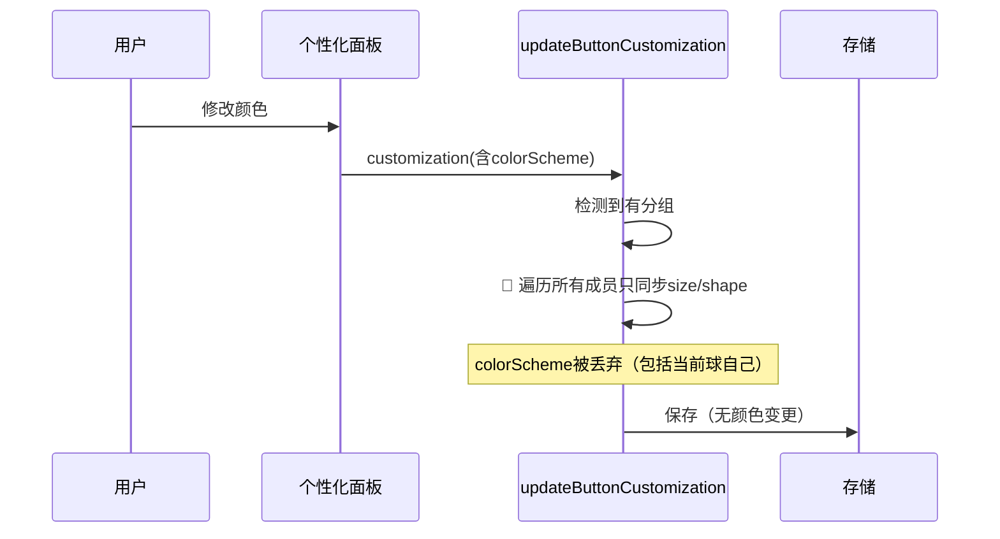

# 修复分组悬浮球颜色修改无效

## 概述
分组悬浮球单独修改颜色无效，原因是 `updateButtonCustomization` 在有分组时遗漏了当前球的 colorScheme 保存。

## 当前实现

## 方案

### 🚀推荐方案：分组分支中保留当前球的 colorScheme
在循环中增加 `memberIndex == index` 判断，仅对当前球同步 colorScheme。

[FloatingButtonConfig.swift](vscode://file/Volumes/Cache/X/Sources/Model/FloatingButtonConfig.swift:585)

## 测试用例
1. 创建分组，修改其中一个悬浮球颜色 → 颜色应生效
2. 组内其他成员颜色不受影响

## 任务总结与结论
`updateButtonCustomization` 分组分支中增加 `memberIndex == index` 判断，保存当前球的 colorScheme。

## 任务耗时
- 任务开始时间：12:14
- 任务结束时间：12:21
- 任务总耗时：7 分钟
