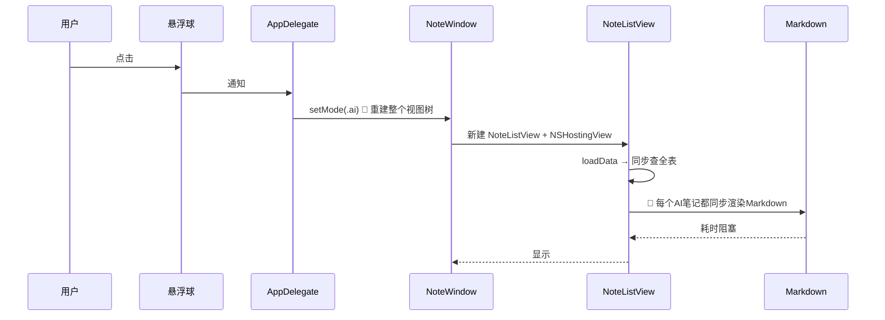

# 优化AI列表加载速度

## 概述
点击悬浮球打开AI列表时延迟明显，需要优化加载速度。

## 当前实现

## 方案

### 🚀推荐方案：列表惰性Markdown渲染
列表初始用 Text 显示，view 出现后异步切换到 Markdown 渲染。

修改位置：
[NoteListView.swift - AINoteItemView](vscode://file/Volumes/Cache/X/Sources/View/NoteListView.swift:308)

## 测试用例
点击悬浮球打开AI列表，观察是否立即出现。

## 任务总结与结论
列表初始用 Text 显示，onAppear 300ms 后切换 Markdown，消除打开延迟。

## 任务耗时
- 任务开始时间：12:55
- 任务结束时间：13:05
- 任务总耗时：10 分钟
